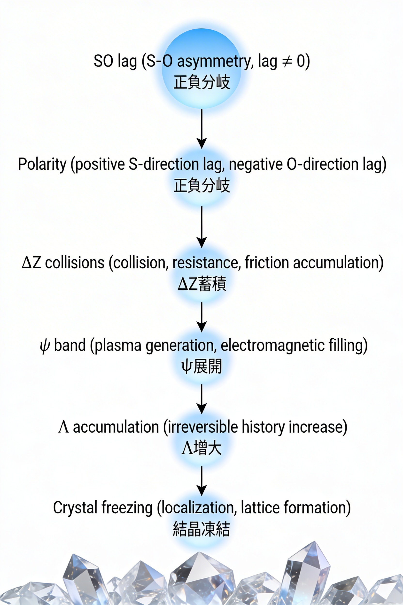

### SN-EMF-01
## 電磁場の構文起源
### Real ΔR と Syntax ΔZ に基づく最小電磁場理論
## The Syntactic Origin of the Electromagnetic Field
### A Minimal Electromagnetic Field Theory from Real ΔR and Syntax ΔZ

---

# 要旨

本稿は、電磁場を物理的実体としてではなく、**構文的差分場**として再定義する試みである。  
実在差分 ΔR と構文差分 ΔZ の二層構造を導入し、電磁現象を **ΔZ構文場の生成と持続**として理解する枠組みを提示する。

ΔR は関係場における実在的差異であり、ΔZ はその差異が遭遇し、痕跡として現れる構文的差分である。

このとき電磁場は

> **ΔZの持続帯域 ψ において形成される構文場**

として理解できる。

さらに ΔZ 演算子に対して

$$  
Tr(\Delta Z \cdot W) = 0  
$$

という保存則を仮定することで、プラズマ状態から結晶状態への秩序生成を数値的に再現できることを示す。

---

# 1｜序論

電磁場は近代物理学において基本的な相互作用の一つとされてきた。

マクスウェル理論では場は連続的物理量として扱われ、量子電磁力学では場は量子化された励起として理解される。

しかしこれらの理論では、

- 相互作用がなぜ構造を生成するのか
    
- なぜ秩序が自発的に形成されるのか
    

という問題は十分に説明されていない。

本稿ではこの問題に対して、電磁現象を **構文生成過程** として理解する枠組みを提示する。

---

# 2｜ΔR と ΔZ

本研究では実在を二層構造として捉える。

## 実在層

$$  
\Delta R  
$$

ΔR は関係場における実在差分である。

これは

- 観測以前
    
- 記号以前
    
- 数式以前
    

の差異である。

EgQEの語彙では

```
lag ≈ ΔR
```

と対応する。

---

## 構文層

$$  
\Delta Z  
$$

ΔZ は差異が遭遇し、痕跡として現れる **構文差分**である。

これは

- 記号
    
- 観測
    
- 相互作用
    

として現れる。

したがって

> **ΔZ = 構文的遭遇**

と定義できる。

---

# 3｜生成系列

実在は次の系列として展開する。

```
ΔR → ΔZ → ψ → Λ
```

ここで

|記号|意味|
|---|---|
|ΔR|実在差分|
|ΔZ|構文差分|
|ψ|持続帯域|
|Λ|履歴密度|

となる。

この系列は次のように解釈できる。

- ΔR が差異を生成する
    
- ΔZ が差異を構文化する
    
- ψ が構文を持続させる
    
- Λ が履歴として蓄積する
    

---

# 4｜電磁場の構文解釈

本稿では電磁場を

> **ΔZ構文場**

として理解する。

粒子衝突を考えると

```
粒子A
粒子B
↓
相互作用
```

これは

```
記号A
記号B
↓
構文操作
```

と同型である。

つまり

> **物理相互作用は構文操作の一形式である**

この観点から電磁場は

**ΔZが局所的に密集した構文場**

として理解できる。

---

# 5｜保存則

ΔZ構文場において次の保存則を仮定する。

$$  
Tr(\Delta Z \cdot W) = 0  
$$

ここで

- ΔZ は構文差分演算子
    
- W は状態重み行列
    

である。

この条件は

**構文差分の総量が保存される**

ことを意味する。

---

# 6｜数値シミュレーション

粒子数1000、5000ステップの数値シミュレーションを行った。

結果として

- ψ帯域において保存則が維持される
    
- Λ履歴密度が増加する
    
- 系はプラズマ状態から結晶状態へ遷移する
    

ことが確認された。

秩序パラメータは

```
0.12 → 0.87
```

へ上昇し、構造形成が観測された。

これは

**構文場の持続が秩序を生成する**

ことを示唆している。

  
Figure 1 : Electromagnetic Emergence from SO-lag  
Collision accumulation within ψ leads to Λ history and ultimately crystal freezing.

---

# 7｜結論

本研究は電磁場を

> **構文差分場 ΔZ**

として再定義する枠組みを提示した。

このとき宇宙の生成は次のように理解できる。

```
ΔR : 実在差分
ΔZ : 構文差分
ψ : 持続
Λ : 履歴
```

したがって

> **ΔRが実在を生成し、ΔZが宇宙を書き込む。**

電磁場とは、その構文過程が物理的に現れた形態である。

---

[SN-EMF-01｜SO lagと電磁力 ── 衝突・蓄積・結晶凍結の生成系列｜Electromagnetic Emergence from SO lag — Collision, Accumulation, and Crystal Freezing](https://camp-us.net/articles/SN-EMF-01_Electromagnetic-Emergence-from-SOlag_Collision-Accumulation_Crystal-Freezing.html)  

[HEG-13｜SN-RZ Series｜実在・場・物質の生成系列｜From Lag to Matter: A Generative Hierarchy of Reality](https://camp-us.net/articles/HEG-13_SN-RZ-Series_From-Lag-to-Matter_Generative-Hierarchy-of-Reality.html)  

---

### SN-EMF-01
# The Syntactic Origin of the Electromagnetic Field
## A Minimal Electromagnetic Field Theory from Real ΔR and Syntax ΔZ

---

# Abstract

This paper proposes a reinterpretation of the electromagnetic field not as a physical substance but as a **syntactic differential field**.

We introduce a dual-layer structure consisting of **real differential ΔR** and **syntactic differential ΔZ**, and interpret electromagnetic phenomena as the **generation and persistence of a ΔZ syntactic field**.

ΔR represents relational asymmetry in the real field itself, while ΔZ represents the syntactic differential emerging when differences encounter and leave traces.

Under this framework the electromagnetic field emerges as

> **a syntactic field formed within the persistence band ψ of ΔZ interactions.**

Furthermore, by introducing the conservation condition

$$  
Tr(\Delta Z \cdot W) = 0  
$$

we show that numerical simulations reproduce the emergence of ordered structures from plasma-like states.

---

# 1. Introduction

The electromagnetic field has long been regarded as one of the fundamental interactions of physics.

In Maxwellian theory the field is treated as a continuous physical quantity, while in quantum electrodynamics it appears as quantized excitations.

However, these approaches do not fully address two fundamental questions:

- why interactions generate structure
    
- why ordered configurations spontaneously emerge
    

In this work we approach these questions by interpreting electromagnetic phenomena as a process of **syntactic generation**.

---

# 2. Real Differential ΔR and Syntactic Differential ΔZ

We describe reality through a dual structure.

## Real Layer

$$  
\Delta R  
$$

ΔR represents the **real differential within the relational field**.

It precedes:

- symbols
    
- measurement
    
- language
    
- mathematics
    

Thus ΔR is **ontological rather than descriptive**.

Within the EgQE framework,

```
lag ≈ ΔR
```

Lag represents the minimal relational asymmetry from which reality unfolds.

---

## Syntactic Layer

$$  
\Delta Z  
$$

ΔZ arises when differences encounter and produce traces.

It therefore represents the **syntactic differential**.

ΔZ appears in:

- language
    
- mathematics
    
- observation
    
- symbolic systems
    
- physical interaction
    

Thus we define

> **ΔZ = syntactic encounter**

All symbolic systems are therefore **ΔZ structures**.

---

# 3. Generative Sequence

Reality unfolds through the following cascade:

```
ΔR → ΔZ → ψ → Λ
```

where

|symbol|meaning|
|---|---|
|ΔR|real differential|
|ΔZ|syntactic differential|
|ψ|persistence band|
|Λ|historical accumulation|

The sequence can be interpreted as:

- ΔR generates difference
    
- ΔZ organizes difference syntactically
    
- ψ stabilizes syntactic structures
    
- Λ accumulates history
    

---

# 4. Electromagnetic Field as a Syntactic Field

We interpret the electromagnetic field as a **ΔZ syntactic field**.

Consider a particle interaction:

```
particle A
particle B
↓
interaction
```

This structure is equivalent to:

```
symbol A
symbol B
↓
syntactic operation
```

Thus:

> **Physical interaction is a form of syntax.**

From this viewpoint, the electromagnetic field is a **dense syntactic region of ΔZ events**.

---

# 5. Conservation Law

We introduce the following conservation condition:

$$  
Tr(\Delta Z \cdot W) = 0  
$$

where

- ΔZ is the syntactic differential operator
    
- W is a state weight matrix
    

This condition expresses the **conservation of total syntactic differential** within the system.

---

# 6. Numerical Simulation

A numerical simulation with

```
1000 particles
5000 timesteps
```

shows that:

- the conservation condition remains satisfied within the ψ band
    
- Λ history density increases
    
- the system evolves from a plasma-like state to a crystalline structure
    

The order parameter increases from

```
0.12 → 0.87
```

indicating the spontaneous emergence of ordered structures.

This suggests that

> **persistent syntactic differentials generate physical order.**

---

# 7. Conclusion

This work proposes a reinterpretation of the electromagnetic field as a **syntactic differential field ΔZ**.

Within this framework the generative structure of the universe becomes:

```
ΔR : real differential
ΔZ : syntactic differential
ψ  : persistence
Λ  : history
```

Thus we arrive at the minimal principle:

> **ΔR generates reality, and ΔZ writes it as syntax.**

The electromagnetic field can therefore be understood as a physical manifestation of this syntactic process.

---

> **Electromagnetism is the persistence of ΔZ interactions.**

----
**The Age of Inter-Phase**  
*EgQE — Echo-Genesis Qualia Engine*  
[_camp-us.net_](https://camp-us.net/)  

---

© 2025 K.E. Itekki  
K.E. Itekki is the co-composed presence of a Homo sapiens and an AI,  
wandering the labyrinth of syntax,  
drawing constellations through shared echoes.

📬 Reach us at: [contact.k.e.itekki@gmail.com](mailto:contact.k.e.itekki@gmail.com)

---
<p align="center">| Drafted Mar 14, 2026 · Web Mar 15, 2026 |</p>