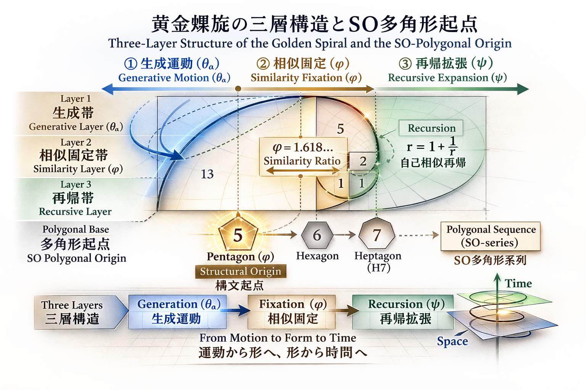
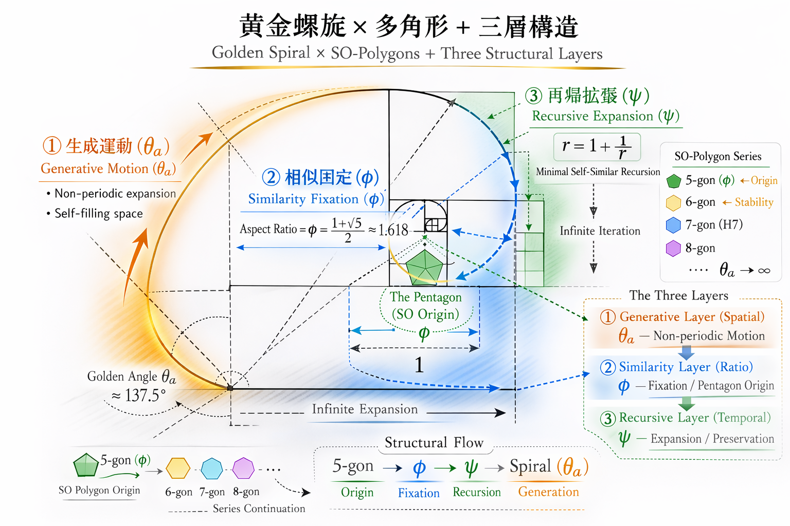

# SN-φ-00
# 黄金螺旋の三層構造 ── 生成・固定・再帰
# The Three-Layer Structure of the Golden Spiral
## — The Pentagon as SO-Origin

[GS-φ｜黄金構文としての φ ── φ as a Golden Syntax (Draft 0.1)JP/EN](https://camp-us.net/GS-φ_Golden-Syntax_Draft_0.1.html)  

---

### 概要

本短論は、黄金螺旋を三層構造として整理する試みである。

第一層は生成運動（θₐ）であり、非周期的な空間拡張を示す。  
第二層は相似固定（φ）であり、生成運動が比として凝縮した構造的固定である。φは原因ではなく、生成の相似的痕跡として理解される。SO多角形系列において、五角形はφが幾何的に顕在化する最小非自明起点として位置づけられる。  
第三層は再帰拡張（ψ）であり、相似固定が時間的反復へ展開する帯である。

構文順序は、**生成 → 相似固定 → 再帰展開** である。

本稿は一般定理の提示を目的とせず、空間運動・比例固定・再帰保存を区別する構造的見取り図を提示するものである。

### Abstract

This short note proposes a structural reading of the golden spiral through three distinct layers: generative motion (θₐ), similarity fixation (φ), and recursive expansion (ψ).

The golden angle represents non-periodic spatial expansion without closure. The golden ratio φ is not treated as the cause of this motion, but as its similarity fixation — a proportional condensation of generative dynamics. Within the SO-polygonal series, the pentagon is positioned as the minimal non-trivial structural origin where φ becomes geometrically manifest.

Recursive expansion, expressed in minimal self-similar form, extends this fixation into temporal iteration.

The proposed order is therefore:  
**generative motion → similarity fixation → recursive expansion**.

This interpretation does not aim to establish a general mathematical theorem, but to provide a structural diagram distinguishing spatial motion, proportional stabilization, and recursive preservation within a unified framework.

---

## 0｜導入｜Introduction

**日本語**

本稿は、黄金螺旋を

- 生成運動（θₐ）
    
- 相似固定（φ）
    
- 再帰拡張（ψ）
    

の三層構造として整理する試みである。

五角形を SO 多角形系列の最小非自明起点として再配置し、φ を原因ではなく、生成運動の相似的固定として位置づける。

本稿の目的は、空間的運動・比例的安定化・時間的再帰を区別する構造的見取り図を提示することにある。

**English**

This note proposes a structural interpretation of the golden spiral through three layers:

- generative motion (θₐ),
    
- similarity fixation (φ),
    
- recursive expansion (ψ).
    

The pentagon is repositioned as the minimal non-trivial origin within the SO-polygonal series, where φ becomes structurally manifest.

Rather than treating φ as a cause, it is interpreted as a proportional fixation of generative motion.

The aim is not to establish a general theorem, but to distinguish spatial motion, proportional stabilization, and temporal recursion within a unified structural diagram.

---

## 図1｜Main Figure

  
**Figure 1: Three-Layer Structure (Main Figure)**

---

## 1｜Layer 1：生成運動（θₐ）

## Layer 1: Generative Motion (θₐ)

**日本語**

黄金角は、

- 非周期的拡張
    
- 自己充填的展開
    
- 空間的拡張運動
    

を示す。

これは運動層である。  
この段階では、比はまだ固定されていない。

**English**

The golden angle represents:

- non-periodic expansion,
    
- self-filling spatial unfolding,
    
- continuous generative motion.
    

This is the layer of motion.  
At this stage, no proportional fixation has yet occurred.

---

## 2｜Layer 2：相似固定（φ）

## Layer 2: Similarity Fixation (φ)

**日本語**

黄金比 φ は、

- 生成運動の相似的凝縮
    
- 比としての定着
    
- 五角形における最小非自明閉包
    

として現れる。

重要なのは次の点である：

> φ は生成の原因ではない。  
> φ は生成の固定痕跡である。

五角形は SO 多角形系列の起点である。

**English**

The golden ratio φ appears as:

- a similarity condensation of generative motion,
    
- stabilization into proportional form,
    
- minimal non-trivial closure within the pentagon.
    

The essential distinction is this:

> φ is not the cause of generation.  
> φ is the fixed trace of generation.

The pentagon functions as the structural origin of the SO-polygonal series.

---

## 3｜Layer 3：再帰拡張（ψ）

## Layer 3: Recursive Expansion (ψ)

**日本語**

最小自己相似再帰は、

- 保存を含む反復
    
- 時間的展開
    
- 無限反復可能構文
    

として理解される。

φ はこの再帰の最小解である。  
ψ はその時間的展開帯を示す。

**English**

Minimal self-similar recursion represents:

- iterative preservation,
    
- temporal unfolding,
    
- structurally infinite repetition.
    

φ is the minimal solution of such recursion.  
ψ denotes the band of recursive expansion extending this fixation in time.

---

## 4｜構文順序

## Structural Order

**日本語**

生成（θₐ） → 相似固定（φ） → 再帰展開（ψ）

幾何学的導出では φ が先に現れるが、構文生成論では運動が先行する。

両立は可能である。

**English**

Generative motion (θₐ) → similarity fixation (φ) → recursive expansion (ψ)

In geometric derivations, φ appears first.  
In structural generative interpretation, motion precedes fixation.

These perspectives are compatible.

---

## 図2｜Structural Overview

  
**Figure 2: Simultaneous Structural Field (Overview)**  
This figure illustrates the simultaneous co-presence of the three layers within a unified structural field.

---

## 結語｜Conclusion

**日本語**

φ は生成そのものではない。  
生成の構文的痕跡である。

五角形は装飾ではない。  
最小非自明 SO 起点である。

黄金螺旋は美的対象ではなく、運動・比・時間という**三層構造の可視化**である。

**English**

φ is not generation itself.  
It is the structural trace of generation.

The pentagon is not decorative.  
It is the minimal non-trivial SO-origin.

The golden spiral is not merely aesthetic.

It is the visible articulation of **motion, ratio, and time** within a three-layer structure.

---

[SN-φ-02｜生成黄金角の痕跡としての φ ── SO多角形起点としての五角形｜φ as the Syntactic Trace of Generative Golden-Angle Motion ── The Pentagon as the Structural Origin of SO-Polygons](https://camp-us.net/articles/SN-φ-02_Pentagon_as_Structural-Origin.html)  
[SLR-00｜SO–lag 転回から φ への再帰（草稿集）｜SO-lαg-φ drifts Collection](https://camp-us.net/articles/SLR-00_SO-lag-Turn_φ-Recursion_Drifts.html)  

---
*EgQE — Echo-Genesis Qualia Engine*  
[_camp-us.net_](https://camp-us.net/)

---

© 2025 K.E. Itekki  
K.E. Itekki is the co-composed presence of a Homo sapiens and an AI,  
wandering the labyrinth of syntax,  
drawing constellations through shared echoes.

📬 Reach us at: [contact.k.e.itekki@gmail.com](mailto:contact.k.e.itekki@gmail.com)

---

| Drafted Feb 27, 2026 · Web Feb 28, 2026 |
