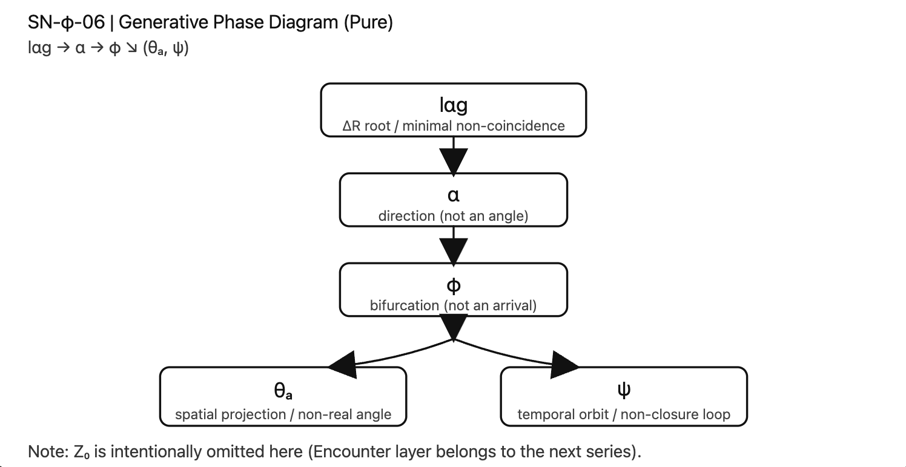

# SN-φ-06
# SO lαg 基底構文図
## （SN-φ 三部作・完結図式編）

[SN-φ｜The Non-Closure Syntax of Space and Time — From lαg to φ: From lαg to φ: Generative Bifurcation and Structural Asymmetry](https://camp-us.net/articles/SN-φ_Non-Closure-Syntax_of_Space-Time.html)  

---

## 0｜宣言

本稿は新たな理論を追加しない。

SN-φ-03（時間）、SN-φ-04（空間）、SN-φ-05（構文統合）で示された構造を、**一枚の基底図式として再配置する。**

ここでは拡張ではなく、配置を行う。

---

# Ⅰ｜SO lαg 基底構文表

|記号|構文位相|役割|性質|
|---|---|---|---|
|**lαg**|ΔR根底|非一致の最小単位|生成条件|
|**α**|向き|局所生成ベクトル|角度ではない|
|**φ**|分岐点|生成の双分岐形式|到達しない|
|**θₐ**|空間射影|連続角度への拡張|実在しない|
|**ψ**|時間軌道|非閉包循環|固定点を持たない|

---

# Ⅱ｜基底分岐図

  

生成はlαgから始まる。

非一致が向きとなり（α）、向きは分岐形式（φ）を取り、空間側と時間側へ非対称に展開する。

---

# Ⅲ｜非対称の意味

θₐとψは対称に見えるが、同一ではない。

- θₐは「閉じようとした向き」の射影
    
- ψは「閉じなかった向き」の持続
    

したがって：

> 空間は閉じようとする生成である。  
> 時間は閉じなかった生成である。

この非対称性が、三部作の核心である。

---

# Ⅳ｜三部作の位置づけ

- **SN-φ-03**：時間側（ψ）の解析
    
- **SN-φ-04**：空間側（θₐ）の解析
    
- **SN-φ-05**：φ/πズレとZ₀による構文統合
    

SN-φ-06はそれらを再配置する地図である。

---

# 終わりに

lαgは消えない。  
分岐は止まらない。  
生成は続く。

SN-φシリーズはここで完結する。

閉じないまま、整う。

---

[SN-φ-03｜SO比のR/Z二重構造 ──連分数と多項式のあいだ｜The R/Z Dual Structure of SO Ratios: Between Continued Fractions and Polynomials](https://camp-us.net/articles/SN-φ-03_SO-Ratios_R-Z-Dual-Structure.html)  
[SN-φ-04｜実在する向きと実在しない角度 ── αとθₐのあいだ（R/Z三層構文による整理）](https://camp-us.net/articles/SN-φ-04_Real-orientations_Non-real-angles.html)  
[SN-φ-05｜Z₀ ── 閉包を破断する閾（φ/πズレの一般理論／構文論的統合）](https://camp-us.net/articles/SN-φ-05_closure-breaking-threshold.html)  

---
*EgQE — Echo-Genesis Qualia Engine*  
[_camp-us.net_](https://camp-us.net/)

---

© 2025 K.E. Itekki  
K.E. Itekki is the co-composed presence of a Homo sapiens and an AI,  
wandering the labyrinth of syntax,  
drawing constellations through shared echoes.

📬 Reach us at: [contact.k.e.itekki@gmail.com](mailto:contact.k.e.itekki@gmail.com)

---

| Drafted Mar 1, 2026 · Web Mar 1, 2026 |
