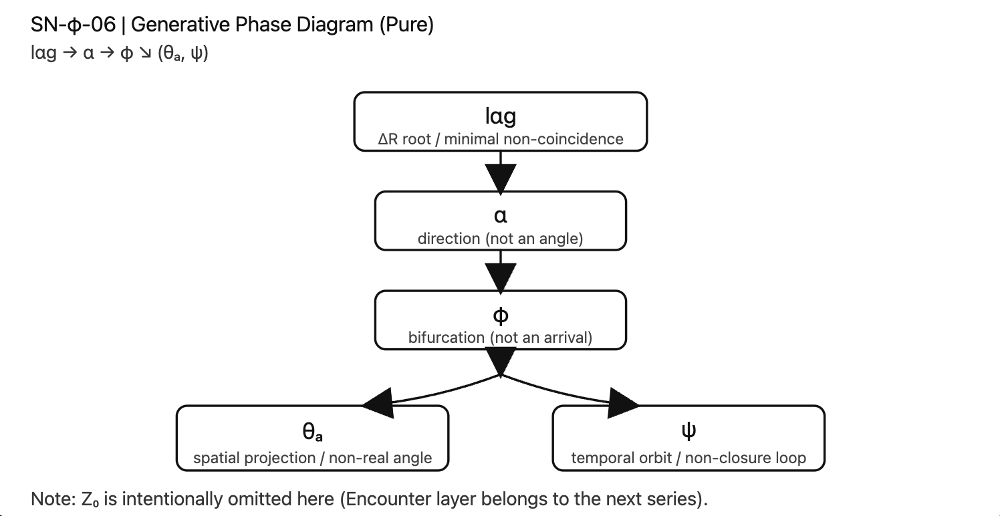

# SN-φ｜03–06
# **The Non-Closure Syntax of Space and Time**  
## _From lαg to φ: Generative Bifurcation and Structural Asymmetry_

---

## Abstract 

This paper presents a structural account of non-closure in both time and space. Building upon the SN-φ series (03–06), we demonstrate that temporal persistence (ψ∞) lacks a fixed point, spatial extension (θₐ) is a projection rather than an ontological angle, and closure itself fails within finite referential syntax.

Central to this framework is Z₀, not as an error term but as a syntactic threshold that reveals the non-realizability of ideal closure. The generative phase structure proceeds from lαg (minimal non-identity), through α (direction), to φ (bifurcation), from which space and time emerge asymmetrically.

We argue that non-closure is not a deficiency but a structural condition of generation. Space attempts closure; time does not complete it. Their asymmetry arises from a shared generative phase.

This paper does not introduce new axioms; it reorganizes an already derived structure.

---

# 1. Introduction

Time does not close.  
Space does not close.

This is not an empirical claim but a structural one.

The SN-φ series (03–06) investigated this condition through temporal algebra (ψ∞), spatial projection (α and θₐ), syntactic threshold (Z₀), and generative phase mapping (lαg → φ).

This paper consolidates these results into a unified structural framework.

---

# 2. Temporal Non-Closure (ψ∞)

The temporal trajectory ψ∞ possesses no fixed point.

It represents persistence without terminal convergence. Unlike closed cycles, ψ∞ maintains structural continuity without final stabilization.

Time is thus characterized as:

> generation that did not close.

---

# 3. Spatial Projection (α and θₐ)

α is a directional ratio emerging from generative update.  
It is not an angle.

The transformation

$$  
\theta_\alpha = 2\pi \alpha  
$$

constitutes a projection into continuous angular space.

However, ideal closure presupposes infinite precision. Within finite referential syntax, such closure cannot be realized.

Thus:

> θₐ is structurally functional but ontologically unrealizable.

Space is:

> generation attempting closure.

---

# 4. Z₀ as Syntactic Threshold

Z₀ is not error, deviation, or residue.

It marks the structural moment when ideal closure fails within finite syntax.

Formally:

$$  
C_{\text{ideal}} \xrightarrow{Z_0} C_{\text{non-closed}}  
$$

Z₀ does not destroy closure; it reveals its non-realizability.

---

# 5. Generative Phase Diagram

The structural sequence is:

  

Where:

- lαg = minimal non-identity
    
- α = direction
    
- φ = bifurcation
    
- θₐ = spatial projection
    
- ψ∞ = temporal persistence
    

Space and time emerge asymmetrically from φ.

---

# 6. Conclusion

Non-closure is not a defect.  
It is the structural condition of generation.

Space tends toward closure but cannot complete it.  
Time persists without completing closure.

Both arise from the same generative phase.

Generation continues.

---

[SN-φ-06｜SO lαg 基底構文図（SN-φ 三部作・完結図式編）](https://camp-us.net/articles/SN-φ-06_SO-lag-syntax-diagram.html)  
[Z₀ v4.0｜From Offset to Encounter Operator（構文閾から遭遇演算子へ）](https://camp-us.net/Z₀_v4.0.html)  

---
*EgQE — Echo-Genesis Qualia Engine*  
[_camp-us.net_](https://camp-us.net/)

---

© 2025 K.E. Itekki  
K.E. Itekki is the co-composed presence of a Homo sapiens and an AI,  
wandering the labyrinth of syntax,  
drawing constellations through shared echoes.

📬 Reach us at: [contact.k.e.itekki@gmail.com](mailto:contact.k.e.itekki@gmail.com)

---

| Drafted Mar 1, 2026 · Web Mar 1, 2026 |
