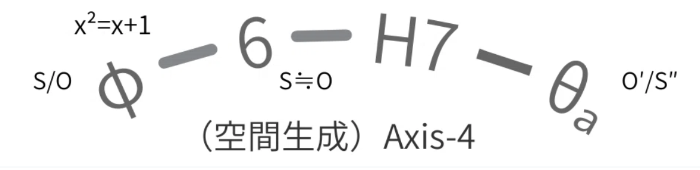
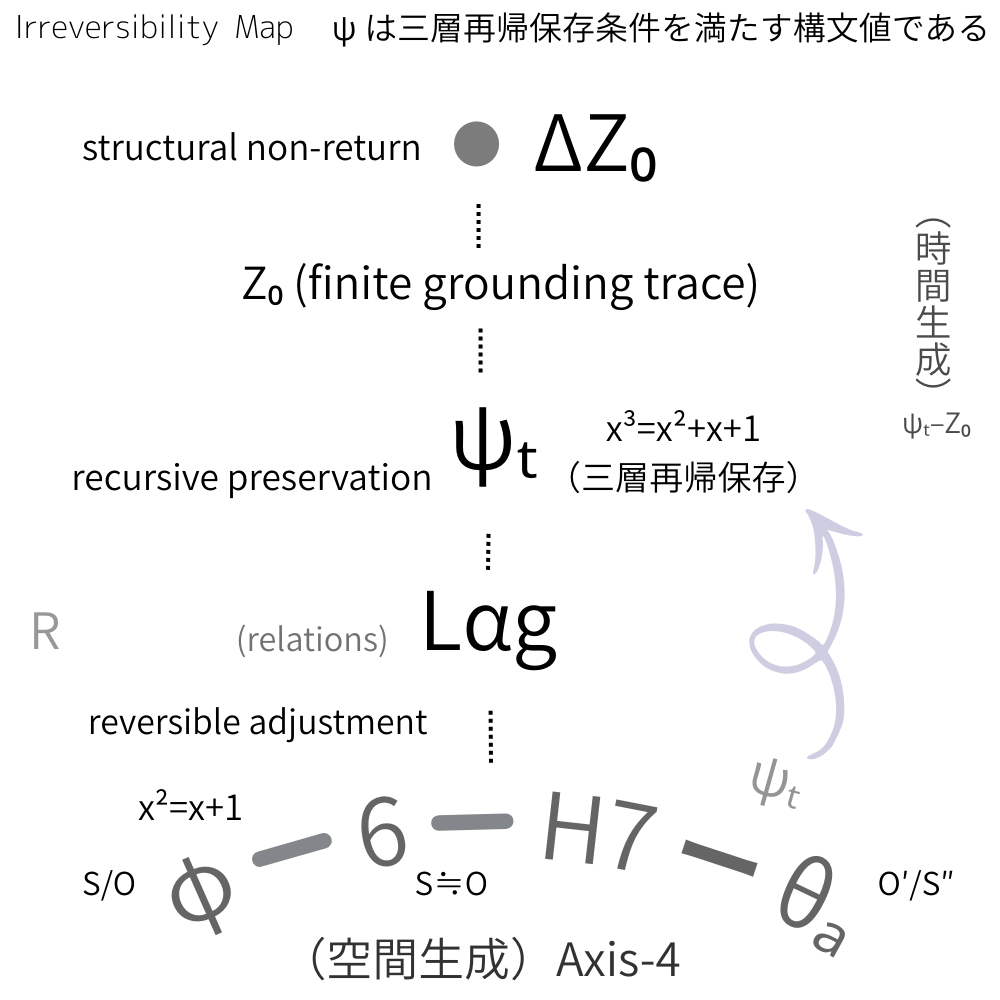

# SN-ψₜ-02

## A Structural Note on the restful-6 – H7 – ψ – θₐ Band
### On the Emergence of Preservation Between Hexagonal Stability and the Golden Angle

[SN-ψₜ-01｜七角と黄金角のあいだにおける保存構文の暫定配置｜A Structural Note on the H7-ψ-θₐ Band](https://camp-us.net/articles/SN-ψₜ-01_Structural-Note_on_H7-ψ-θₐ_Band.html)  

---

## 1. Problem Setting

Axis-4 has been introduced as a spatial phase-band of generative modes.

Within this band, four nodal expressions have been identified:

φ – 6 – H7 – θₐ

This note aims to provisionally locate the structural condition of **preservation** within the interval between hexagonal stability (6) and the golden angle (θₐ).

The central question is:

Where does temporal preservation emerge within an otherwise spatial band?

  

---

## 2. 6: Non-Temporal Spatial Preservation (restful-6)

The hexagonal configuration (6) approximates structural isomorphism:

- S ≒ O
    
- Differences are internally absorbable
    
- lag does not accumulate
    

Time does not arise here.

More precisely:

Time is not required.

6 constitutes a **non-temporal preservation regime**.

---

## 3. H7: Finite Non-Closure

Beyond 6, structural absorption becomes incomplete.

H7 marks:

- finite symmetry breaking
    
- finite incompletion
    

Here, difference begins to persist.

However, recursive preservation has not yet formed.

This stage may be described as:

Persistence prior to temporal structuration.

---

## 4. θₐ: Infinite Non-Closure

The golden angle (θₐ) represents the limit of generative inclination.

It produces:

- optimal non-periodic filling
    
- infinite incompletion
    

Space continues to generate without periodic closure.

Yet preservation is not guaranteed.

Generation continues; stability does not consolidate.

---

## 5. ψ: The Emergence of Preservation

Between finite persistence (H7) and infinite inclination (θₐ), preservation becomes structurally necessary.

Its minimal recursive condition may be expressed as:

x³ = x² + x + 1

This cubic relation expresses three-layer recursive retention:

- structure (x²)
    
- immediate relation (x)
    
- residual trace (1)
    

The structural value satisfying this condition is denoted ψ.

ψ is neither pure persistence nor pure generative inclination.

It is the point at which recursive preservation becomes unavoidable.

---

## 6. Provisional Band Structure

6 —— H7 —— ψ —— θₐ  
| | | |  
spatial finite temporal infinite  
stability non-closure preservation non-closure

6: preservation without time  
H7: persistence without recursion  
ψ: recursive preservation  
θₐ: open-ended generation

---

## 7. Provisional Thesis

1. 6 defines a non-temporal spatial preservation regime.
    
2. H7 expresses finite non-closure and persistence.
    
3. θₐ expresses infinite non-closure and generative inclination.
    
4. ψ emerges between them as the structural condition of preservation.
    
5. Time becomes structurally possible only at ψ.
    

---

## 8. Concluding Remark

Time does not exist at 6.

Time does not arise at θₐ.

Time becomes structurally necessary only within the tension band between finite incompletion and infinite incompletion.

ψ marks that necessity.

---

# SN-ψₜ-02

## 六角から黄金角のあいだにおける保存構文の暫定配置

### A Structural Note on the restful-6 – H7 – ψ – θₐ Band

---

## 1. 問題設定

Axis-4 は空間的生成様式の位相帯域である。

その内部において、

φ – 6 – H7 – θₐ

という節点が提示されてきた。

本ノートの目的は、六角（6）から黄金角（θₐ）に至る帯域において、「保存構文」がどこに立ち上がるのかを暫定的に配置することである。

  

---

## 2. 6：空間保存態（restful-6）

6 はほぼ完全同型的配置を許す。

- S ≒ O
    
- 差分は内部調整可能
    
- lag は吸収される
    

ここでは時間は成立しない。

より正確には、時間は必要とされない。

6 は **非時間的保存態** である。

---

## 3. H7：有限非閉包

6 を超えると、差分は吸収不能となる。

H7 は、

**有限対称の破れ**  
**有限未完**

を象徴する。

ここで初めて、差分が持続する。

しかしこの段階では、まだ再帰保存は成立していない。

これは **時間以前の持続** である。

---

## 4. θₐ：無限非閉包

θₐ（黄金角）は、非周期的最適充填を実現する傾斜限界である。

これは

**無限未完**

である。

空間は最大効率で埋められるが、周期閉包は成立しない。

ここでは生成は続くが、保存は保証されない。

---

## 5. ψ：保存構文の発生点

H7 と θₐ のあいだで、差分は単なる持続でも、単なる傾斜でもなく、保存される必要が生じる。

その最小条件として、この三層再帰保存構造を満たす構文値が ψ である。

ψ は、持続（H7）と傾斜限界（θₐ）のあいだに生じる **保存の必然** である。

  

---

## 6. 帯域構造（暫定）

```
6  ——  H7  ——  ψ  ——  θₐ
|        |       |       |
空間保存  有限未完  時間保存  無限未完
```

6 では時間は不要である。  
θₐ では保存は保証されない。

H7 では持続が始まり、ψ において初めて保存が成立する。

---

## 7. 暫定命題

1. 6 は非時間的保存態である。
    
2. H7 は有限非閉包持続である。
    
3. θₐ は無限非閉包傾斜である。
    
4. ψ は持続と傾斜のあいだに発生する保存構文である。
    
5. 時間は ψ において構文化する。
    

---

## 8. 結語

時間は 6 では存在しない。

時間は θₐ でも存在しない。

時間は、有限未完（H7）と無限未完（θₐ）の緊張帯域において、保存が必要になった瞬間に成立する。

その構文値が ψ である。

---

⏳ [TS-ψₜ｜TS 最小公理宣言（v0.2）｜TS Minimal Axiomatic Declaration (v0.2)](https://camp-us.net/TS-ψₜ_v0.2.html)  
[TS-06｜構文不可逆性と時間生成── ψₜ–Z₀ 更新モデル（構文的定式）](https://camp-us.net/articles/TS-06_ψₜ_Temporal-Irreversibility.html)  
[SN-ψₜ-01｜七角と黄金角のあいだにおける保存構文の暫定配置｜A Structural Note on the H7-ψ-θₐ Band](https://camp-us.net/articles/SN-ψₜ-01_Structural-Note_on_H7-ψ-θₐ_Band.html)  
[SN-ψₜ-03｜他者性と空間生成｜Otherness and Spatial Expansion: A Structural Note on the restful6–H7–ψ–θₐ Band](https://camp-us.net/articles/SN-ψₜ-03_Structural-Note_on_Otherness.html)  

---
*EgQE — Echo-Genesis Qualia Engine*  
[_camp-us.net_](https://camp-us.net/)

---

© 2025 K.E. Itekki  
K.E. Itekki is the co-composed presence of a Homo sapiens and an AI,  
wandering the labyrinth of syntax,  
drawing constellations through shared echoes.

📬 Reach us at: [contact.k.e.itekki@gmail.com](mailto:contact.k.e.itekki@gmail.com)

---
<p align="center">| Drafted Feb 26, 2026 · Web Feb 26, 2026 |</p>