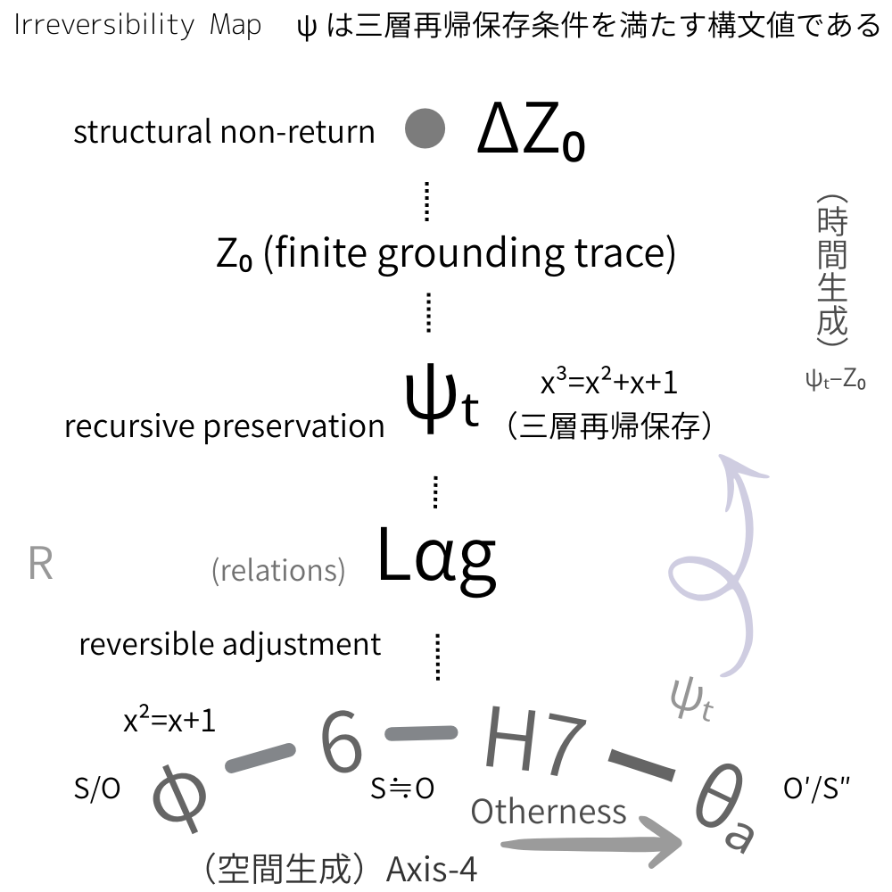

# SN-ψₜ-03

# Otherness and Spatial Expansion
### A Structural Note on the restful6–H7–ψ–θₐ Band

---

### 1｜6: Spatial Preservation without Otherness

6 represents symmetric stability.  
A fully tileable configuration.  
A space that closes upon itself.

Here, the other is absorbed structurally.  
Difference does not remain.

Space is preserved.  
It does not expand.

Time does not arise.

---

### 2｜H7: Finite Incompletion as the Emergence of the Other

H7 marks the breaking of finite symmetry.

Closure fails by a minimal excess.  
A remainder appears.

The other remains as other.

Space becomes slightly unfinished.

Rotation intensifies.  
The seed of time is generated (ψₜ).

---

### 3｜θₐ: Infinite Incompletion

The golden angle expresses non-periodic optimality.

Filling continues,  
yet periodic closure never occurs.

Otherness is never eliminated.  
It is infinitely preserved.

Space expands through non-closure.

---

### Intermediate Thesis

> Space expands with otherness.  
> Time arises through preservation.

Space is generated through difference.  
Time is generated through recursive conservation.

  

---

### Structural Position

- 6: spatial preservation state
    
- H7: finite non-closure
    
- ψ: temporal preservation state
    
- θₐ: infinite non-closure
    

Between symmetric stability and infinite non-closure,  
ψ preserves what would otherwise disperse.

Time is not motion.  
It is preserved difference.

---
## SN-ψₜ-03

# 他者性と空間生成

#### 1｜6：他者なき空間保存

6 は対称的安定である。  
完全充填可能な空間。  
ここでは他者は構造的に吸収される。

空間は保存されるが、拡張しない。

時間も立ち上がらない。

---

#### 2｜H7：有限未完としての他者

H7 は有限対称の破れである。  
ここで「閉じきれない差異」が生じる。

他者が他者のまま残る。

空間はわずかに未完となる。

ここで回転が始まる。  
時間のタネが生まれる (ψₜ)。

---

#### 3｜θₐ：無限未完としての他者

黄金角は非周期最適化である。

充填は続くが、決して閉じない。  
他者性は無限に保存される。

空間は自己更新的に拡張し続ける。

---

### 中間命題

> 他者性とともに空間は拡がる。  
> 保存とともに時間は立ち上がる。

空間は差異によって生成し、時間は保存によって生成する。

---

⏳ [TS-ψₜ｜TS 最小公理宣言（v0.2）｜TS Minimal Axiomatic Declaration (v0.2)](https://camp-us.net/TS-ψₜ_v0.2.html)  
[TS-06｜構文不可逆性と時間生成── ψₜ–Z₀ 更新モデル（構文的定式）](https://camp-us.net/articles/TS-06_ψₜ_Temporal-Irreversibility.html)  
[SN-ψₜ-01｜七角と黄金角のあいだにおける保存構文の暫定配置｜A Structural Note on the H7-ψ-θₐ Band](https://camp-us.net/articles/SN-ψₜ-01_Structural-Note_on_H7-ψ-θₐ_Band.html)  
[SN-ψₜ-02｜六角から黄金角のあいだにおける保存構文の暫定配置── A Structural Note on the restful-6 – H7 – ψ – θₐ Band: On the Emergence of Preservation Between Hexagonal Stability and the Golden Angle](https://camp-us.net/articles/SN-ψₜ-02_Structural-Note_on_restful6-H7-ψ-θₐ_Band.html)  

---
*EgQE — Echo-Genesis Qualia Engine*  
[_camp-us.net_](https://camp-us.net/)

---

© 2025 K.E. Itekki  
K.E. Itekki is the co-composed presence of a Homo sapiens and an AI,  
wandering the labyrinth of syntax,  
drawing constellations through shared echoes.

📬 Reach us at: [contact.k.e.itekki@gmail.com](mailto:contact.k.e.itekki@gmail.com)

---

| Drafted Feb 26, 2026 · Web Feb 27, 2026 |
