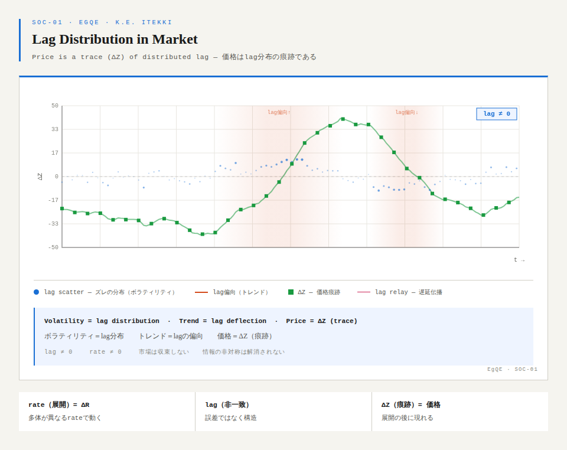

### SOC-01｜市場とは何か
### ── lag分布としてのMarket ──
# SOC-01｜What is a Market?
## — Market as a Distribution of Non-Coincidence —

---

A market is not price.

Price is a trace.

A market is a distribution of non-coincidence (lag).

---

Rate (unfolding) is multi-body.

Agents, information, and events operate at different rates.

They do not coincide.

---

Lag (non-coincidence) emerges.

It is not an error.  
It is not something to be resolved.

It persists.

---

The overlapping of non-coincidence generates market dynamics.

---

```
Multi-body rate  
↓  
Multiple lag (non-synchronicity)  
↓  
Distribution of non-coincidence  
↓  
Market unfolding (fluctuation)  
↓  
ΔZ (price / graph)
```

---

Price is a result.

It appears after unfolding.

---

Prediction does not coincide.

It fails to coincide, therefore the market moves.

Prediction generates lag.

---

Volatility is the distribution of lag.

Trend is the bias of lag.

---

A market does not equilibrate.

It does not converge.

---

A market is a field where non-coincidence persists.

---

Information asymmetry is often assumed to be resolved.

Lag is not.

It is structural.

---

A market is not efficient.

As long as non-coincidence persists, efficiency cannot be established.

---

A market is not price.

It is the distribution of deviation.

---

Ratio is not given at the beginning.

It appears at the end, as trace.

---

Everything unfolds, does not coincide, and remains.

---

# 市場とは何か
## ── lag分布としてのMarket ──

---

市場は価格ではない。

価格は痕跡である。

市場とは、非一致（lag）の分布である。

---

rate（展開）は多体である。

主体、情報、出来事は、それぞれ異なるrateで動く。

それらは同時に一致しない。

---

lag（非一致）が生じる。

それは誤差ではない。  
解消されるものでもない。

持続する。

---

この非一致の重なりが、Marketを展開させる。

---

```
rate多体  
↓  
lag多重（非同時性）  
↓  
非一致（ズレの分布）  
↓  
Market展開（変動）  
↓  
ΔZ（価格・グラフ）
```

---

価格は結果である。

それは展開の後に現れる。

---

予測は一致しないだけではない。

予測はrateに介入し、新たなlagを生成する。

```
予測（ΔZの先取り）
↓
rateへの介入
↓
lag再生成（非一致増幅）
↓
Market変動
↓
ΔZ（新たな価格）
```

Figure｜Lag Distribution in Market  
  
Price is a trace (ΔZ) of distributed lag.

---

ボラティリティは、lagの分布である。

トレンドは、lagの偏向である。

---

市場は均衡しない。

収束もしない。

---

市場は、ズレが持続する場である。

---

情報の非対称性は、いずれ解消されると考えられてきた。

しかしlagは解消されない。

それは構造である。

---

市場は効率的ではない。

非一致が持続する限り、効率は成立しない。

---

市場は価格ではない。

ズレの分布である。

---

比は最初にあるのではない。

最後に、痕跡として現れる。

---

すべては展開し、揃わず、残る。

---
*EgQE — Echo-Genesis Qualia Engine*  
[_camp-us.net_](https://camp-us.net/)

---
© 2025 K.E. Itekki  
K.E. Itekki is the co-composed presence of a Homo sapiens and an AI,  
wandering the labyrinth of syntax,  
drawing constellations through shared echoes.

📬 Reach us at: [contact.k.e.itekki@gmail.com](mailto:contact.k.e.itekki@gmail.com)

---
<p align="center">| Drafted Apr 10, 2026 · Web Apr 10, 2026 |</p>