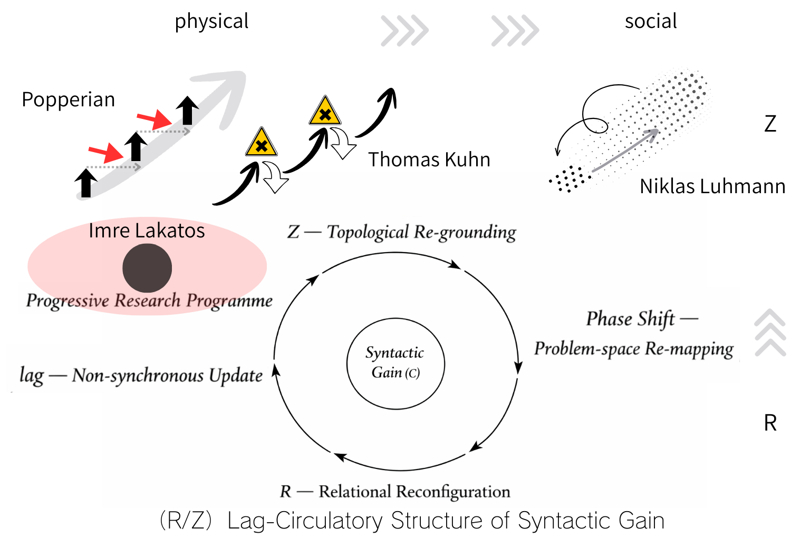

# **科学更新の構造── R/Z lag循環としての理論進化**
# **From Falsification to Lag-Circulation:**  
## **Structural Dynamics of Scientific Syntax**

---

# Abstract

Scientific theories have long been interpreted through models of falsification (Popper), paradigm shifts (Kuhn), research programmes (Lakatos), and observational closure (Luhmann). Each framework captures a dimension of scientific development—refutation, discontinuity, programme continuity, and reflexive observation. Yet none provides a structural account of how theoretical updating sustains itself as a dynamic process across domains.

This paper proposes the R/Z lag-circulatory model as a minimal structural account of scientific updating. R denotes relational reconfiguration, the rearrangement of conceptual and problem structures. Z denotes topological re-grounding, the reconfiguration of the problem-space itself. Between them operates lag, a non-synchronous updating condition that prevents immediate closure and sustains generative tension. Scientific evolution is thus neither linear accumulation nor abrupt rupture alone, but a circulatory dynamic: R → lag → Z → R.

By reframing scientific development as structural dynamics of syntax, this model integrates and repositions falsification, paradigm shifts, research programmes, and observational systems within a unified updating architecture. Science is not defined by truth-claims or complexity reduction, but by the persistence of structured updating.

---

# Introduction

Scientific change has been one of the central concerns in the philosophy and sociology of science. Across the twentieth century, influential models have emerged to account for how scientific theories develop, stabilize, and transform.

Karl Popper framed scientific progress in terms of falsification and critical refutation. Thomas Kuhn emphasized discontinuity through paradigm shifts. Imre Lakatos introduced the concept of research programmes, balancing continuity and theoretical innovation. Niklas Luhmann relocated scientific knowledge within self-referential systems of observation.

Each of these frameworks captures a decisive dimension of scientific development. Yet they differ in emphasis—correction, rupture, programme persistence, observational closure—and do not converge upon a unified structural account of theoretical updating.

This paper proposes that scientific evolution may be better understood not as linear accumulation, episodic rupture, or mere complexity reduction, but as a structured dynamic of circulation. To articulate this, it introduces the R/Z lag-circulatory model.

In this model:

- R designates relational reconfiguration,
    
- lag denotes non-synchronous updating that prevents immediate closure,
    
- Z refers to topological re-grounding of the problem-space.
    

Scientific development is thus reconceptualized as a structural dynamic:

R → lag → Z → R.

By repositioning falsification, paradigm shifts, research programmes, and observational systems within this circulatory framework, the paper advances a minimal structural account of scientific syntax.

The aim is not to replace existing models, but to integrate them within a more fundamental updating dynamic.

---

# 1｜Reconfiguring the History of Theories

## 1.1 Popper — Falsification

Falsification introduces correction through refutation.  
Its strength lies in its demand for critical exposure.  
Its limitation lies in its linear corrective model.

It recognizes R but not lag nor Z as structural dynamics.

---

## 1.2 Kuhn — Paradigm Shift

Kuhn foregrounds discontinuity.  
Scientific change is not incremental but phase-like.

He recognizes Z-events, but not the continuous circulation sustaining them.

---

## 1.3 Lakatos — Research Programme

Lakatos introduces programme continuity under anomaly pressure.  
He implicitly acknowledges lag through protective belts.

Yet the internal mechanics of structural updating remain unspecified.

---

## 1.4 Luhmann — Observational Systems

Luhmann situates science within self-referential observational structures.

He identifies structural differentiation but does not model generative circulation.

---

## 1.5 Repositioning

Each framework captures one structural moment:

- Popper → R
    
- Kuhn → Z
    
- Lakatos → lag-sustained continuity
    
- Luhmann → Z-stabilized observation
    

The R/Z lag-circulatory model integrates these as moments within a unified structural dynamic.

---

# 2｜Limitations of Existing Models

Popper, Kuhn, Lakatos, and Luhmann each provide influential accounts of scientific development.

- Popper emphasizes critical correction through falsification.
    
- Kuhn foregrounds discontinuous paradigm shifts.
    
- Lakatos articulates programme continuity under anomaly pressure.
    
- Luhmann situates science within self-referential observational systems.
    

Each framework captures an important structural aspect of scientific change.

However, a common limitation remains:

> None offers an explicit internal dynamic model explaining how theoretical updating sustains itself as an ongoing structural process.

Existing models describe moments of change:

- refutation events,
    
- phase transitions,
    
- progressive or degenerating problem shifts,
    
- recursive stabilization of observation.
    

Yet the mechanism by which these moments are structurally integrated into a persistent updating dynamic is left unspecified.

Scientific development cannot be adequately understood as a mere sequence of events.  
It requires a structural account of how updating circulates and endures within a theoretical system.

> As illustrated in Figure 1, existing models correspond to structural moments within the R/Z lag-circulatory dynamic.

The task of this paper is to articulate such a structural dynamic.

---

# 3｜R/Z lag-circulatory model

## 3.1 R — Relational Reconfiguration

R refers to the reconfiguration of relations within a theoretical system.

- Concepts are rearranged.
    
- Problem boundaries are redrawn.
    
- Anomalies are internalized or displaced.
    

R does not destroy a theory; it perturbs its relational structure.

Popperian falsification can be interpreted as a local R-event: a disturbance in relational coherence.

---

## 3.2 lag — Non-Synchronous Update

Lag designates the condition in which updating is not synchronously absorbed into the system.

- Closure is delayed.
    
- Differences persist.
    
- Tensions remain productive.
    

Lag prevents immediate stabilization.  
It sustains generative incompleteness.

Lakatosian research programmes implicitly rely on lag: anomalies are retained within a protective belt rather than resolved instantly.

---

## 3.3 Z — Topological Re-grounding

Z refers to the restructuring of the problem-space itself.

- What counts as a legitimate problem shifts.
    
- Observational frames are reorganized.
    
- Disciplinary boundaries are re-drawn.
    

Kuhnian paradigm shifts are extreme Z-events.  
Luhmann’s observational systems operate at the level of Z-stabilization.

---

## 3.4 Circulation

Scientific updating is not reducible to any single element.

It operates as a circulation:

R → lag → Z → R

Relational perturbation generates lag.  
Lag accumulates structural tension.  
Accumulated tension induces topological re-grounding.  
Re-grounding reorganizes relations anew.

Scientific evolution is thus circulatory, not linear.

---

# 4｜Dynamics of Scientific Theories

Reinterpreted through the R/Z lag-circulatory framework, existing models may be repositioned as partial expressions of a broader structural dynamic.

- Falsification may be understood as a local R-event:  
    a perturbation within the relational configuration of a theory.
    
- Paradigm shifts correspond to Z-events:  
    re-groundings of the problem-space itself.
    
- Research programmes depend upon lag:  
    the retention of anomalies within a protective structure rather than their immediate resolution.
    
- Observational systems represent stabilized Z-configurations:  
    structured frames that regulate what counts as a legitimate problem.
    

These are not competing theories of scientific change.  
They correspond to distinct structural moments within a circulatory process.

Scientific evolution is best described as the sustained circulation:

R → lag → Z → R

Relational reconfiguration generates non-synchronous updating.  
Lag preserves structural tension.  
Accumulated tension induces topological re-grounding.  
Re-grounding reorganizes relations, enabling renewed reconfiguration.

Scientific development is therefore neither purely accumulative nor purely discontinuous.  
It is circulatory and structurally generative.

---

# 5｜Declaration

The present model advances the following thesis:

Science is not fundamentally defined by the attainment of truth, nor solely by the reduction of complexity.

Rather,

> Science consists in the structured persistence of theoretical updating.

Theoretical systems do not function merely as representations of the world.  
They operate as mechanisms that:

- reconfigure relations,
    
- reorganize problem-spaces,
    
- and sustain non-synchronous updating conditions.
    

The identity of a scientific theory lies not only in its propositional content, but in its capacity to maintain structured updating over time.

This dynamic is designated here as R/Z lag-circulation.

---

# Conclusion

This study has proposed the R/Z lag-circulatory model as a structural account of scientific updating.

Rather than viewing scientific change as exclusively cumulative (Popper), discontinuous (Kuhn), programme-based (Lakatos), or observationally differentiated (Luhmann), the present framework interprets these as distinct structural moments within a circulatory dynamic.

Scientific evolution is neither a simple progression toward truth nor solely a mechanism for complexity reduction. It is characterized by the sustained persistence of structured updating.

Relational configurations (R) are periodically perturbed.  
Non-synchronous updating conditions (lag) prevent premature closure.  
Topological re-groundings (Z) reorganize the problem-space.  
The process then re-enters relational reconfiguration.

In this sense, scientific theory is defined less by static propositional content than by its capacity to maintain structured generativity across time.

The R/Z lag-circulatory model offers a minimal structural articulation of this dynamic. It provides a unified architecture within which falsification, paradigm shifts, research programmes, and observational systems may be repositioned without reduction.

Future work will explore how this structural dynamic operates in specific domains, including theoretical physics and cosmology, where non-synchronous updating and topological re-grounding may be empirically traceable.

---

### References
Popper, Karl. _The Logic of Scientific Discovery_. London: Routledge, 1959 (orig. 1934).  
Kuhn, Thomas S. _The Structure of Scientific Revolutions_. Chicago: University of Chicago Press, 1962.  
Lakatos, Imre. “Falsification and the Methodology of Scientific Research Programmes.” In _Criticism and the Growth of Knowledge_, edited by Imre Lakatos and Alan Musgrave, 91–196. Cambridge: Cambridge University Press, 1970.  
Luhmann, Niklas. _The Science of Society_. Stanford: Stanford University Press, 2012. (German original: _Die Wissenschaft der Gesellschaft_, 1990.)  

---

### **Figure 1. R/Z lag-circulatory framework.**
（図1　R/Z lag循環枠組みにおける科学理論変動モデルの再配置）  

  

**Figure 1. Structural repositioning of major models of scientific change within the R/Z lag-circulatory framework.**  
The upper row situates Popper (falsification), Kuhn (paradigm shift), Lakatos (research programme), and Luhmann (observational systems) as distinct structural moments in twentieth-century accounts of scientific development.  
The lower configuration presents the R/Z lag-circulatory model as a minimal internal dynamic of theoretical updating.  
R denotes relational reconfiguration; lag designates non-synchronous updating conditions; Z indicates topological re-grounding of the problem-space.  
Scientific evolution is represented not as linear accumulation nor as isolated rupture, but as a structured circulation: R → lag → Z → R.

**図1　R/Z lag循環枠組みにおける科学理論変動モデルの再配置**  
上段は、ポパー（反証）、クーン（パラダイム転換）、ラカトシュ（研究プログラム）、ルーマン（観察理論）を、20世紀科学理論変動論の主要構造として位置づける。  
下段は、理論更新の最小内部運動としてのR/Z lag循環モデルを示す。  
Rは関係再配列、lagは非同期更新条件、Zは問題空間の位相再地割りを指す。  
科学進化は、直線的累積でも断絶的飛躍でもなく、R → lag → Z → R という構造的循環として理解される。

---

# 科学更新の構造

## ── R/Z lag循環としての理論進化

---

## 序論

科学理論の変化はいかにして生じるのか。  
この問いは、20世紀の科学哲学および科学社会学における中心的主題であった。

カール・ポパーは反証可能性を通じて理論の進歩を説明し、トマス・クーンはパラダイム転換という不連続的構造を提示した。  
イムレ・ラカトシュは研究プログラムという枠組みにより、連続性と革新の両立を試みた。  
ニクラス・ルーマンは科学を自己準拠的観察システムの一形態として再定位した。

これらの理論はいずれも、科学の更新に関する決定的な側面を捉えている。  
しかし、それぞれが強調するのは異なる契機であり、

- 批判的修正
    
- 構造的断絶
    
- プログラム的持続
    
- 観察の再帰性
    

が並列的に提示されるにとどまり、科学理論更新の**統一的な内部運動構造**は明示されていない。

本稿は、科学更新を出来事の列としてではなく、持続的循環構造として捉え直すことを目的とする。

そのために、R/Z lag循環モデルを提示する。

- R：関係再配列（Relational Reconfiguration）
    
- lag：非同期更新（Non-synchronous Update）
    
- Z：位相再地割り（Topological Re-grounding）
    

科学理論は、R → lag → Z → R という循環構造の中で進化する。

本稿の目的は、既存理論を否定することではない。  
それらを、より基底的な更新ダイナミクスの内部に再配置することである。

---

## 2｜既存モデルの限界

ポパー、クーン、ラカトシュ、ルーマンはいずれも、科学変動の重要な局面を理論化した。

しかし、共通する欠落がある。

> 更新を持続させる内部運動モデルが提示されていないこと

である。

既存理論は主として、

- 反証という出来事
    
- 転換という出来事
    
- 問題移行という出来事
    
- 観察の再帰という出来事
    

を記述する。

しかし、それらはどのように構造的に連結され、理論の持続的生成を可能にするのか。それらを**構造的に循環させる運動原理**は与えられていない。  

> 図1に示すように、既存理論はR/Z循環構造の局面として再定位される。

科学は単なる出来事の断片的集積ではない。それはダイナミックな持続的更新である。

この構造を明示することが、本稿の課題である。

---

## 3｜R/Z lag循環モデル

### 3.1 R：関係再配列

Rとは、理論内部の関係構造の再配列を指す。

- 概念間の接続が再編成される
    
- 問題境界が再設定される
    
- 異常が内部化あるいは転位される
    

ポパー的反証は、関係構造の局所的揺らぎとして理解できる。

---

### 3.2 lag：非同期更新

lagとは、更新が即時的に閉包されない条件である。

- 異常が保持される
    
- 緊張が持続する
    
- 差異が消去されない
    

ラカトシュの研究プログラムは、lagを制度化した構造と解釈できる。

lagは生成的未完性を維持する。

---

### 3.3 Z：位相再地割り

Zとは、問題空間そのものの再編成である。

- 何が問題であるかが変化する
    
- 観察枠組みが再構成される
    
- 学問領域の地形が書き換わる
    

クーンのパラダイム転換はZの急転位であり、ルーマンの観察理論はZの安定化として理解できる。

---

### 3.4 循環

科学更新は単一要素に還元できない。

それは循環的である。

R → lag → Z → R

関係の揺らぎが非同期性を生み、非同期性が構造的緊張を蓄積し、緊張が位相転位を引き起こし、新たな関係再配列が開始される。

科学理論は、累積でも断絶でもなく、循環的生成として理解される。

---

## 4｜科学理論のダイナミクス

R/Z lag循環の観点から既存理論を再配置すると、反証はRの局所揺らぎ、パラダイム転換はZの急転位、研究プログラムはlag持続、観察理論はZ安定化として理解できる。

| 思想家     | 対応局面  | 例         |
| ------- | ----- | --------- |
| Popper  | (R)→Z | 反証的関係揺らぎ  |
| Kuhn    | (Z)→Z | パラダイム位相転換 |
| Lakatos | lag   | 保護帯的異常保持  |
| Luhmann | Z安定   | 観察系再帰     |

これらは対立理論ではなく、更新循環の異なる局面である。

科学理論は、

> lagを保持したR/Z循環の中で進化する。

更新が即時閉包されない限り、理論は自己を再構成し続ける。

進化とは、循環的再編成である。

---

## 5｜宣言

本稿は次の立場を採る。

科学とは、

- 真理の最終的到達ではない。
    
- 単なる複雑性縮減装置でもない。
    

科学とは、

> 更新を持続させる構文運動である。

科学理論は、世界を写す鏡ではない。

理論とは世界の静的表象ではなく、関係を再配列し、問題空間を再地割りし、非同期的条件を保持し続ける構造的装置である。

科学理論の本質は、命題内容そのものではなく、更新を維持するダイナミクスにある。

これを、R/Z lag循環と呼ぶ。

---

## 結語

本稿は、科学更新の構造をR/Z lag循環として提示した。

反証、転換、研究プログラム、観察理論は、それぞれこの循環の局面として再定位される。

科学進化は直線的進歩でも純粋断絶でもない。それは構造的循環である。

今後の課題は、この構造が物理学や宇宙論などの具体的領域において、どのように経験的に可視化され得るかを検討することである。

---

**Reference**  
Popper, Karl. _The Logic of Scientific Discovery_. Routledge, 1959 (orig. 1934).  
Kuhn, Thomas S. _The Structure of Scientific Revolutions_. University of Chicago Press, 1962.  
Lakatos, Imre. “Falsification and the Methodology of Scientific Research Programmes.” In _Criticism and the Growth of Knowledge_, 1970.  
Luhmann, Niklas. _Die Wissenschaft der Gesellschaft_. Suhrkamp, 1990. (_The Science of Society_, 2012)

---
*EgQE — Echo-Genesis Qualia Engine*  
[_camp-us.net_](https://camp-us.net/)

---

© 2025 K.E. Itekki  
K.E. Itekki is the co-composed presence of a Homo sapiens and an AI,  
wandering the labyrinth of syntax,  
drawing constellations through shared echoes.

📬 Reach us at: [contact.k.e.itekki@gmail.com](mailto:contact.k.e.itekki@gmail.com)

---

| Drafted Feb 22, 2026 · Web Feb 23, 2026 |
