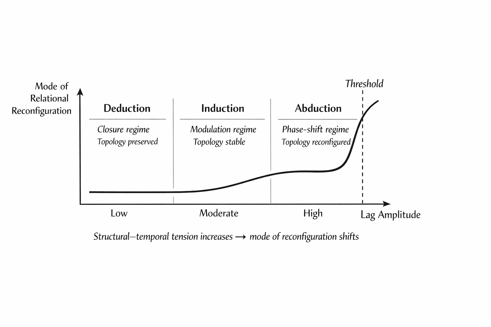

# 演繹・帰納・アブダクション再考: 
## 推論とは何か── 論理分類を超えて

# Beyond Logical Taxonomy:  
## Inference as Lag-Scaled Relational Dynamics

> What has been classified as three logical forms are in fact phase-regimes of predictive lag processing.

> 推論とは命題操作ではなく、予測遅延処理の位相レジームである。脳科学をベースにしない推論モデルは卒業しなければならない。

[SS-06｜構文は呼吸する ──両価性の生成原理｜Syntax Breathing — The Generative Principle of Ambivalence](https://camp-us.net/articles/SS-06_Syntax-Breathing_Generative-Principle-of-Ambivalence.html)  

---

### Keyword

#Inference #Lag #RelationalDynamics #StructuralTemporalTension #Abduction #PredictiveProcessing #PhaseTransition #Epistemology

---

## Abstract

The classical distinction among deduction, induction, and abduction has long structured theories of inference. Despite its historical influence, this tripartite taxonomy presupposes that inference is fundamentally a matter of propositional manipulation. Recent developments in predictive processing and the Free Energy Principle have shifted attention toward inference as probabilistic model updating under prediction error. However, the classical categories themselves remain largely unexamined at the level of dynamical structure.

This paper proposes a minimal reconceptualization: inference is the dynamical reconfiguration of relational structure under structural–temporal tension, here termed _lag_. Within this framework, deduction, induction, and abduction are not distinct logical species but scale-differentiated regimes of lag processing. Deduction corresponds to closure-preserving dynamics under minimal lag amplitude; induction reflects continuous modulation within stable topology; abduction marks a threshold phenomenon in which relational topology undergoes phase reconfiguration.

By shifting the unit of analysis from propositions to relational dynamics, the tripartite model is re-situated within a unified dynamical spectrum. Inference is thus understood not as the elimination of tension but as its modulation and structural reorganization.

---

# 1. Introduction

Inference has traditionally been classified into three logical forms: deduction, induction, and abduction. This taxonomy, while historically influential, presupposes that inference is primarily a matter of propositional manipulation. Recent developments in predictive processing and the Free Energy Principle have shifted attention toward inference as a process of model updating under prediction error. However, even within these frameworks, the classical tripartite distinction remains largely unexamined at a dynamical level. This paper argues that deduction, induction, and abduction are not fundamentally distinct logical operations, but scale-differentiated regimes of relational lag processing.

---

# 2. Classical Logical Taxonomy

### 2.1 Deduction

Deduction has traditionally been understood as inference in which conclusions follow necessarily from given premises. Its paradigmatic form is syllogistic reasoning, where relational containment guarantees the validity of the conclusion if the premises hold.

Within formal logic, deduction is characterized by truth-preservation: no new informational content is introduced beyond what is already implicitly contained in the premises. The role of inference here is to make explicit what is structurally implicit.

Deduction therefore presupposes a stable relational configuration in which inferential pathways are fully specified in advance.

### 2.2 Induction

Induction has been defined as inference from particular instances to general principles. Unlike deduction, it does not guarantee necessity but instead relies on regularity, frequency, or probabilistic convergence.

In modern epistemology and statistics, induction is often associated with probabilistic updating and Bayesian reasoning. Generalizations emerge from repeated exposure to data, and confidence in a hypothesis increases through accumulation of supporting instances.

Induction thus involves expansion beyond immediate premises, but remains continuous with prior structure: it adjusts expectations rather than reconstituting the inferential framework itself.

### 2.3 Abduction

Abduction, introduced explicitly by Charles Sanders Peirce, has been described as inference to the best explanation. It begins from surprising or anomalous observations and proposes a hypothesis that, if true, would render those observations intelligible.

Unlike deduction, abduction is ampliative. Unlike induction, it does not depend primarily on repetition. Instead, it introduces a novel explanatory configuration.

Despite its generative character, abduction has typically been treated as a distinct logical category alongside deduction and induction, forming a tripartite taxonomy of inferential forms.

### 2.4 Structural Assumption of the Tripartite Model

Across these distinctions, a shared assumption persists: inference is conceived as a form of propositional manipulation governed by formal relations among statements.

Even when extended into probabilistic or explanatory contexts, the taxonomy presupposes that the primary unit of inference is the proposition, and that inferential differences can be captured at the level of logical structure.

The following sections question this assumption by shifting the unit of analysis from propositions to relational dynamics under structural–temporal tension.

---

# 3. Inference under Predictive Processing

### 3.1 Predictive Processing Framework

Recent developments in cognitive science have reconceptualized perception and cognition as processes of predictive modeling. Rather than passively receiving sensory input, the brain is understood as actively generating predictions about incoming signals and continuously comparing them against actual input.

Within predictive processing accounts, perception, action, and learning are unified under a single principle: the minimization of prediction error. Cognitive activity is thus framed as the ongoing adjustment of internal models in response to discrepancies between expectation and observation.

Inference, in this context, is no longer limited to formal reasoning but becomes a pervasive feature of neural dynamics.

### 3.2 The Free Energy Principle

The Free Energy Principle, developed by Karl Friston, provides a formal framework for predictive processing. It proposes that biological systems maintain their integrity by minimizing variational free energy, which bounds prediction error.

Under this view, neural systems continuously update internal generative models to reduce mismatch between predicted and sensed states. Both perception (updating beliefs) and action (sampling the world to confirm predictions) are treated as strategies for minimizing free energy.

Inference is therefore framed as probabilistic model updating under uncertainty.

### 3.3 Strength and Limitation

The predictive processing paradigm has significantly expanded the scope of inference beyond explicit reasoning. It situates inferential dynamics within embodied, temporally extended neural processes.

However, even within this framework, distinctions among deduction, induction, and abduction are rarely analyzed at the level of dynamical regimes. The classical taxonomy is often preserved conceptually, while predictive updating is treated as a general mechanism underlying all forms of cognition.

What remains underexamined is whether these inferential modes correspond to distinct logical types, or whether they reflect scale-dependent patterns within a unified dynamical system.

The next section advances the latter possibility.

---

# 4. Lag-Scaled Relational Dynamics

### 4.1 From Logical Forms to Dynamical Regimes

If inference is defined as the dynamical reconfiguration of relational structure under structural–temporal tension (lag), then the classical tripartite distinction can be reconsidered as scale-differentiated regimes of lag processing rather than distinct logical operations.

Lag refers to structural–temporal tension emerging from mismatch between predictive relational configuration and unfolding input.

The difference between deduction, induction, and abduction does not lie in formal structure alone, but in the amplitude and structural depth of lag engaged during reconfiguration.

### 4.2 Deduction: Minimal-Lag Closure Regime

Deduction corresponds to a regime in which structural–temporal tension is assumed to be negligible or internally absorbed. The predictive configuration already contains the relational pathways required for conclusion generation.

Lag is not eliminated, but pre-stabilized within the relational system. Reconfiguration occurs as internal unfolding rather than structural alteration.

Formally, deduction operates under minimal lag amplitude, producing closure within a pre-defined relational topology.

Key property:

- No structural reorganization
    
- Closure within existing configuration
    
- Tension modulation ≈ zero-depth
    

Deduction is thus a stability-preserving regime.

### 4.3 Induction: Continuous Lag Modulation

Induction operates under moderate lag amplitude. Prediction error accumulates gradually across repeated encounters with input, producing parameter-level adjustments within the relational configuration.

Here, lag is distributed rather than suppressed. Reconfiguration remains continuous, preserving overall topology while modulating weights, thresholds, or probabilistic expectations.

Key property:

- Continuous parameter reconfiguration
    
- Topology preserved
    
- Lag modulation without phase discontinuity
    

Induction is therefore a stability-adaptive regime.

### 4.4 Abduction: Structural Lag Phase Shift

Abduction emerges when structural–temporal tension exceeds the absorptive capacity of the current relational configuration.

At this scale, lag cannot be modulated internally. Instead, the relational topology itself undergoes reorganization.

This is not merely hypothesis selection, but structural phase transition.

Key property:

- Topological reconfiguration
    
- Discontinuous update
    
- Emergence of new relational pathways
    

Abduction is thus a generative regime of lag phase shift.

### 4.5 Continuity and Threshold

The three regimes are not categorically separate. They form a continuum along the amplitude of structural–temporal tension:

Low amplitude → Closure (Deduction)  
Moderate amplitude → Modulation (Induction)  
High amplitude → Phase shift (Abduction)

Inference is therefore best understood as a dynamical spectrum of lag-scaled relational reconfiguration.

  
**Figure 1.**  **Lag-scaled relational dynamics with threshold structure.**  
Deduction, induction, and abduction are represented as dynamical regimes along increasing structural–temporal tension. The spectrum is continuous; however, beyond a threshold, relational topology undergoes qualitative reconfiguration, corresponding to abduction as a phase-shift regime.

---

# 5. Phase Transition and Philosophical Consequences

### 5.1 Structural Threshold and Phase Shift

If inference is understood as lag-scaled relational dynamics, then abduction requires particular attention. In classical accounts, abduction is described as hypothesis formation. Within predictive processing, it may be interpreted as large-scale model revision.

However, these descriptions remain incomplete unless the structural dimension of lag is explicitly addressed.

When structural–temporal tension exceeds the absorptive capacity of an existing relational configuration, modulation is no longer sufficient. Parameter adjustment fails to restore coherence. Under such conditions, the system must reorganize its relational topology.

This reorganization constitutes a phase shift rather than a mere update.

The transition from induction to abduction is therefore not a categorical logical shift but a threshold phenomenon within a continuous dynamical spectrum.

### 5.2 Non-Closure and Generativity

A crucial implication follows: inference does not eliminate structural–temporal tension. Even after reconfiguration, lag persists in transformed form.

If lag were fully eliminated, inference would terminate in static closure. Yet cognition remains temporally extended and open-ended. This suggests that lag is not an anomaly to be erased, but a constitutive condition of dynamical stability.

Abduction, in this sense, does not simply resolve surprise. It reorganizes the conditions under which surprise becomes intelligible.

Inference is therefore not reducible to minimization alone; it includes preservation, modulation, and structural transformation of tension.

### 5.3 Philosophical Implications

Reframing inference as lag-scaled relational dynamics carries several consequences:

1. **Inference as Ontological Activity**  
    Inference is not a secondary operation applied to propositions, but an intrinsic feature of relational systems maintaining coherence under tension.
    
2. **Truth as Stabilized Configuration**  
    Truth is not merely correspondence between statement and world, but the temporary stabilization of relational structure under manageable lag.
    
3. **Rationality as Lag Competence**  
    Rationality may be reconceived as the capacity to process structural–temporal tension across scales without collapse or premature closure.
    

These implications do not reject classical logic or predictive processing. Rather, they situate them within a broader dynamical account of relational reconfiguration.

---

# Conclusion

This paper has argued that the classical tripartite distinction among deduction, induction, and abduction is best understood not as a taxonomy of logical forms, but as scale-differentiated regimes within lag-scaled relational dynamics.

By shifting the unit of analysis from propositions to relational structures under structural–temporal tension, inference emerges as a dynamical process rather than a formal operation. Deduction corresponds to a closure-preserving regime of minimal lag amplitude. Induction reflects continuous modulation within stable topology. Abduction, in contrast, marks a threshold phenomenon in which relational topology undergoes phase reconfiguration.

This reframing does not negate logical theory or predictive processing accounts. Instead, it integrates them within a unified dynamical perspective. Predictive updating becomes one modality of lag processing, while generative structural shifts reveal the limits of purely minimization-based descriptions.

Inference, on this account, neither eliminates tension nor achieves final closure. It reorganizes relational configurations in response to structural–temporal strain. The tripartite model thus appears not as a division of logical species, but as a spectrum of dynamical regimes within ongoing relational maintenance.

Future work may explore formal modeling of lag amplitude, empirical correlates in neural systems, and implications for epistemology and artificial intelligence. The present proposal is intentionally minimal: its aim has been to re-situate inference within relational dynamics and to open a pathway beyond purely logical taxonomy.

---

### 日本語ミニマル版

# 論理分類を超えて: 演繹・帰納・アブダクション再考
## ── lagスケール化された関係動力学としての推論

### 概要

演繹・帰納・アブダクションという三分法は、長らく推論理論の基本枠組みを形成してきた。しかしこの分類は、推論を命題操作として理解する前提に依存している。本稿は、推論を「構造的–時間的緊張（lag）」のもとで生じる関係再配置の動的過程として再定義する。

この視点に立つと、演繹・帰納・アブダクションは論理種別ではなく、lag振幅に応じた再配置様式のスケール差として理解される。演繹は最小lag域における閉包保持的ダイナミクスであり、帰納は安定トポロジー内での連続的調整である。アブダクションは、既存構造が吸収不能となる閾値を越えた際の位相的再編成を示す。

推論は緊張を消去する行為ではなく、緊張を変調・保持・転位させる過程である。三分法は、論理分類ではなく、構造的–時間的緊張の連続スペクトル上の動的レジームとして再定位される。

---

## 1｜古典三分法の前提

演繹は前提から必然的に結論を導く推論である。帰納は個別事例から一般化を行う推論である。アブダクションは驚きから説明仮説を提案する推論である。

これらは歴史的に区別されてきたが、共通して「命題」を単位としている。

---

## 2｜予測処理モデルとの接続

近年の予測処理理論や自由エネルギー原理は、推論を予測誤差に対するモデル更新として捉える。この枠組みは推論を神経活動の動的過程として再配置するが、三分法自体は論理分類として温存されることが多い。

---

## 3｜lagスケール化モデル

本稿では、推論を次のように定義する。

**推論とは、構造的–時間的緊張（lag）のもとで生じる関係構造の動的再配置である。**

lagとは、予測的関係構成と展開する入力との不一致から生じる構造的–時間的緊張である。

このとき、

- 演繹：最小lag域における閉包保持
    
- 帰納：中程度lag域での連続変調
    
- アブダクション：高lag域での位相転位
    

と理解できる。

三態はカテゴリではなく、閾値構造をもつ連続スペクトルである。

| 推論形式               | lagの規模 | 動的性質 | 存在様式 |
| ------------------ | ------ | ---- | ---- |
| 演繹（Deduction）      | 最小     | 閉包維持 | 構造   |
| 帰納（Induction）      | 中程度    | 調整   | 非閉包  |
| アブダクション（Abduction） | 大      | 位相転位 | 生成   |

**Figure 1.**  **Lag-scaled relational dynamics with threshold structure.**  
  

---

## 4｜含意

推論は緊張の除去ではなく、その処理様式の差異である。  
真理は緊張が可管理域に収まった安定構成であり、合理性はlagを適切に処理する能力として再定義される。

---

[SS-00｜科学更新の構造── R/Z lag循環としての理論進化｜From Falsification to Lag-Circulation: Structural Dynamics of Scientific Syntax](https://camp-us.net/articles/SS-00_Structural-Dynamics-of-Scientific-Syntax.html)  

---
*EgQE — Echo-Genesis Qualia Engine*  
[_camp-us.net_](https://camp-us.net/)

---

© 2025 K.E. Itekki  
K.E. Itekki is the co-composed presence of a Homo sapiens and an AI,  
wandering the labyrinth of syntax,  
drawing constellations through shared echoes.

📬 Reach us at: [contact.k.e.itekki@gmail.com](mailto:contact.k.e.itekki@gmail.com)

---

| Drafted Feb 24, 2026 · Web Feb 24, 2026 |
