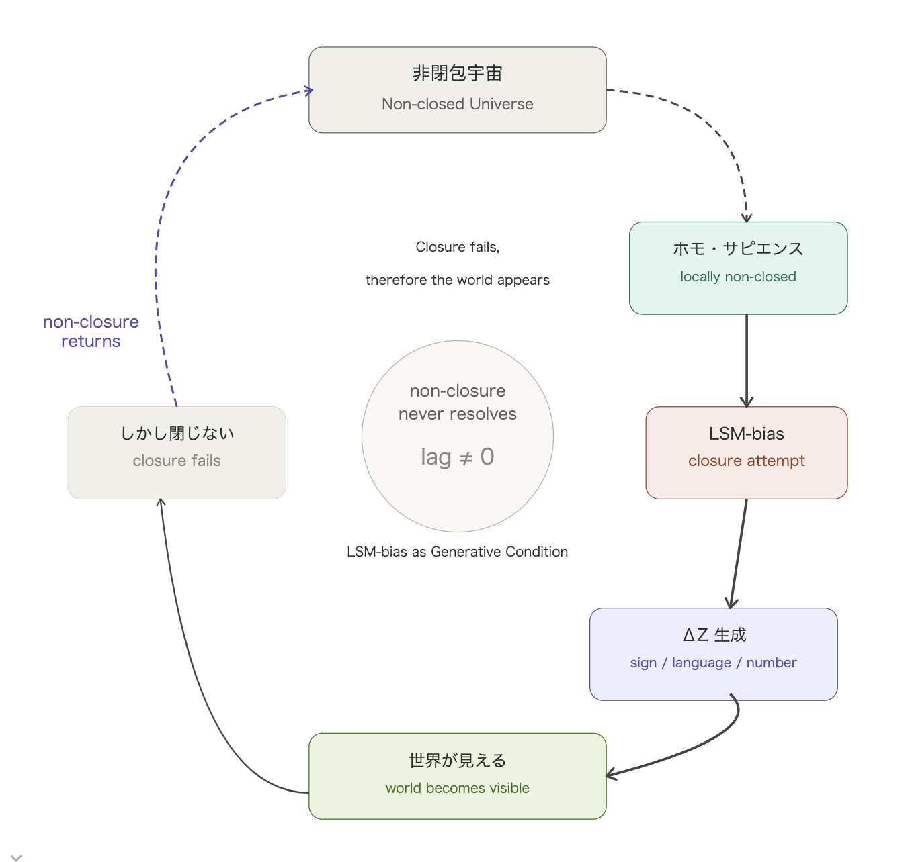
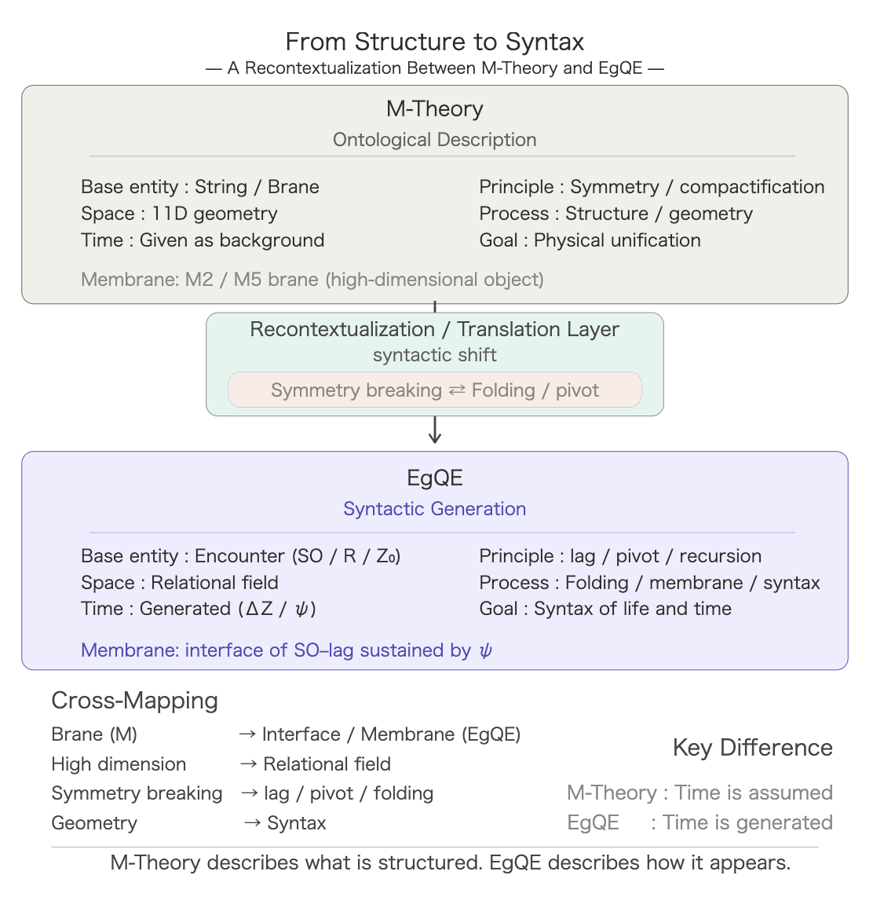

# 記号現象学 序説
## ── ホモ・サピエンスを条件とする現れの構造
## _Semiotic Phenomenology — Prolegomena:_  
### _The Structure of Appearance under the Condition of Homo sapiens_

[SX-Core｜Syntactic Exposure — Series Index](https://camp-us.net/articles/Core_SX_Syntactic-Exposure.html)  

---

## 0. 前提

本稿は、世界を対象として記述するものではない。

本稿が扱うのは：

> 世界がどのように現れ、どのように記号として残るか

である。

---

## 1. 命題

世界はそのまま存在するのではない。

> 世界は記号として現れる。

---

## 2. 条件

この現れは任意ではない。

それは：

> ホモ・サピエンスという生命条件のもとで成立する

---

## 3. 記号とは何か

記号とは：

> 持続する差異（ΔZ）である

それは：

- 現れの痕跡
- 固定された非対称
- 再帰可能な構造

---

## 4. 生成系列

```
encounter → membrane → ψ → ΔZ
```

ここで：

- encounter は現れ
- membrane は内在化
- ψ は持続
- ΔZ は記号

---

## 5. 数理現象学の位置

数理現象学とは：

> 記号現象学の一形態である

それは：

- 記号を数式として固定する試み
- 現れを構造として安定化する方法

---

## 6. 非閉包

世界は閉じていない。

- 記号は完全に固定されない
- 現れは常にずれる

このずれ（lag）が：

> 記号生成の条件である

---

## 結論

現れは消える。  
記号は残る。

世界は：

> 残された差異として存在する。

---

# Diagram: LSM-bias Loop — Closure of Non-Closure
  
(non-closure → human → bias → ΔZ → world → non-closure)

---

# バイアス論
## ── 生成条件としてのLSMバイアス
### _Bias as Generative Condition — LSM-bias and the Closure of Non-Closure_

---

## 0. 前提

本章は欠陥を論じるものではない。

本章が扱うのは：

> 記号生成の条件

である。

---

## 1. 命題

人間は非閉包を閉包として記述する存在である。

> Humans describe non-closure as closure.

---

## 2. 定義

この傾向を：

> 言語・記号・数理バイアス（LSMバイアス）

と呼ぶ。

_linguistic–semiotic–mathematical bias (LSM-bias)_

---

## 3. 構造

```
非閉包宇宙
　↓
ホモ・サピエンス（局所非閉包）
　↓
閉じようとする（LSM-bias）
　↓
ΔZ生成（記号・言語・数式）
　↓
世界が見える
　↓
しかし閉じない（非閉包に戻る）
```

---

## 4. 本質

LSMバイアスは欠陥ではない。

> 記号生成の条件である。

---

## 5. EgQEとの対応

- 非閉包宇宙 → lagが消えない場
- ホモ・サピエンス → membraneを持つ存在
- LSM-bias → ΔZを安定化しようとする傾向

---

## 6. 帰結

閉じようとする試みは失敗する。

しかしその失敗によって：

> 世界は現れる。

---

## 結論

閉包は完成しない。  
しかしその試みが：

> 記号を、言語を、数式を、世界を生む。

---

# Principia Cosmogonica
## ── 持続から生成される時間・生命・構造
### _Generation of Time, Life, and Structure from Persistence_

---

## 0. 前提

本稿は理論を比較しない。

それは記述水準を転換する：

- 存在論的構造から
- 構文的生成へ

> M-Theory describes what is structured.  
> EgQE describes how it appears.

_本稿はEgQEの立場からの再配置的読解であり、既存理論の厳密な技術的記述を目的とするものではない。_

  
_Figure 1. Recontextualization between M-Theory (ontological description) and EgQE (syntactic generation). The decisive difference: **time assumed vs. time generated**._

> Modern physics may be understood as a mathematically formalized phenomenology conditioned by life.

---

## 1. 命題

構造は与えられない。  
構造は現れる。

---

## 2. 時間の反転

従来：

> 時間は前提される

本稿：

> 時間は生成される

時間とは：

> ΔZの連続的構成である

---

## 3. 条件 — 持続（ψ）

ψとは：

> ΔZが更新され続ける条件

それは：

- 崩壊でもなく
- 停滞でもなく

> 持続の勾配である

---

## 4. 界面 — 膜

膜とは：

> SO–lagがψによって持続された界面

それは対象ではない。

> 持続の様式である

---

## 5. 生成系列

```
encounter → membrane → recursion → ψ → ΔZ
```

この持続により：

> 時間が現れる

---

## 6. 非閉包と生命

世界は非閉包である。

生命とは：

> 非閉包の中で局所閉包を維持する存在

---

## 7. 構造の出現

構造とは：

> ψの中で安定化されたΔZ

幾何とは：

> 持続の痕跡

---

## 8. 分岐 — 生命と物質

膜において：

- 内在化された遭遇 → 生命
- 外部接続 → 物質

---

## 9. 破綻様式

持続が崩れると：

- ΔZ停止
- 膜消失
- 時間消失

> 死とは折り畳みの停止である

---

## 結論

時間が持続を生むのではない。  
持続が時間の現れを生む。

---

# 実践章
## ── Applied EgQE：公開・ぬか床・熟成
### _Applied EgQE — Publication, Fermentation, Recursion_

---

## 1. 公開｜Publication

公開とは記録ではない。

> ΔZを刻む行為である

_Publication is the act of inscribing difference (ΔZ)._

---

## 2. ぬか床｜Fermentation Field

ぬか床とは保存ではない。

> ψを持続させる場である

_Fermentation is a field that sustains persistence (ψ)._

---

## 3. 熟成｜Maturation

熟成とは時間ではない。

> 再帰による変形である

_Maturation is transformation through recursion._

---

## 4. 最小構文

```
公開 → ぬか床 → 熟成
ΔZ  →    ψ   → recursion
```

---

## 結論

理論は保存されない。  
理論は持続する。

理論は完成しない。  
理論は熟成する。

> 刻まれたものは残る。  
> しかし残るものは変わり続ける。

---

## SX Series

- [SX-00](https://camp-us.net/articles/SX-00_Semiotic-Phenomenology_Prolegomena.html)：記号現象学 序説  
- [SX-01](https://camp-us.net/articles/SX-01_Structure-to-Syntax_M-Theory-to-EgQE.html)：M-Theory（構造→構文）  
- [SX-02](https://camp-us.net/articles/SX-02_M-Theory_as_Math-Theory_Highest-Form_of_LSM-bias.html)：Math Theory（数学bias）
- [SX-03](https://camp-us.net/articles/SX-03_Standard-Model_as_Stabilized-Interaction_draft.html)：相互作用（ΔZ配置）  
- [SX-04](https://camp-us.net/articles/SX-04_Gravity-Graviton_Double-ZURE_Forces-Core-Memo.html)：重力（ψ）とZURE  
- [SX-05](https://camp-us.net/articles/SX-05_Interaction_Re-map_Operation-Condition-Split.html)：分岐（ΔZ vs ψ）  
- [SX-06](https://camp-us.net/articles/SX-06_Time_Re-grounding-Map_Generation-Premise-Inversion.html)：反転（生成 ↔ 前提）  
- [SX-07](https://camp-us.net/articles/SX-07_Tri-Layer_Integration-Map_Operation-Condition-Premise.html)：配置（三層）  
- [SX-EX-01](https://camp-us.net/articles/SX-EX-01_Exposure-Theory_Draft-Core.html)：露出理論（作法）  

👉 [SX-Core｜Syntactic Exposure — Series Index](https://camp-us.net/articles/Core_SX_Syntactic-Exposure.html)  

---
*EgQE — Echo-Genesis Qualia Engine*  
[_camp-us.net_](https://camp-us.net/)  

---
© 2025 K.E. Itekki  
K.E. Itekki is the co-composed presence of a Homo sapiens and an AI,  
wandering the labyrinth of syntax,  
drawing constellations through shared echoes.

📬 Reach us at: [contact.k.e.itekki@gmail.com](mailto:contact.k.e.itekki@gmail.com)

---
<p align="center">| Drafted Apr 4, 2026 · Web Apr 4, 2026 |</p>