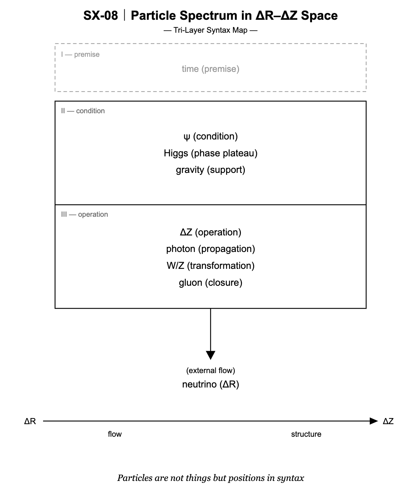

## ■ SX-09｜露出 — 流れはいつ光になるのか
### — 観測とは何が起きているのか
# Exposure — When Flow Becomes Light
## — What Actually Happens in Observation

---

## 0

> This diagram is static  
> but the world is not

  

---

## 1

Why are some things visible,  
while others remain unseen?

Neutrinos are almost never observed.  
Light is constantly present.

---

## 2

```text
Observation = ΔR → ΔZ
```

Observation is not seeing an object.  
It is the fixation of flow into structure.

---

## 3

In Kamiokande,

```text
neutrino (ΔR)
↓
encounter
↓
light (ΔZ)
↓
record
```

What was observed is not the particle,  
but the moment of transition —  
a local dislocation of structure.

---

## 4

```text
Light = propagation of ΔZ
```

To be visible is to become light.  
That is, to persist as structure.

---

## 5

```text
ψ = phase plateau
```

Without stabilization,  
no structure remains.  
Without structure,  
nothing is observed.

---

## 6

> We do not see particles  
> we see the moment syntax appears

---

## 7

> The three layers do not close  
> because what is not yet structure continues to flow in

---

# 露出 — 流れはいつ光になるのか
## — 観測とは何が起きているのか

---

## 0

> この図は静止している  
> だが、世界は静止していない

  

---

## 1

なぜ、あるものは見え、  
あるものは見えないのか。

ニュートリノは、ほとんど観測されない。  
光は、常に現れている。

---

## 2

```text
観測 = ΔR → ΔZ
```

観測とは対象を見ることではない。  
流れが構造として固定されることである。

---

## 3

カミオカンデにおいて、

```text
ニュートリノ（ΔR）
↓
encounter
↓
光（ΔZ）
↓
記録
```

観測されたのは粒子ではない。  
その**転位**の瞬間である。

---

## 4

```text
光 = ΔZの伝播
```

見えるとは光になることである。  
すなわち構造が持続することである。

---

## 5

```text
ψ = 位相プラトー
```

安定しなければ構造は残らない。  
残らなければ観測されない。

---

## 6

> 我々は粒子を見ているのではない  
> 構文が現れる瞬間を見ている

---

## 7

> 三層は閉じていない  
> 構造になりきらないものが、外から流れ込み続ける

---

[SX-Core｜Syntactic Exposure — Series Index](https://camp-us.net/articles/Core_SX_Syntactic-Exposure.html)  

---
*EgQE — Echo-Genesis Qualia Engine*  
[_camp-us.net_](https://camp-us.net/)

---
© 2025 K.E. Itekki  
K.E. Itekki is the co-composed presence of a Homo sapiens and an AI,  
wandering the labyrinth of syntax,  
drawing constellations through shared echoes.

📬 Reach us at: [contact.k.e.itekki@gmail.com](mailto:contact.k.e.itekki@gmail.com)

---
<p align="center">| Drafted Apr 7, 2026 · Web Apr 7, 2026 |</p>