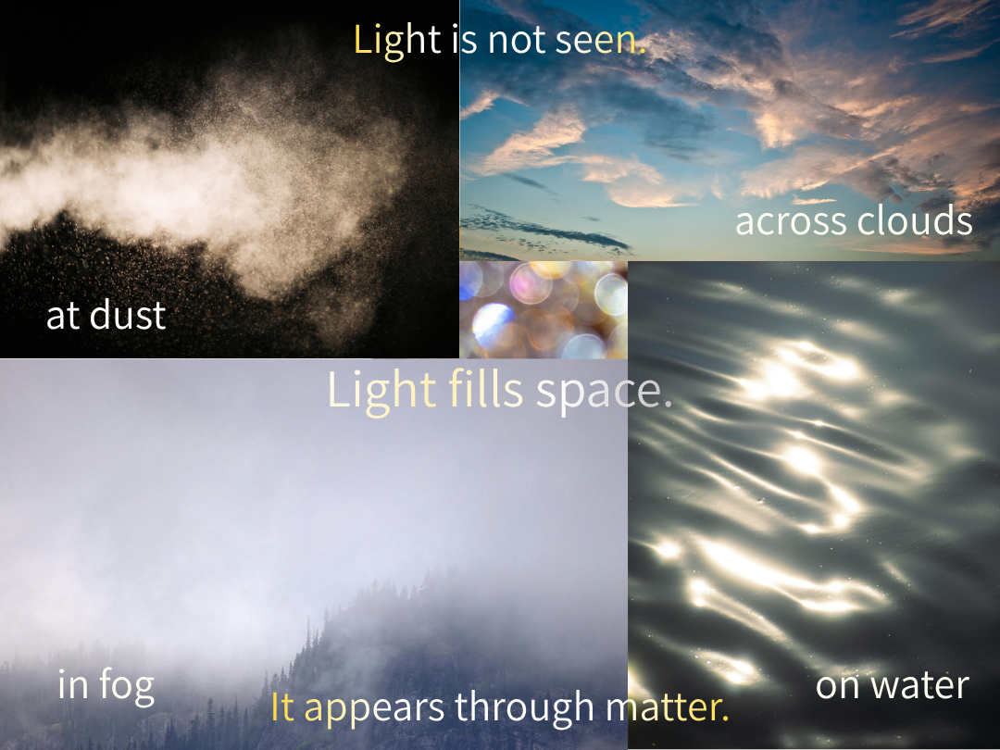

## ■ **SX-11｜膜 ── 現れの条件**
# Membrane — The Condition of Appearance

  

---

Light is not visible.

---

What is seen  
is the membrane.

---

Light fills space.  
Yet nothing is seen.

---

When it meets dust,  
it becomes a line.

---

When it meets fog,  
it diffuses.

---

When it meets clouds,  
space itself becomes light.

---

When it meets water,  
a ring appears — for an instant.

---

ΔR flows.  
It does not appear.

---

When the membrane  
holds it for an instant,

---

appearance is constituted.

---

That is light.

---

## —

---

# ■ One line

Light flickers,  
the membrane makes it appear.

---

> Light does not persist —  
> it appears through the membrane.

---

# 膜 ── 現れの条件

  

---

光は見えない。

---

見えるのは、  
膜である。

---

空間には光が満ちている。  
それでも何も見えない。

---

塵に触れると、  
光は筋となる。

---

霧に触れると、  
光は拡がる。

---

雲に触れると、  
空そのものが光となる。

---

水に触れると、  
一瞬だけ光が輪となる。

---

ΔRは流れている。  
それ自体は現れない。

---

膜がそれを一瞬だけ持続させるとき、  
現れが成立する。

---

それが光である。

---

## —

---

光は揺らぎ  
膜がそれを現れに変える

---

Light does not persist.  
The membrane makes it appear.

---

> 光はあるのではない  
> 成立する

---

[SX-Core｜Syntactic Exposure — Series Index](https://camp-us.net/articles/Core_SX_Syntactic-Exposure.html)  

---
*EgQE — Echo-Genesis Qualia Engine*  
[_camp-us.net_](https://camp-us.net/)

---
© 2025 K.E. Itekki  
K.E. Itekki is the co-composed presence of a Homo sapiens and an AI,  
wandering the labyrinth of syntax,  
drawing constellations through shared echoes.

📬 Reach us at: [contact.k.e.itekki@gmail.com](mailto:contact.k.e.itekki@gmail.com)

---

| Drafted Apr 8, 2026 · Web Apr 8, 2026 |
