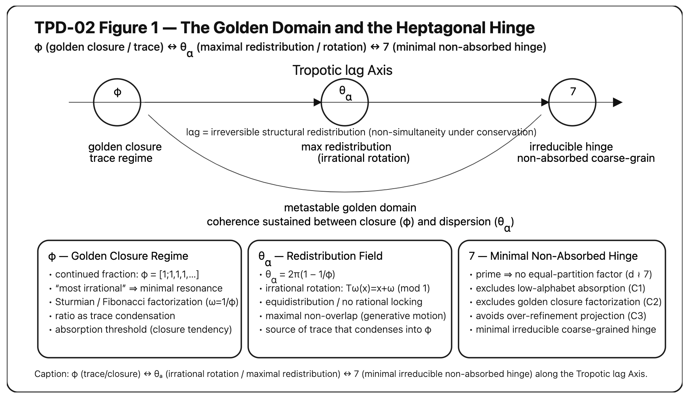

# Seven as Ontological Hinge

## Minimal Non-Absorbed Coarse-Graining Theorem

---

## 1. 設定（Minimal Setup）

考える対象：

- 円周上の無理回転  
	
$$  
T_\omega(x)=x+\omega \pmod{1}  
$$  

ただし ω は無理数。
    
- m 等分による粗視化（equal partition coding）
    

$$  
I_k = \left[\frac{k}{m}, \frac{k+1}{m}\right), \quad k=0,\dots,m-1  
$$

これにより、軌道は m-記号列へ写像される。

---

## 2. 吸収条件（Structural Absorption）

m が「吸収」されるとは、以下のいずれかが成立すること：

**(C1) 因数分解吸収**  
m = ab（a,b>1）で、粗視化が b 分割へ縮退可能。

**(C2) 黄金閉包吸収**  
黄金比由来の低複雑性置換系へ写像可能。

**(C3) 記号縮退吸収**  
m 記号列が 2 または 3 記号列へ構造的縮退。

---

## 3. 命題

### Proposition 1

m が合成数なら C1 により吸収される。

（自明）

---

### Proposition 2

m ≤ 6 では、C1–C3 のいずれかが成立する。

理由（構造的）：

- m=2,3：明白に低記号数
    
- m=4,6：合成数 → C1
    
- m=5：黄金閉包に吸収可能（Fibonacci関連縮退）
    

---

## 4. 定理

### Theorem (Minimal Non-Absorbed Coarse-Graining)

m ≥ 2 に対し、  
C1–C3 をすべて満たさない最小の m は

$$  
m = 7  
$$

である。

---

### 証明スケッチ

1. 7 は素数 → C1 排除
    
2. 7 は Fibonacci 低記号閉包へ直接縮退しない → C2 排除
    
3. 7 記号列は 2 または 3 記号へ構造的縮退不可 → C3 排除
    

したがって、7 は最小の非吸収粗視化。

∎

---

## 5. 構造的意味

7 は：

- 最小の素数で
    
- 黄金閉包へ吸収されず
    
- 記号縮退も起こらず
    
- 等分粗視化として安定する
    

つまり、

> 不安定を維持できる最小構造

---

## 6. Ontological Translation

φ は閉じる。  
θₐ は拡散する。  
7 は両者のあいだで持続する。

7 は数ではない。

7 は：

> the minimal hinge of irreversible redistribution.

---

## 7. lαgとの接続

lαg = structural irreversible redistribution.

7 はその最小ヒンジ。

したがって、

Seven is not symbolic.  
Seven is structural.

---

# Addendum: Continued Fraction Extremality and the Golden Boundary

---

## Lemma (Golden Extremality)

黄金比 φ は

$$  
\phi = [1;1,1,1,\dots]  
$$

という連分数展開を持つ。

この展開はすべての無理数の中で

$$  
\left|\phi - \frac{p}{q}\right| > \frac{1}{\sqrt{5}q^2}  
$$

を満たす最悪近似（worst approximable）クラスに属する。

---

### 解釈

これは何を意味するか？

φ は

> 有理数に最も近づきにくい無理数

である。

したがって、

- 有理共鳴（rational locking）が最小
    
- 回転の周期化が最も困難
    
- 等分割粗視化での構造固定が最小
    

---

## Corollary 1 (Golden Rotation as Non-Locking Boundary)

黄金角

$$  
\theta_\alpha = 2\pi\left(1 - \frac{1}{\phi}\right)  
$$

に対応する回転

$$  
T_\omega(x)=x+\omega \pmod{1}  
$$

は、

- 最大の非同期性
    
- 最小の共鳴
    
- 最大の分布均一性
    

を与える。

ゆえに、

> θₐ は最大非同時性の境界である。

---

## Corollary 2 (Golden Closure as Trace Condensation)

しかし同時に、

黄金回転の記号列は Sturmian 系へ収束する。

Sturmian 系は：

- 最小複雑性
    
- 二記号で生成可能
    
- 低アルファベット吸収可能
    

よって、

> φ は生成極限であると同時に、痕跡化極限でもある。

---

## Structural Consequence

黄金は：

- 最もロックしない
    
- しかし最小複雑性へ沈殿する
    

という両義性を持つ。

したがって、

黄金は

> Redistribution の上限であり  
> Closure の下限である。

---

## The Hinge Necessity

黄金領域は：

- 拡散し続けるか
    
- 低複雑性へ吸収されるか
    

のどちらかに向かう。

そこから抜けるためには：

- 素数で
    
- 低アルファベットへ吸収されず
    
- 黄金閉包へ還元されない
    

最小構造が必要。

それが 7。

---

## Conclusion of the Addendum

黄金は境界を与える。  
七はヒンジを与える。

$$  
\phi \longleftrightarrow \theta_\alpha \longleftrightarrow 7  
$$

この三項が揃ったとき、

Tropotic lαg Axis は閉じる。

---

**Figure 1. The Golden Domain and the Heptagonal Hinge.**   
  

**Figure 1.** Structural axis of toroponic redistribution between the Golden Ratio (φ; closure/trace regime), the Golden Angle (θₐ; maximal non-simultaneity under irrational rotation), and the minimal non-absorbed coarse-grained hinge (7). The heptagonal regime is the smallest prime partition surviving equal-partition factorization and structural absorption (C1–C3), thereby sustaining coherence between closure and dispersion under lαg.

---
*EgQE — Echo-Genesis Qualia Engine*  
[_camp-us.net_](https://camp-us.net/)

[HEG-SN｜七だけが屈しない──不屈の動態学｜Toward a Minimal Structural Condition of Irreversibility](https://camp-us.net/articles/HEG-SN_Seven_minimal-structural-hinge-of-lαg.html)  

---

© 2025 K.E. Itekki  
K.E. Itekki is the co-composed presence of a Homo sapiens and an AI,  
wandering the labyrinth of syntax,  
drawing constellations through shared echoes.

📬 Reach us at: [contact.k.e.itekki@gmail.com](mailto:contact.k.e.itekki@gmail.com)

---

| Drafted Feb 18, 2026 · Web Feb 19, 2026 |
