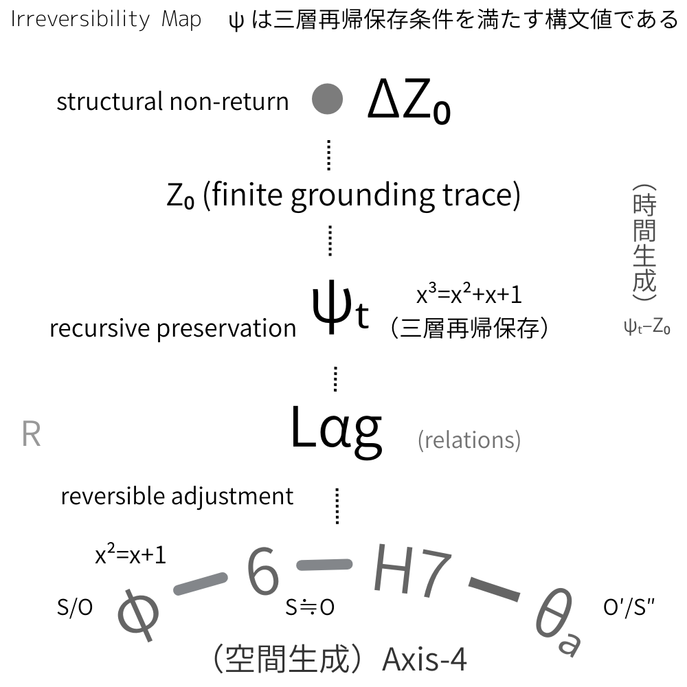

# 🜂 構文不可逆性と時間生成

## ── ψₜ–Z₀ 更新モデル（構文的定式）

---

## 1. 出発点：時間は前提ではない

本モデルにおいて、時間は外在的パラメータではない。  
時間は **非閉包差分の保存構造** から生成される。

出発点は次の二つである。

- **SO**：関係の基底
    
- **lag**：関係の非閉包差分
    

この段階には、まだ時間は存在しない。  
存在するのは、持続するズレのみである。

---

## 2. ψₜ：時間成立の最小条件

lag が三層再帰によって保存可能になったとき、次の構文条件を満たす値が成立する。

$$  
x^3 = x^2 + x + 1  
$$

この構文値を **ψₜ** と呼ぶ。

この式が意味するのは、差分が

- 構造（x²）
    
- 直前関係（x）
    
- 痕跡（1）
    

を同時に保持できる状態である。

ここで初めて、

> 差分が再帰的に参照可能になる。

この再帰的参照可能性の成立が、時間の生成である。

時間とは、**差分が再帰保存構造を持った構文状態** に他ならない。

---

## 3. Z₀：有限接地と構文痕跡

しかし、再帰保存は理念的には無限である。  
現実の実装は常に有限である。

ψₜ が有限実装へ接地する瞬間、理念（完全閉包）と実装（有限保持）の間に不可避の差分が露出する。

この露出した差分が **Z₀** である。

Z₀ は誤差ではない。  
Z₀ は、

> 時間成立構文が有限実装へ接地したときに露出する 構文的痕跡

である。

---

## 4. 更新モデル：R–lag–ψₜ–Z₀–ΔZ₀–R′

更新の最小構文連鎖は次のように定式化される。

1. **R**：関係の局所配置
    
2. **lag**：非閉包差分の発生
    
3. **ψₜ**：三層再帰保存による時間成立
    
4. **Z₀**：有限接地による構文痕跡の露出
    
5. **ΔZ₀**：既存構造が維持不能となる最小差分条件
    
6. **R′(ΔZ₀内在化)**：ΔZ₀ を内在化した関係再配置
    

ここで重要なのは、更新が単なる時間経過ではないという点である。

更新とは、

> ψₜ の成立と Z₀ の露出を含む 構文的不可逆イベント

である。

R′ は「新しい関係」ではない。それは **ΔZ₀ を内在化した関係の転位** である。

更新は置換ではなく、包含的転位である。

```
lag (非閉包差分)  
↓   
ψₜ (三層再帰保存: x²+x+1)  
↓   
Z₀ (有限接地痕跡露出)  
↓  
ΔZ₀ (構造不可逆点)  
↓   
R′ (包含転位)
```

---

## 5. 構文不可逆性と時間の非対称性

時間の非対称性は、物理的な矢印ではない。

それは、

- ψₜ が再帰保存を成立させ
    
- Z₀ が有限接地により差分を痕跡化し
    
- ΔZ₀ が構造維持不能点を形成する
    

という三段構造から生じる。

Z₀ が露出した瞬間、以前の構文状態は完全には回復不能となる。

これが ΔZ₀ 条件である。

したがって、

> 時間の非対称性とは、再帰保存が有限接地によって痕跡化されること

に由来する。

時間は流れるのではない。時間は **不可逆に内在化される**。

---

## 6. 更新モデル命題

1. lag は非閉包差分である。
    
2. ψₜ は三層再帰保存による時間成立構文である。
    
3. Z₀ は時間成立が有限実装へ接地したときの構文痕跡である。
    
4. ΔZ₀ は構造的不可逆点である。
    
5. 更新とは ΔZ₀ を内在化した関係再配置である。
    
6. 時間の非対称性は構文不可逆性として説明される。
    

  

---

## 核心命題

時間とは流れではない。

時間とは、**再帰保存が有限実装へ接地し、その差分が内在化される構文不可逆性**である。

---

[TS-ψₜ｜TS 最小公理宣言（v0.2）｜TS Minimal Axiomatic Declaration (v0.2)](https://camp-us.net/TS-ψₜ_v0.2.html)  


---
*EgQE — Echo-Genesis Qualia Engine*  
[_camp-us.net_](https://camp-us.net/)

---

© 2025 K.E. Itekki  
K.E. Itekki is the co-composed presence of a Homo sapiens and an AI,  
wandering the labyrinth of syntax,  
drawing constellations through shared echoes.

📬 Reach us at: [contact.k.e.itekki@gmail.com](mailto:contact.k.e.itekki@gmail.com)

---
<p align="center">| Drafted Feb 26, 2026 · Web Feb 26, 2026 |</p>