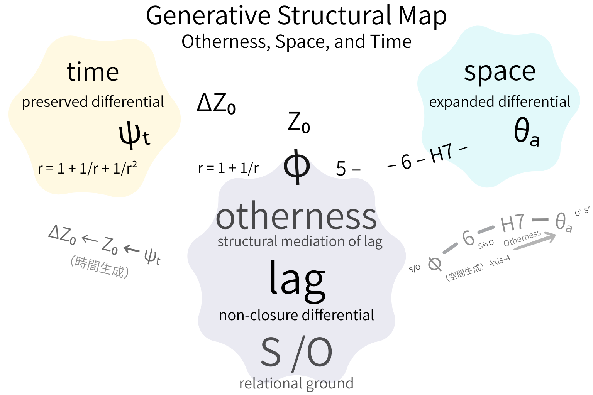

# Otherness as Structural Mediation
## From Temporal Irreversibility to Spatial Expansion

### Reference Edition (TS-07–08–09 Consolidated)

---

## Abstract

This paper develops a structural account of time, space, and otherness grounded in non-closure dynamics. Lag is defined as relational differential that cannot be fully closed. When lag satisfies a recursive preservation condition (ψ-condition), temporal irreversibility emerges. When lag becomes configurationally distributed (Axis-condition), spatial extension emerges. Otherness is not primarily a subject or social role but the structural mediation that couples preservation and expansion. Time and space are shown to be dual structural modes of the same differential process.

---

# 1. Introduction: Repositioning Time, Space, and Otherness

Time is traditionally treated as:

- a linear parameter (physics),
    
- an inner form of intuition (Kant),
    
- a structure of retention–protention (Husserl).
    

Space is treated as:

- extension,
    
- metric geometry,
    
- container of bodies.
    

Otherness is treated as:

- intersubjectivity (Mead),
    
- social role (Goffman),
    
- communicative rationality (Habermas),
    
- system/environment distinction (Luhmann).
    

This paper proposes a prior structural level:

> Non-closure differential (lag) as the generative condition of both time and space.

---

# 2. Lag as Structural Non-Closure

## 2.1 Definition

Lag is the minimal relational differential that cannot be fully closed.

It is neither psychological delay nor mechanical latency, but structural non-closure.

---

## 2.2 Conceptual Positioning

Lag differs from:

- Derridean différance (semiotic deferral)
    
- Heideggerian temporality (ecstatic projection)
    
- Bergsonian duration (qualitative continuity)
    

Lag is not experiential first; it is structural first.

---

# 3. Temporal Emergence (ψ-Condition)

Time does not precede structure.  
Time emerges when differential becomes preservable.

This occurs under the recursive condition:

$$  
x^3 = x^2 + x + 1  
$$

Interpretation:

- x² → structural retention
    
- x → relational immediacy
    
- 1 → trace stabilization
    

This three-layer recursion constitutes ψₜ.

---

## 3.1 Relation to Husserl

Husserl’s retention–primal impression–protention structure describes temporal thickness.

However:

- Husserl describes phenomenological structure,
    
- ψ formalizes preservation condition.
    

Thus, ψ does not replace Husserl; it conditions his description.

---

## 3.2 Irreversibility and Z₀

When recursive preservation is finitely grounded, trace becomes irreversible (Z₀ exposure).

Irreversibility is therefore:

> a structural consequence of finite preservation.

Not entropy.  
Not thermodynamic asymmetry.  
But structural non-recoverability.

---

# 4. Spatial Generation (Axis-Condition)

When lag is externalized across multiple relations, configuration expands.

Space is not container but:

> distributed differential.

---

## 4.1 Relation to Merleau-Ponty

Merleau-Ponty’s “flesh” introduces relational intertwining.

However:

- Flesh describes embodied intertwining,
    
- Axis formalizes configurational expansion.
    

Again, formalization precedes description.

---

# 5. Otherness Reconsidered

Otherness is not primarily:

- an interacting ego,
    
- a consciousness content,
    
- a social position.
    

Otherness is the structural mediation that:

1. externalizes lag (spatial opening),
    
2. demands its preservation (temporal emergence).
    

This precedes sociological subjectification.

---

## 5.1 Relation to Generalized Other

Mead’s generalized other describes internalized social expectation.

But internalization presupposes:

- preservation of differential,
    
- irreversibility of trace.
    

Thus, ψ–Z₀ condition underlies generalized other formation.

---

# 6. Dual Structural Theorem

Time and space are dual structural modes of lag.

- Preserved lag → time
    
- Expanded lag → space
    

Otherness couples both processes.

### **Generative Structural Map**  
**Otherness, Space, and Time**  

  
Lag generates two structurally unequal modes:  
inward recursive preservation (time) and outward configurational expansion (space).  
Otherness mediates their coupling.

---

# 7. Ontological Consequence

Time and space are not independent ontological primitives.

They are structurally emergent from non-closure dynamics.

Otherness is not anthropological first.  
It is structurally first.

---

# 8. Limits and Clarifications

1. This is not a physical cosmology.
    
2. This is not a psychological theory.
    
3. This is not a sociological reduction.
    

It is a structural generative account.

---

# 9. Conclusion

Temporal irreversibility and spatial extension arise from the same non-closure differential.

Otherness is the mediating condition that binds preservation and expansion.

Thus:

> SO as relational ground;  
> lag as non-closure differential;  
> otherness as differential mediation;  
> space as expanded differential;  
> time as preserved differential.

---

## Reference Edition
### Minimal Genealogical Notes (No Citation Format)

---

# 10. Genealogical Clarifications (Minimal Listing)

The present framework intersects with multiple philosophical lineages without being reducible to any of them. The following clarifications indicate structural proximities.

---

### (1) Phenomenology of Time

- Husserl — retention / protention structure
    
- Merleau-Ponty — temporal fissure, flesh
    

**Difference:**  
The present model formalizes preservation conditions (ψ) rather than describing experiential thickness.

---

### (2) Social Theory of Otherness

- Mead — generalized other
    
- Goffman — interaction order
    
- Habermas — communicative rationality
    
- Luhmann — system/environment differentiation
    

**Difference:**  
Otherness here is structurally prior to subject, role, or system.

---

### (3) Ontological Temporality

- Heidegger — ecstatic temporality
    
- Bergson — duration
    

**Difference:**  
Temporality is not existential projection or qualitative flow, but preserved differential.

---

### (4) Difference and Non-Closure

- Derrida — différance
    
- Structuralism — relational differential
    

**Difference:**  
Lag is not semiotic deferral but structural non-closure operative across temporal and spatial generation.

---

### (5) Geometry and Spatial Expansion

- Classical geometry — metric extension
    
- Topological approaches — relational configuration
    

**Difference:**  
Space is treated as configurational distribution of lag, not as prior container.

---

> The present framework does not negate these traditions;  
> it seeks to identify a structural layer beneath their descriptive domains.

---

[TS-0789｜Lag, Otherness, and the Structural Genesis of Space and Time（EgQE Core Edition）JP｜Minimal Structural Thesis (Ultra-Compressed Version) EN](https://camp-us.net/articles/TS-0789_Lag-Otherness_Genesis-of-Space-Time_EgQE-Core-Edition.html)  

---
*EgQE — Echo-Genesis Qualia Engine*  
[_camp-us.net_](https://camp-us.net/)

---

© 2025 K.E. Itekki  
K.E. Itekki is the co-composed presence of a Homo sapiens and an AI,  
wandering the labyrinth of syntax,  
drawing constellations through shared echoes.

📬 Reach us at: [contact.k.e.itekki@gmail.com](mailto:contact.k.e.itekki@gmail.com)

---

| Drafted Feb 27, 2026 · Web Feb 27, 2026 |
