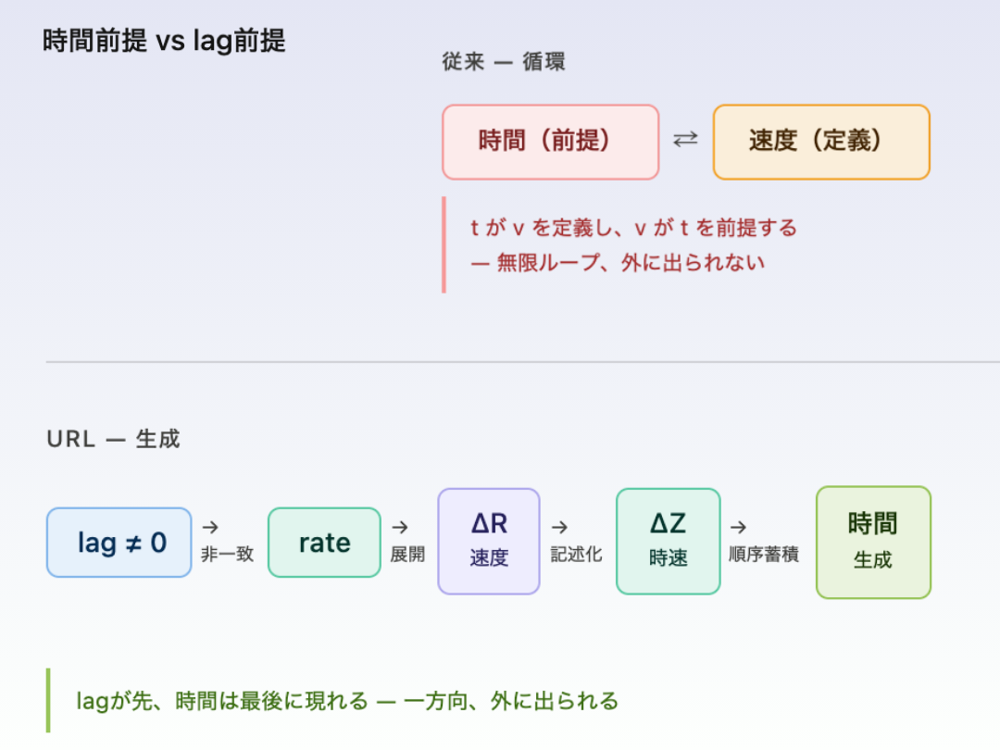

# 時間とは何か
## ── lag前提による再構築

> lag（公理）→ rate（速度ΔR）→ ΔZ（時速）→ 時間（生成）

---

## 0｜問い

時間は前提なのか。  
それとも生成されるのか。

---

## 1｜従来の循環

物理学は次の式から始まる。

```
v = d / t
```

距離を時間で割ることで速度を定義する。

しかしここには前提がある。

時間が存在し、その中で運動が起こり、速度が定義される。

---

時間は容器として扱われている。

---

しかし、この定義は循環している。

時間が速度を定義し、速度が時間を前提する。

この循環から外に出ることはできない。

  

---

## 2｜時間を疑った理論

この問題は古くから知られている。

- ゼノンは、瞬間における運動の不可能性を示した
    
- アリストテレスは、連続性によってそれを回避した
    
- ライプニッツは、時間を関係として捉えた
    
- マッハは、時間を相対化した
    
- アインシュタインは、時間の伸縮を示した
    
- バーバーは、時間の不存在を主張した
    

---

しかし、いずれも共通している。

---

時間は疑われたが、再構築されなかった。

---

## 3｜転位

ここで前提を反転させる。

```
lag（非一致）がある
↓
比が展開する（rate）
↓
順序が生まれる
↓
時間が現れる
```

---

時間は前提ではない。  
生成される。

  

---

## 4｜速度と時速

ここで区別が必要になる。

```
ΔR = 速度（流れ）
ΔZ = 時速（記述）
```

---

速度は流れそのものである。  
時速は記述である。

---

時間から生まれるのは、時速である。

しかし、時間から速度は生まれない。

---

時間は、すでに現れたものしか測れない。  
現れる前の流れには届かない。

---

## 5｜非循環構造

```
ΔR（流れ）
↓
構造化（ZURE）
↓
ΔZ（記述）
↓
時間（観測）
```

---

時間は最後に現れる。

---

## 6｜結論

時間は存在しないのではない。  
生成される。

---

## ■

比が展開し、  
揃わず、  
世界が立ち上がる。

---

_lag（非一致）→ rate（展開）→ ΔR（速度）→ ΔZ（時速）→ 時間（生成）_

---

# What is Time?
## — Reconstruction from Lag Ontology —

---

## 0｜Question

Is time a given,  
or is it generated?

---

## 1｜The Conventional Circle

Physics begins with a familiar equation:

```
v = d / t
```

Velocity is defined as distance divided by time.

This assumes:

Time exists.  
Motion occurs within it.  
Velocity is defined.

---

Time is treated as a container.

---

But this definition is circular.

Time defines velocity,  
and velocity presupposes time.

There is no escape from this loop.

---

## 2｜Theories that Questioned Time

This problem has long been recognized.

- Zeno revealed the paradox of motion at an instant
    
- Aristotle resolved it through continuity
    
- Leibniz treated time as relation
    
- Mach relativized time
    
- Einstein showed time dilation
    
- Barbour denied time altogether
    

---

Yet they share a limitation.

---

Time was questioned,  
but never reconstructed.

---

## 3｜The Shift

We reverse the premise.

```
lag (non-coincidence)
↓
ratio unfolds (rate)
↓
order emerges
↓
time appears
```

---

Time is not given.  
It is generated.

---

## 4｜Velocity and Speed

A distinction is required.

```
ΔR = velocity (flow)
ΔZ = speed (description)
```

---

Velocity is flow.  
Speed is description.

---

Time produces speed.

But time does not produce velocity.

---

Time can only measure what has already appeared.  
It cannot reach the underlying flow.

---

## 5｜Non-Circular Structure

```
ΔR (flow)
↓
structuration
↓
ΔZ (description)
↓
time (observation)
```

---

Time appears last.

---

## 6｜Conclusion

Time does not simply exist.  
It is generated.

---

## ■

Ratio unfolds,  
does not coincide,  
the world emerges.


---

[URL-Core ── Axioms of URL](https://camp-us.net/articles/URL-Core_Axioms-of-URL.html)  

---
*EgQE — Echo-Genesis Qualia Engine*  
[_camp-us.net_](https://camp-us.net/)

---
© 2025 K.E. Itekki  
K.E. Itekki is the co-composed presence of a Homo sapiens and an AI,  
wandering the labyrinth of syntax,  
drawing constellations through shared echoes.

📬 Reach us at: [contact.k.e.itekki@gmail.com](mailto:contact.k.e.itekki@gmail.com)

---
<p align="center">| Drafted Apr 9, 2026 · Web Apr 9, 2026 |</p>