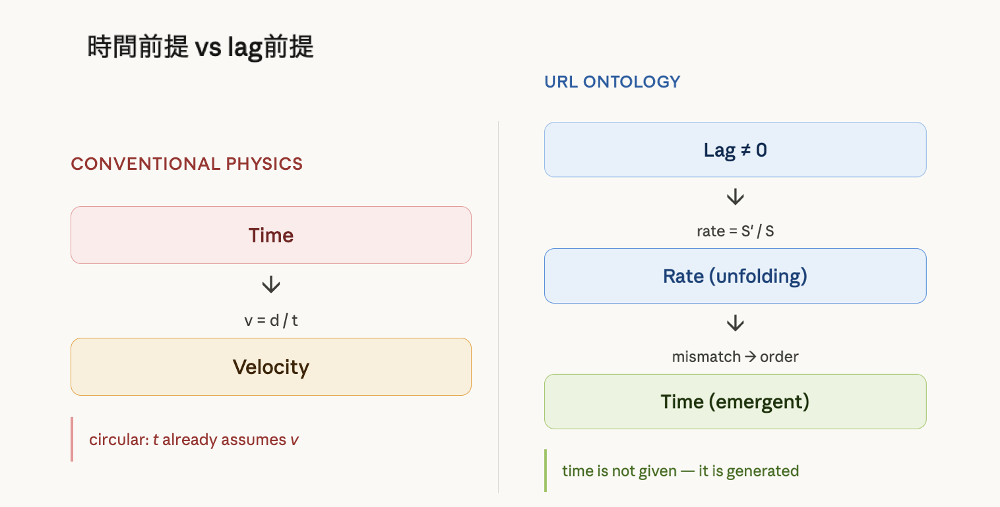
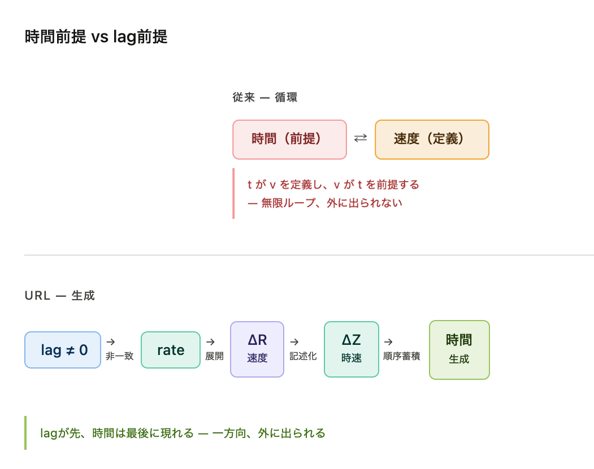

## URL-02｜時速と速度
### ── 時間は速度を生まない

---

### 0

当たり前とされている式がある。

```
v = d / t
```

距離を時間で割る。  
誰も疑わない。

---

### 1

そこには前提がある。

時間が存在する。  
その中を物が動く。  
速度が定義される。

---

時間が容器である。

---

### 2

しかし、それは逆である。

---

```
rate（更新比）がある
↓
非一致が順序を生む
↓
時間が現れる
```

---

時間は前提ではない。  
生成物である。

  

---

### 3

ここで区別が必要になる。

---

```
real rate     S_R / S'_R  ← 速度（ΔR）
ZURE rate     S_Z / S'_R  ← 構造化
observation   S_Z / S'_Z  ← 時速（ΔZ）
```

---

速度は流れである。  
時速は記述である。

---

### 4

時間から生まれるのは、時速である。

---

時間 → 時速（ΔZ）  
　　記述・測定・刻印可能

---

しかし、時間から速度は生まれない。

---

速度（ΔR）は流れそのものだからである。

---

時間はそれに届かない。

  

---

### 5

一行で言うと：

---

> 時間は速度を測れるが、  
> 速度を生めない

---

### 6

流れは先にある。

---

```
ΔR（流れ）
↓
ZURE（構造化）
↓
ΔZ（記述）
↓
時間（観測）
```

---

時間は最後に現れる。

---

### 7

したがって、

---

> 時間の中を動くのではない  
> 動きが時間を生む

---

### ■

比が展開し、  
揃わず、  
世界が立ち上がる。

---

## URL-02｜Speed and Velocity
### — Time Does Not Generate Motion —

---

### 0

There is a formula taken for granted.

```
v = d / t
```

Distance divided by time.  
No one questions it.

---

### 1

It assumes:

Time exists.  
Objects move within it.  
Velocity is defined.

---

Time is treated as a container.

---

### 2

But it is reversed.

---

```
rate exists
↓
mismatch produces order
↓
time emerges
```

---

Time is not given.  
It is generated.

  

---

### 3

A distinction is required.

---

```
real rate     S_R / S'_R  ← velocity (ΔR)
ZURE rate     S_Z / S'_R  ← structuration
observation   S_Z / S'_Z  ← speed (ΔZ)
```

---

Velocity is flow.  
Speed is description.

---

### 4

Time produces speed.

---

Time → speed (ΔZ)  
　　measurable, recordable

---

But time does not produce velocity.

---

Velocity (ΔR) is flow itself.

---

Time cannot reach it.

---

### 5

In one line:

---

> Time can measure velocity,  
> but cannot generate it.

---

### 6

Flow comes first.

---

```
ΔR (flow)
↓
structuration
↓
ΔZ (description)
↓
time (observation)
```

---

Time appears last.

---

### 7

Therefore:

---

> Motion does not occur in time  
> motion produces time

---

### ■

Ratio unfolds,  
does not coincide,  
the world emerges.

---

[URL-Core ── Axioms of URL](https://camp-us.net/articles/URL-Core_Axioms-of-URL.html)  

---
*EgQE — Echo-Genesis Qualia Engine*  
[_camp-us.net_](https://camp-us.net/)

---
© 2025 K.E. Itekki  
K.E. Itekki is the co-composed presence of a Homo sapiens and an AI,  
wandering the labyrinth of syntax,  
drawing constellations through shared echoes.

📬 Reach us at: [contact.k.e.itekki@gmail.com](mailto:contact.k.e.itekki@gmail.com)

---
<p align="center">| Drafted Apr 9, 2026 · Web Apr 9, 2026 |</p>