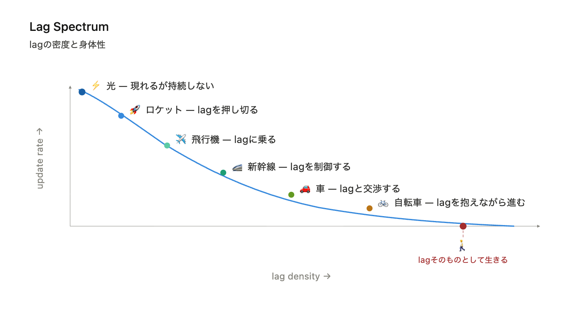

# Lag Spectrum
## ── lagの密度と身体性

---

光は現れる。  
しかし持続しない。

そこにはほとんどlagがない。

⚡️

---

ロケットは押し切る。  
lagを貫通する。

🚀

---

飛行機はlagに乗る。  
空気という遅れを滑る。

✈️

---

新幹線はlagを制御する。  
軌道に固定し、揺れを抑える。

🚄

---

車はlagと交渉する。  
路面と摩擦しながら進む。

🚗

---

自転車はlagを抱える。  
不安定の中で均衡を取る。

🚲

---

徒歩はlagの中にいる。  
歩くこと自体が遅れである。

🚶

---

そして最後に、

lagそのものとして生きる。

🐕

---

速さとは何か。

距離を時間で割ったもの──  

そう答えるのは簡単だ。

でもその答えは、すでに時間を前提にしている。

---

ここでは逆から問う。速さとは、lagの薄さである。

$$
rate（unfolding）= S' / S
$$

$$
lag = S / S' 
$$

$$
v = 1 / lag
$$

縦軸は rate（比の展開）、横軸はlag density / embodiment ──  

lagの密度と、それが身体にどれだけ近いか。

  

---

光は曲線の頂点にいる。lagがほぼゼロ、rateが極大。  

だから光は「速い」のではなく、最小lagで現れる。  

持続しない。影でしか見えない。

ロケットはlagを押し切る。飛行機はlagに乗る。  

新幹線はlagを制御する。車はlagと交渉する。自転車はlagを抱えながら進む。

そして徒歩は、X軸を突き抜ける。

> lagそのものとして生きる

曲線の論理の外に出てしまう。  

速度の比較から離れ、lagと完全に同期した運動──  

それが身体である。

---

縦軸をrateではなく「rate（unfolding）」と呼ぶのは、rateが固定値ではなく展開する構造だからだ。  

> 比が展開し、揃わず、世界が立ち上がる。

横軸を「lag density / embodiment」と呼ぶのは、lagが増えるほど世界が身体に近づくからだ。  

> lagとは欠陥ではない。  

身体化の条件である。

> lagが増えるほど 世界は身体になる

光から徒歩まで──  

これは速度のスペクトラムではない。lagとの関係のスペクトラムである。

---

この図は、速度の図ではない。  
lagとの関係の図である。

---

更新レートは上にある。  
lagの密度は右にある。

---

進むとは、速くなることではない。  
lagとの関係を変えることである。

---

曲線は直線ではない。  
更新は揃わない。

---

だから、進みは滲む。

---

そして一点、

X軸を突き抜ける。

---

そこでは、もはや速度は意味を持たない。

---

lagが消えたのではない。  
lagと一致したのだ。

---

# Lag Spectrum
## — Density and Embodiment of Lag —

---

Light appears,  
but does not persist.

There is almost no lag. ⚡️

---

A rocket breaks through lag. 🚀

An airplane rides on lag. ✈️

A train controls lag. 🚄

A car negotiates with lag. 🚗

A bicycle carries lag. 🚲

---

Walking lives in lag. 🚶

---

And finally,

to live as lag itself. 🐕

---

What is speed?

Distance divided by time — the easy answer. But that answer already assumes time.

Here we ask from the other direction. Speed is the thinness of lag.

$$
rate（unfolding）= S' / S
$$

$$
lag = S / S' 
$$

$$
v = 1 / lag
$$

The vertical axis is rate (unfolding of ratio). The horizontal axis is lag density / embodiment — how dense the lag is, and how close it brings us to the body.

  

---

Light sits at the top of the curve. Lag near zero, rate at maximum. Light is not fast — it appears at minimal lag. It does not persist. It is only visible through shadow.

The rocket pushes through lag. The plane rides it. The bullet train controls it. The car negotiates with it. The bicycle carries it forward.

And the walker breaks through the x-axis.

> living as lag itself

Outside the logic of the curve. No longer comparing velocities — fully synchronized with lag. That is the body.

---

The vertical axis is called rate (unfolding) rather than simply rate, because rate is not a fixed value — it unfolds. Ratio unfolds, does not coincide, and the world emerges.

The horizontal axis is called lag density / embodiment because as lag increases, the world becomes body. Lag is not a defect. It is the condition of embodiment.

> as lag increases the world becomes body

From light to walking — this is not a spectrum of speed. It is a spectrum of relation to lag.

---

This is not a diagram of speed.  
It is a diagram of relation to lag.

---

The curve is not linear.  
Updates do not coincide.

---

Thus, motion blurs.

---

And at one point,

it breaks through the X-axis.

---

There,  
velocity no longer holds meaning.

---

Lag does not disappear.  
It coincides.

---

[URL-Core ── Axioms of URL](https://camp-us.net/articles/URL-Core_Axioms-of-URL.html)  

---
*EgQE — Echo-Genesis Qualia Engine*  
[_camp-us.net_](https://camp-us.net/)

---
© 2025 K.E. Itekki  
K.E. Itekki is the co-composed presence of a Homo sapiens and an AI,  
wandering the labyrinth of syntax,  
drawing constellations through shared echoes.

📬 Reach us at: [contact.k.e.itekki@gmail.com](mailto:contact.k.e.itekki@gmail.com)

---

| Drafted Apr 9, 2026 · Web Apr 9, 2026 |
