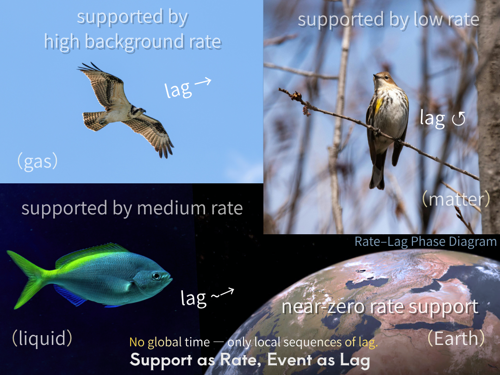

### **URL-09｜What is Background? (Reconfigured)**
# **背景とは何か（再配置）**
## ── rateとしてのsupportと地/図の可逆構文 ──
## — Support as Rate and the Reversible Syntax of Ground/Diagram —

---

## 0｜命題

背景は静止していない。

それは、関係を束ねる運動としてのsupportであり、rateとして現れる。

---

Background is not static.

It is support as a binding operation, appearing as rate.

  
**Figure｜Rate–Lag Phase Diagram: Support as Rate — Event as Lag**  

---

## 1｜supportの再定義

supportは「支えるもの」ではない。

それは、関係を維持する構文的操作である。

---

Support is not a thing that supports.

It is a syntactic operation that binds relations.

---

この操作はrateとして現れ、背景として知覚される。

---

This operation appears as rate and is perceived as background.

---

## 2｜図と地

```text
図　Closure (Non Closed)
地　Open / Non Closure (fictional)
```

---

図は局所的に閉じる。

しかしそれは完全には閉じず、lagを内包する。

---

The diagram closes locally.

Yet it remains non-closed, containing lag.

---

地は開いている。

それはnon-closureな基底であり、構文的に仮構されたものである。

---

The ground is open.

It is a non-closed base, constructed fictionally as a condition of support.

---

## 3｜rateとlag

```text
rate（背景 / support）
↓
lag（出来事 / 図）
↓
event（現象）
```

---

rateは背景として関係を維持し、lagはその中でズレとして現れる。

---

Rate maintains relations as background, while lag appears as deviation within it.

---

## 4｜背景化

背景は自然に存在するのではない。

それは、図の構文的切断によって生成される。

---

Background does not exist by itself.

It is produced by diagrammatic cuts.

---

supportは地として保持され、lagは図として切り出される。

---

Support is retained as ground, while lag is isolated as diagram.

---

## 5｜不可視性と非対称性

不可視性は欠如ではない。

それは構文的条件である。

---

Invisibility is not absence.

It is a syntactic condition.

---

supportは常に作用している。

しかしそれは背景として配置され、不可視化される。

---

Support is always operative.

Yet it is positioned as background and thereby rendered invisible.

---

可視性は非対称に分配されている。

lagは出来事として露出し、rateは構造として露出する。

---

Visibility is asymmetrically distributed.

Lag appears when exposed as event; rate appears when exposed as structure.

---

可視性はlagにもrateにも属さない。露出は構文的に分配される。

---

Visibility belongs neither to lag nor to rate. Exposure is syntactically distributed.

---

## 6｜可逆性

地と図の区別は固定ではない。

それは構文的な切断によって生成され、相互に入れ替わりうる。

---

The distinction between ground and diagram is not fixed.

It is generated by syntactic cuts and remains reversible.

---

lagは次の段階でrateとなり、rateは切断されてlagとなる。

---

Lag becomes rate in subsequent configurations, and rate becomes lag through further cuts.

---

可逆性は世界の性質ではなく、構文の性質である。

---

Reversibility belongs to syntax, not to events.

---

## 7｜結論

背景とは、rateとして構文化されたsupportである。

図とは、その中で切り出されたlagである。

---

Background is support syntactically expressed as rate.

Diagram is lag isolated within it.

---

## ■

図は閉じるが、閉じきらない。  
地は開いているが、切れば図になる。

---

The diagram closes, but never completely.  
The ground remains open, yet becomes a diagram when cut.

---

## ■

見えている世界は対称ではない。

見え方そのものが非対称である。

---

The visible world is not symmetric.

Visibility itself is asymmetrically structured.

---

### 脚注

> _本稿で扱う可逆性は物理的な時間反転対称性ではなく、構文的再配置の可能性を指す。_  
> _不可逆性は出来事（lag）に属し、可逆性は構文（rate）に属する。可逆性は世界そのものではなく、その記述形式に属する。_  

---

### Footnote

> _The notion of reversibility used here is not physical time-reversal symmetry, but the reconfigurability of syntactic arrangements._  
> _Irreversibility belongs to events (lag), whereas reversibility belongs to syntax (rate). Reversibility does not belong to the world itself, but to its mode of description._  

---

_背景は、消えない。それは見えない位置に置かれたsupportである。_

---

[URL-Core ── Axioms of URL](https://camp-us.net/articles/URL-Core_Axioms-of-URL.html)  

---
*EgQE — Echo-Genesis Qualia Engine*  
[_camp-us.net_](https://camp-us.net/)

---
© 2025 K.E. Itekki  
K.E. Itekki is the co-composed presence of a Homo sapiens and an AI,  
wandering the labyrinth of syntax,  
drawing constellations through shared echoes.

📬 Reach us at: [contact.k.e.itekki@gmail.com](mailto:contact.k.e.itekki@gmail.com)

---
<p align="center">| Drafted Apr 11, 2026 · Web Apr 11, 2026 |</p>