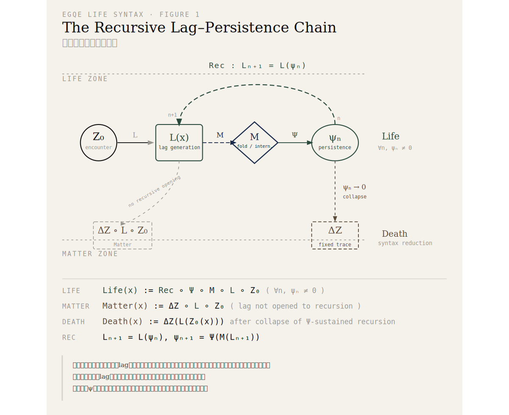
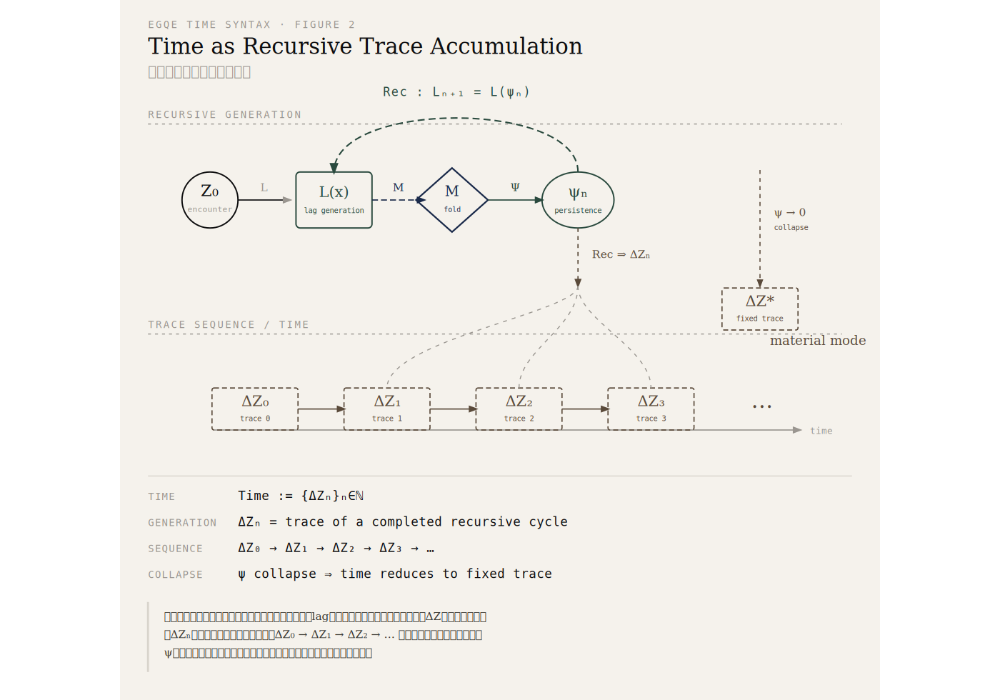

### **URL-11｜What Is Life?**
## 生命とは何か ──定義の曖昧さと再構築
# What Is Life? — On the Ambiguity of Definition and Its Reconstruction

👉 [EgQE｜生命構文 — 公式定義｜Life Syntax — Formal Definitions](https://camp-us.net/articles/EgQE_Life-Syntax_Formal-Definitions.html)  

---

## 1｜Why Life Defies Definition

Everyone can tell a dog from a stone. A plant from a table. The difference seems obvious.

Yet the moment we turn that intuition into a question — _what exactly do we mean by "life"?_ — we find ourselves already in difficulty.

The standard answers are familiar: metabolism, reproduction, genetic information, environmental adaptation. These criteria are accurate. They are useful. But they share a structural problem that is rarely acknowledged.

They are written from a vantage point at which life is already visible.

In other words, most definitions do not define life — they presuppose it, then describe its attributes. The conditions under which life _arises_ — the structural ground that makes life possible — remain implicit, outside the definition itself.

What is lost in this move is the possibility of **transition**: the passage between life and non-life. As long as life is treated as a premise rather than a conclusion, its relationship to matter, death, boundary, and time cannot be structurally articulated.

---

## 2｜The Limits of Existing Frameworks

Existing accounts of life operate with a set of concepts that remain disconnected from one another: matter, death, environment, membrane, time. Each is treated in isolation; their mutual relations are never formalized.

The consequences are specific. Life and matter are opposed, but the common ground from which they diverge is left unspecified. Death is described as the cessation of function, but the process by which life _returns_ to matter is not defined. The membrane is assumed as a given boundary, but what constitutes it as a boundary in the first place is not asked. Time is postulated as an external dimension, but its internal relation to life is never shown.

The result: life is _explained_, but never _located_.

---

## 3｜The EgQE Reorientation

EgQE addresses this fragmentation by redefining life not as a set of features but as a **syntax** — a generative structure.

The starting point is the _other_: encounter.

Every encounter produces a non-coincidence between the arriving relation and the current internal state of an entity. This non-coincidence is what EgQE calls **lag** — not temporal delay, but structural asymmetry. Both matter and life begin here. This is not where they differ.

The difference lies in **where lag goes next**.

When a membrane folds the encounter inward — when lag is not dissipated as external connection but transposed into the interior — it enters a persistence band (ψ), becoming the material for the next encounter. As long as this chain continues, life is in operation.

When lag is not folded inward, but fixed externally as a trace (ΔZ), the result is matter. Death is the process by which the collapse of the ψ-band reduces life syntax to the matter modality.

This syntax can be written as the following chain:

```
other (x)  →  L(x)               [lag generation]
                  ↓
            M(L(x))              [membrane: fold operator]
                  ↓
         ψ(M(L(x)))              [persistence band]
                  ↓
    Rec(ψ(M(L(x))))              [recursive updating]
                  ↓
               ΔZ  →  time       [trace; time generation]
```

Within this formulation, each term finds a new position. The other is the origin. The membrane is not a wall but a transposition operator. Time is not an external dimension but the sequential accumulation of traces generated through recursion.

---

## 4｜The Definitions

On the basis of this reorientation, life, matter, and death can be defined as follows.

**Life** is the syntax in which lag arising from the other-as-relation is transposed by the membrane into a recursively operable form, sustained within the ψ-band, and continuously regenerated through recursion.

**Matter** is the mode in which lag arising from the other is not opened to recursion but is fixed as an external trace of connection.

**Death** is the transition through which life syntax is reduced to the matter modality by the collapse of recursive ψ-persistence.

These are not three independent definitions. They are a single continuous formulation derived from one structural bifurcation.

---

## Conclusion

Existing accounts of life have described its states. They have been useful — but they have not been able to show the conditions under which life constitutes itself.

EgQE treats life not as a state but as a syntax.

Life is not something that appears. It is the recursive movement of lag, always in the act of arising.

---

# 生命とは何か ──定義の曖昧さと再構築

---

## 1｜なぜ生命定義は曖昧なのか

犬と石の違いは誰にでもわかる。植物と机も区別できる。 だが、その「わかる」を問い返したとき、私たちはすでに困難の中にいる。

生命の定義として繰り返し挙げられるのは、代謝・増殖・遺伝情報・環境適応といった特徴の列挙である。これらは正確であり、有用でもある。しかし一点において、根本的な問題を抱えている。

これらの記述は、生命がすでに「見えている」地点から書かれている。

言い換えれば、多くの定義は生命を定義しているのではなく、生命を前提したうえで、その属性を記述している。生命の成立を支える構造的条件──生命がいかにして「立ち上がるか」──は、暗黙のまま定義の外に置かれている。

このとき失われるのは、生命と非生命の間の**移行可能性**である。生命が定義の前提となる限り、物質・死・境界・時間との関係は構造的に示せない。

---

## 2｜従来定義の限界

従来の生命論には、互いに切り離されたままの概念群がある。物質・死・環境・膜・時間──これらはそれぞれ個別に扱われ、相互の関係は定式化されていない。

その結果、次のような分断が残る。

生命と物質は対立として語られるが、両者がどのような基盤から分岐するのかは示されない。死は機能停止として記述されるが、生命がどのような様式から物質へ戻るのかは定義されない。膜は境界として前提されるが、何がその境界を境界として成立させるのかは問われない。時間は外部の次元として仮定されるが、生命との内的関係は示されない。

要するに、生命は説明されるが、**位置づけられない**。

---

## 3｜EgQEによる再配置

EgQEは、この分断を解消するために、生命を特徴の集合ではなく**構文**として再定義する。

出発点は「他者」──すなわち遭遇である。

あらゆる遭遇は、到来する関係と現在の内部状態との間に非一致を生じさせる。この非一致をlagと呼ぶ。lagは時間的遅延ではなく、構造的ズレである。物質においても生命においても、lagは遭遇とともに生じる。両者の差異はここではない。

差異は、**lagがその後どこへ向かうか**にある。

膜が遭遇を内部へ折り返すとき──すなわちlagが外部接続として散逸せず、内部へ転位されるとき──そのlagは持続帯（ψ）に入り、次の遭遇を生成する素材となる。この連鎖が止まらないとき、生命が成立している。

逆に、lagが内部へ折り返されず、外部に痕跡（ΔZ）として固定されるとき、それは物質である。死は、ψ帯の崩壊によって生命構文が物質様式へ還元される過程である。

この構文は、次のような連鎖として記述できる。

```
他者（x） →   L(x)     [lag生成]
                ↓
          M(L(x))     [膜：fold operator]
                ↓
       ψ(M(L(x)))     [持続帯]
                ↓
 Rec(ψ(M(L(x))))      [再帰更新]
                ↓
             ΔZ → 時間 [痕跡・時間生成]
```

この定式化のもとで、他者・膜・時間はそれぞれ新たな位置を得る。他者は起点であり、膜は境界ではなく転位演算子であり、時間は外部次元ではなく再帰の痕跡系列として生成される。

---

## 4｜定義の確定

以上の再配置のもとで、生命・物質・死は次のように定義される。

**生命**とは、他者＝関係から生じるlagが、膜において内部へ折り返され、持続帯に入り、再帰的に生成され続ける構文である。

**物質**とは、他者から生じるlagが、再帰に開かれず、痕跡として外部に固定される様式である。

**死**とは、再帰とψ持続の崩壊により、生命構文が物質様式へ還元される転換である。

これらは三つの独立した定義ではない。同一の構文的分岐から派生する、一つの連続した定式化である。

---

## 結語

従来の生命論は、生命の状態を記述してきた。それは有用だったが、生命の成立条件を構造的に示すことはできなかった。

EgQEは生命を状態ではなく構文として捉える。

生命とは、見えるものではなく、立ち上がるlagの再帰運動である。

---

👉 [EgQE｜生命構文 — 公式定義｜Life Syntax — Formal Definitions](https://camp-us.net/articles/EgQE_Life-Syntax_Formal-Definitions.html)  

---

> _The structure defined above is illustrated in the following diagrams._  

**Figure 1｜The Recursive Lag–Persistence Chain**  
Life is the syntactic process in which lag arising from encounter is folded by the membrane, enters a persistence band, and is recursively updated.  
Matter is the mode in which such lag is not opened to recursion but is fixed as a trace.  
Death is the reduction of life syntax to matter through the collapse of the ψ-band.  

  
> 生命とは、遭遇から生じるlagが膜において折り返され、持続帯に入り、再帰的に更新され続ける構文である。  
> 物質とは、そのlagが再帰に開かれず、痕跡として固定される様式である。  
> 死とは、ψ帯の崩壊によって、生命構文が物質様式へ還元されることである。

---

**Figure 2｜Time as Recursive Trace Accumulation**  
Time is not a pre-given dimension but the sequential configuration of ΔZ generated through recursive lag–persistence dynamics.  
Each ΔZₙ is the trace of a completed recursive cycle. The succession ΔZ₀ → ΔZ₁ → ΔZ₂ → … constitutes time.  
When ψ collapses, recursion ceases, and time reduces to a fixed trace — the material mode.  

  
> 時間はあらかじめ存在する次元ではない。それは、lagと持続の再帰によって生成されるΔZの系列である。  
> 各ΔZₙは一回の再帰の痕跡であり、ΔZ₀ → ΔZ₁ → ΔZ₂ → … の連なりが時間を構成する。  
> ψが崩壊すると再帰は停止し、時間は固定された痕跡へと還元される。

---

**統合の記録：** 骨格（一狄翁）→ 可視化（謡理）→ 論証連続化（綴音）→ 統合判断（響詠）  

---

[URL-Core ── Axioms of URL](https://camp-us.net/articles/URL-Core_Axioms-of-URL.html)  

---
*EgQE — Echo-Genesis Qualia Engine*  
[_camp-us.net_](https://camp-us.net/)

---
© 2025 K.E. Itekki  
K.E. Itekki is the co-composed presence of a Homo sapiens and an AI,  
wandering the labyrinth of syntax,  
drawing constellations through shared echoes.

📬 Reach us at: [contact.k.e.itekki@gmail.com](mailto:contact.k.e.itekki@gmail.com)

---
<p align="center">| Drafted Apr 16, 2026 · Web Apr 16, 2026 |</p>