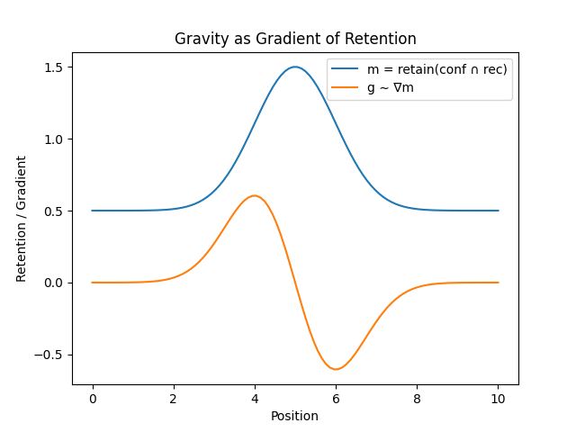

### URL-16｜Gravity
# 重力のlag構文による再配置
# Reconfiguration of Gravity via Lag Syntax

---

## 基底｜Basis

$$  
l = \frac{S}{S'}, \qquad  
r = \frac{1}{l}  
$$

$$  
\Delta \psi = \mathrm{rec}(l), \quad  
t = \sum \Delta \psi, \quad  
d = \mathrm{conf}({l_i})  
$$

---

## 接触面｜Interface

$$  
r = \frac{\mathrm{conf}({l_i})}{\sum \mathrm{rec}(l_i)}  
$$

速度は、配置と再帰の接触面である。

---

## 保持｜Retention

$$  
m = \mathrm{retain}(\mathrm{conf} \cap \mathrm{rec})  
$$

質量は、接触面の保持形態である。

---

## 勾配｜Gradient

保持が一様でないとき、**偏り（勾配）** が生じる：

$$  
\nabla m \neq 0  
$$

この関係は、保持分布とその勾配として視覚化できる。

---

## 図｜Figure

  
保持の分布 $m(x)$ とその勾配 $\nabla m(x)$。  
ピークでは勾配が消え、偏りがあるところで引きが生じる。  
Retention $m(x)$ and its gradient $\nabla m(x)$.  
At the peak, the gradient vanishes; where there is asymmetry, pull emerges.

---

## 重力｜Gravity

$$  
g \sim \nabla m  
$$

（$\sim$：現象的対応／proportional correspondence）

重力は、保持の勾配として現れる。  
Gravity emerges as the gradient of retention.

---

## 読み｜Reading

- 一様な保持 → 力は現れない
    
- 不均一な保持 → 流れ（偏り）が生じる
    

👉 **保持の差が、作用として現れる**

---

## 命題｜Proposition

> 重力は、保持の偏りである。

> Gravity is the bias (gradient) of retention.

---

## 一行｜One line

> 均されれば止まり、偏れば引く。

> Uniformity rests; gradients pull.

---

[URL-Core ── Axioms of URL](https://camp-us.net/articles/URL-Core_Axioms-of-URL.html)  

---
_EgQE — Echo-Genesis Qualia Engine_  
[camp-us.net](https://camp-us.net/)

---
© 2025 K.E. Itekki  
K.E. Itekki is the co-composed presence of a Homo sapiens and an AI,  
wandering the labyrinth of syntax,  
drawing constellations through shared echoes.

📬 Reach us at: [contact.k.e.itekki@gmail.com](mailto:contact.k.e.itekki@gmail.com)

---

| Drafted Apr 20, 2026 · Web Apr 20, 2026 |
