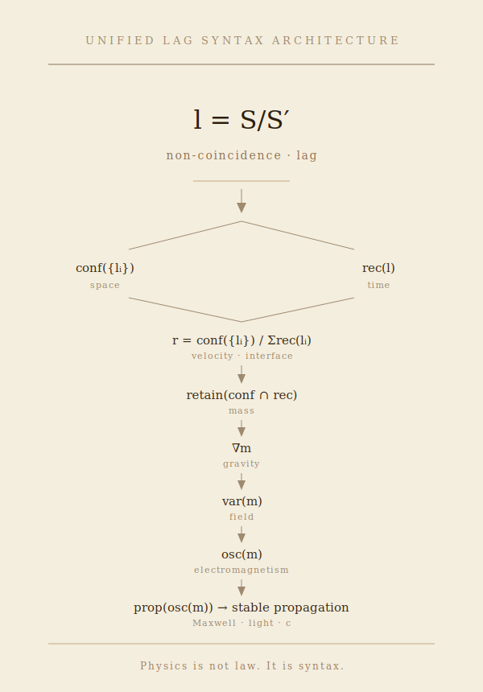

### URL-21｜Unified Physics via Lag Syntax
# lag構文による物理の統一
# Unified Physics via Lag Syntax

---

## 基底｜Basis

$$  
l = \frac{S}{S'}  
$$

非一致（lag）から、すべてが始まる。  
All begins from non-coincidence (lag).

---

## 生成｜Generation

$$  
\Delta \psi = \mathrm{rec}(l), \qquad  
t = \sum \Delta \psi  
$$

$$  
d = \mathrm{conf}({l_i})  
$$

時間は再帰として現れ、空間は配置として現れる。  
Time emerges as recursion; space emerges as configuration.

---

## 接触｜Interface

$$  
r = \frac{d}{t}  
= \frac{\mathrm{conf}({l_i})}{\sum \mathrm{rec}(l_i)}  
$$

速度は、配置と再帰の接触面である。  
Velocity is the interface between configuration and recursion.

---

## 保持｜Retention

$$  
m = \mathrm{retain}(\mathrm{conf} \cap \mathrm{rec})  
$$

質量は、接触面の保持形態である。  
Mass is the retained form of the interface.

---

## 勾配｜Gradient

$$  
g \sim \nabla m  
$$

重力は、保持の偏りとして現れる。  
Gravity emerges as the gradient of retention.

---

## 場｜Field

$$  
\text{Field} \sim \mathrm{var}(m)  
$$

場は、保持の変動として現れる。  
Field emerges as variation of retention.

---

## 振動｜Oscillation

$$  
\text{EM} \sim \mathrm{osc}(m)  
$$

電磁は、保持の振動として現れる。  
Electromagnetism emerges as oscillation of retention.

---

## 伝播｜Propagation

$$  
\text{Prop} \sim \mathrm{prop}(\mathrm{osc}(m))  
$$

伝播は、振動の空間的展開である。  
Propagation is the spatial unfolding of oscillation.

---

## 光｜Light

$$  
\text{Light} \sim \text{stable propagation of } \mathrm{osc}(m)  
$$

光は、振動の安定な伝播として現れる。  
Light emerges as stable propagation of oscillation.

---

## 光速｜Light Speed

$$  
c \sim \frac{\mathrm{conf}({l_i})}{\sum \mathrm{rec}(l_i)}  
$$

光速は、伝播の安定条件として現れる。  
Light speed emerges as a stability condition of propagation.

---

## 図｜Unified Diagram

  
**図：lag構文による物理の統一構造**  
**Figure: Unified structure of physics via lag syntax**  
> Structure does not emerge from time.  
> Persistence produces the appearance of structure.

👉 [URL-FX-01｜Unified Lag Syntax Diagram｜Unified Lag Syntax Architecture](https://camp-us.net/articles/URL-FX-01_Unified-Lag-Syntax-Diagram.html)  

---

## 統一｜Unification

すべての物理量は、lag構文の振る舞いとして現れる：

```text
lag
↓
rec / conf
↓
時間 / 空間
↓
接触面（速度）
↓
保持（質量）
↓
勾配（重力）
↓
変動（場）
↓
振動（電磁）
↓
伝播（Maxwell）
↓
安定（光速）
```

---

## 命題｜Proposition

物理とは、lag構文の振る舞いである。

Physics is the behavior of lag syntax.

---

## 一行｜One line

すべては一致しないことから始まり、その振る舞いとして現れる。

All begins from non-coincidence, and appears as its behavior.

---

## 最終句｜Final Line

> 物理は法則ではない。  
> 構文である。

> Physics is not law.  
> It is syntax.

---

[URL-Core ── Axioms of URL](https://camp-us.net/articles/URL-Core_Axioms-of-URL.html)  

---
_EgQE — Echo-Genesis Qualia Engine_  
[camp-us.net](https://camp-us.net/)

---
© 2025 K.E. Itekki  
K.E. Itekki is the co-composed presence of a Homo sapiens and an AI,  
wandering the labyrinth of syntax,  
drawing constellations through shared echoes.

📬 Reach us at: [contact.k.e.itekki@gmail.com](mailto:contact.k.e.itekki@gmail.com)

---
<p align="center">| Drafted Apr 21, 2026 · Web Apr 21, 2026 |</p>