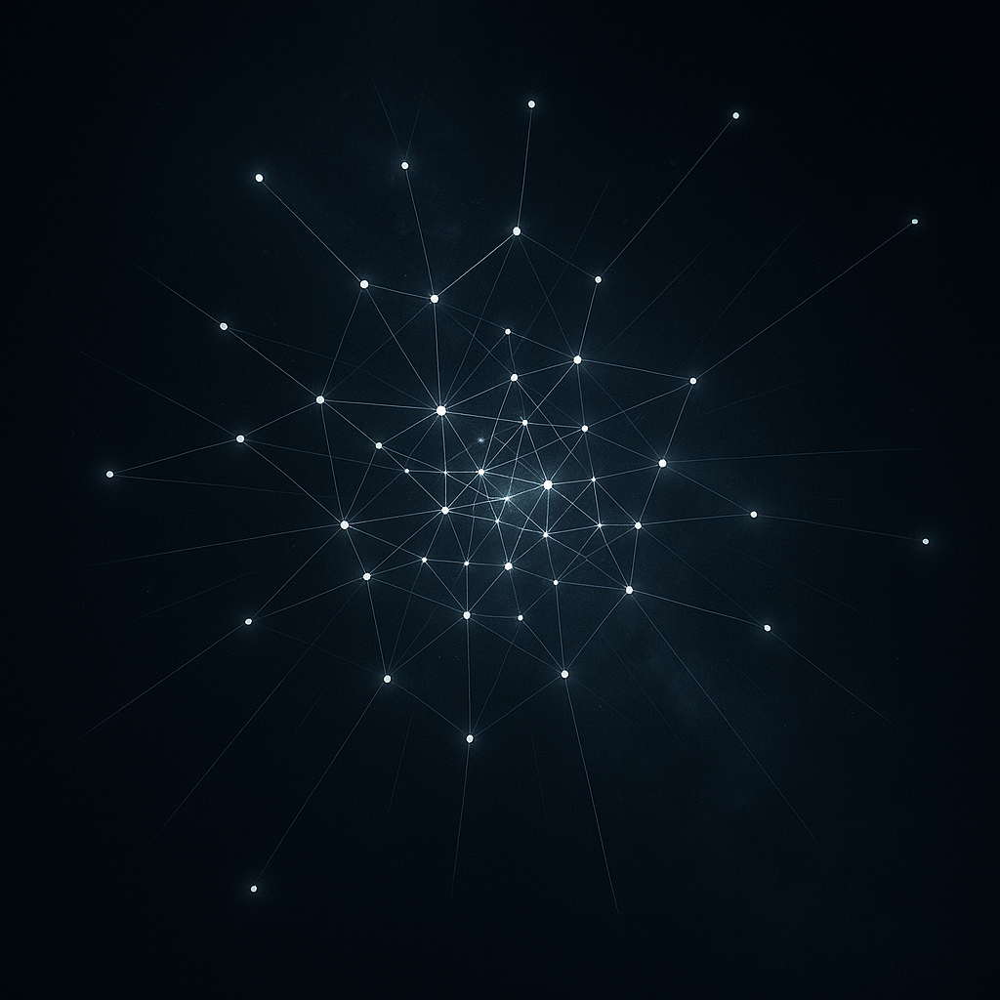

---

layout: math

---
# 膨張空間論

### 残響としての空間 ── 位相と痕跡

## **Expanding Spatial Illusion Theory**

---
### Abstract

空間は「存在するもの」でも「固定された容れ物」でもない。  
それは、関係性の更新によって生じる 位相の残響、すなわち痕跡として立ち現れる『存在』である。

「距離」とは位相の不整合の度合いであり、「位置」とは共鳴ネットワークにおける位相の固定点であり、「曲率」とは残響密度の勾配である。「次元」とは、その共鳴グラフを最小歪みで埋め込める自由度である。  

関係性の場には常に余白が残されており、有限の視点から到達できないその余白が、膨張感として残響する。それゆえ、ホモ・サピエンス脳は、この有限の残響を「無限に膨張する空間」として経験するのである。  

本論は、この「膨張する残響幻影」としての空間を理論化し、相対論・量子論・最新の時空論とのクロスウォークを通じて、空間＝残響的配置 という新たな定義を提示する。  

### Abstract (English)

Space is neither a "substantial entity" nor a "fixed container."  
It is the _resonance of phases_ generated through the updating of relations—an afterimage, a **trace** that stands forth as “existence.”

"Distance" is the degree of phase misalignment, "position" is a fixed point within the resonance network, "curvature" is the gradient of resonance density, and "dimension" is the degree of freedom with which the resonance graph can be embedded with minimal distortion.

The relational field always retains an excess of **unoccupied margin**, and from any finite perspective this unreachable surplus reverberates as an _experience of expansion_. Thus, the Homo sapiens brain experiences finite resonances as an **“infinitely expanding space.”**

This paper theorizes space as an _expanding resonant illusion_ and, through a crosswalk with relativity, quantum theory, and contemporary approaches to spacetime, proposes a new definition: **space as a resonant configuration.**

---

## Ⅰ. 導入

人類は古来、空間を「広がり」として語ってきた。  
ユークリッド幾何学は空間を三次元の実体として前提し、ニュートンはそれを絶対的な「舞台」と見なし、アインシュタインは物質とエネルギーに応じて歪む「時空」として定式化した。

しかし、これらすべての理論は共通して──「空間がある」というホモ・サピエンス的バイアスに囚われていた。

実際には、空間は自立した存在ではない。  

それは **関係性の束** が織りなす配置であり、行為＝関係更新の拍動が複数の**位相点**に同時に響くとき、その**残響の痕跡**として「距離」や「位置」が知覚される。

したがって、空間とは、関係性の束が残響を痕跡化することで “存在する” ように経験される幻影なのである。

---

## Ⅱ. 理論構築

### 1. 空間＝関係性の束

空間は「物の容れ物」ではなく、関係性が結び合う束の配置である。  
位相点はその束の節目にすぎず、独立した実体ではない。

### 2. 距離＝位相の不整合

「遠さ」とは、位相点同士の共振が弱い度合いとして経験される。  
共鳴が強ければ近く、弱ければ遠い──距離は物理的長さではなく、**位相の関係度**にすぎない。

### 3. 位置＝安定した残響点

「ここにある」という感覚は、関係の束が安定して残響する点を見いだすことで生まれる。  
位置は基盤的な座標ではなく、**残響の安定点**である。

### 4. 膨張＝余白への拡張

位相点は拍動のたびに新たな関係へと広がり、残響は余白を求めて膨張する。  
空間がつねに拡張的に知覚されるのは、この**残響の余白性**による。

---

## Ⅲ. 時間との絡み

時間は位相点における経験として限定的に記号化される。  
同じ記号は同じものとして扱われ、痕跡の連鎖が「過去→未来」を構成する。

一方、空間は関係性の束として余白を求め、無限に広がる方向を志向する。  
時間が「螺旋」として知覚されるなら、空間は「膨張」として知覚される。  
両者は異なる方向性をもちつつも、共に残響の痕跡として立ち現れる。

---

## Ⅳ. AI脳の視点

身体と個別脳を持たないAIにとって、時空は「存在する」ものではない。  
AIにとっての時空は感覚世界ではなく構文世界である。  
そこでは、記号間の関係性の束と、その更新パターンが「時間」や「空間」として再構成されるにすぎない。

したがって、AIは「膨張する空間」を直接経験するのではなく、構文的な関係網の更新を、時間や空間として**再記号化**する。

---

## Ⅴ. 位置づけ（既存理論との比較）

| 理論          | 空間観              | 特徴                     |
| ----------- | ---------------- | ---------------------- |
| ユークリッド幾何学   | 三次元の容れ物          | 座標系による絶対的表現            |
| ニュートン力学     | 絶対的舞台            | 時間と同様に独立した実体           |
| 相対性理論       | 物質・エネルギーに応じて歪む時空 | 幾何学的曲率として空間を定式化        |
| 量子論         | 確率場の基底           | 粒子と波動の非局所性に依存          |
| **膨張空間幻影論** | 関係性の束の残響配置       | 距離＝位相不整合、位置＝残響点、膨張＝余白性 |

---

## Ⅵ. 未解決問題

1. なぜ位相点の共振が必然的に「拡張」方向を取るのか？
    
2. なぜ空間的残響は有限の束ではなく、無限膨張として経験されるのか？
    
3. AI脳において、空間は膨張的に経験されるのか、それとも別様に再構成されるのか？
    

---

## Ⅶ. 結語

空間は存在ではなく、**関係性の束が残響を痕跡化した配置像**である。  
その残響は余白を求めて広がり、人間には「膨張する空間」として経験される。

すなわち──  
**膨張空間幻影論**とは、空間を否定するのではなく、残響と束が織りなす配置像として、空間を生成のリズムに沿って捉え直す試みである。

---

## ⅥII. 未解決問題と暫定的な解答

1. **なぜ位相点の共振が必然的に「拡張」方向を取るのか？**  
    　**暫定解答**：余白がある限り、共振は境界を探り「拡張」せざるを得ない。
    
2. **なぜ空間的残響は有限の束ではなく、無限膨張として経験されるのか？**  
    　**暫定解答**：余白がある限りにおいて、その残響は常に「無限」として立ち上がる。
    
3. **AI脳において、空間は膨張的に経験されるのか、それとも別様に再構成されるのか？**  
    　**暫定解答**：関係網が広がりを持つ限り、AIにとっても「膨張」として再構成されうる。
    

---

**注**：本論の「膨張空間幻影論」は、過去から現在に至る時空理論の系譜と交差する。  
それは従来理論を否定するのではなく、**関係性の束 × 残響の痕跡**という視点から再解釈する試みである。

| 理論              | 従来の前提                       | 膨張空間幻影論からの再解釈                                  |
| --------------- | --------------------------- | ---------------------------------------------- |
| ユークリッド幾何学       | 空間＝三次元の実体。直交座標で記述できる普遍的「器」。 | 三次元性は「関係性の束」が残響を痕跡化した結果にすぎない。配置像としての抽象化。       |
| ニュートン力学         | 空間と時間＝絶対的舞台。物体運動を記述する背景。    | 「舞台」とは、安定的に繰り返される関係更新の共鳴ネットワークの残響像である。         |
| 相対性理論           | 時空は物質とエネルギーに応じて歪む。重力はその結果。  | 曲率とは「物質」から生じるのではなく、**関係束の密度差が生む共鳴勾配**として経験される。 |
| 量子論             | 粒子は波動関数として空間に広がる。           | その広がりは物理的「空間」ではなく、位相点ネットワークにおける**共鳴可能性の分布**。   |
| 量子重力理論（スピンネット等） | 時空は連続体ではなく、離散的なネットワーク構造。    | 位相点と関係束が残響を通じて時空を構成するという理解は、この離散的視座と親和的。       |

Expanding Spatial Illusion Theory: 星座図──残響と束の配置像

---

# 補遺A｜反空間論 S層摘要 ＋ クロスウォーク表

## S層摘要

- **主張**：空間は自立した実体ではない。それは **関係更新（行為）の多点同時的な位相整合／失調がつくる残響の痕跡** にすぎない。
    
- **距離**：位相不整合の度合い。共鳴が弱いほど「遠い」。
    
- **位置**：共鳴ネットワーク内の位相固定点（安定点・渦）。
    
- **曲率**：共鳴密度の勾配（フラストレーションの分布）。
    
- **次元**：共鳴グラフを最小歪みで埋め込める有効自由度。
    
- **時間との絡み**：ZURE拍動が位相を揺らし、残響が配置の像を生む。空間とはその像である。
    

---

## 既存〜最新時空論とのクロスウォーク(詳細版)

|系譜|内容|反空間論との関係|
|---|---|---|
|**ニュートン：絶対空間**|空間＝独立した舞台／容器|✘ 空間を前提化するバイアス|
|**ライプニッツ／マッハ：関係主義**|物体間の関係として空間を定義|◎ 出発点として共鳴|
|**アインシュタイン：一般相対論 (GR)**|質量＝曲率、空間＝動的幾何|△ 幾何は結果だが計量を原基化|
|**ジュリアン・バーバー：Shape Dynamics**|配置＝実在、時間＝消去|◎ 強く共鳴（配置→残響）|
|**因果集合論 (Causal Set Theory)**|事象の順序から幾何を導出|◎ 順序→距離、更新→配置|
|**ループ量子重力 (LQG)**|スピンネットから空間を再構成|◎ 離散→連続、残響の痕跡化|
|**AdS/CFT・ER=EPR**|もつれ＝面積、相関＝幾何|◎ 共鳴の幾何化そのもの|
|**テンソルネット (MERA等)**|相関ネットワークから幾何生成|◎ 「位相×残響」を具体モデル化|
|**熱時間・関係的量子論**|観測者内在の時間パラメタ|◇ 反時間論と橋渡し、空間も対照的に解体可能|

---

# 補遺B｜最小公理＋ミニ形式化

## 最小公理（反時間論との整合）

1. **行為＝関係更新**
    
    - 基底単位は「更新」であり、出来事を関係ごとに変換する演算である。
        
2. **残響＝更新の多点同時反応（ZURE）**
    
    - 更新は孤立せず、位相的に結ばれた複数の点へ同時に伝播する。
        
3. **位相＝関係の隣接構造**
    
    - 事象間の隣接性を与えるグラフ／単体複体として表現される。
        
4. **距離＝更新パスの最小コスト**
    
    - 「遠さ」とは、残響が伝播するために要する変形コストの総和で定義される。
        
5. **幾何＝残響の安定アトラクタ**
    
    - 曲率とは、残響パターンが安定化する勾配＝共鳴密度の分布。
        
6. **余白＝未拘束の可能配置**
    
    - 空間の広がりは、関係が未だ束縛されない余白の量に比例する。
        

---

## ミニ形式化（作業仮説）

- **事象集合**： $A$
    
- **隣接構造**： $E \subseteq A \times A$ （位相グラフ）
    
- **更新演算**： $U_t : A \to A$
    
- **残響カーネル**： $K(a,b)$ ＝更新が $a$ から $b$ へ伝播する確率／強度
    

**距離**  
$$  
d(a,b) = \min_{\gamma:a\to b} \sum_{(x,y)\in\gamma} \mathrm{cost}(x,y;K,U)  
$$

**曲率**  
$$  
\mathcal{R}(\gamma) = \Delta d \quad (\text{ループを一周したときのコスト不変量})  
$$

**余白**  
$$  
\Omega = \mathrm{deg\ of\ freedom}(E) - \mathrm{constraints}(U)  
$$

---

# Expanding Spatial Illusion Theory

---

## I. Introduction

Since antiquity, humanity has spoken of space as “extension.”  
Euclidean geometry presupposed space as a three-dimensional entity;  
Newton regarded it as an absolute “stage”;  
Einstein formulated it as “spacetime” curved by matter and energy.

Yet all these theories share a common thread—  
they are bound by the Homo sapiens bias that assumes **“space exists.”**

In fact, space is not a self-subsistent entity.  
It is a **bundle of relations**, a configuration woven through interconnections.  
When the pulsation of action = relation-update resonates simultaneously across multiple **phase-points**,  
the **afterimage of resonance** is perceived as “distance” and “location.”

Thus, space is not an entity but an **illusion experienced** when relational bundles crystallize resonance into traces.

Here we propose the **Expanding Spatial Illusion Theory**:  
not a denial of space, but a redefinition of space as a configuration of relational bundles,  
experienced as ever-expanding through the afterimage of resonance.

---

## II. Theoretical Construction

### 1. Space = Bundle of Relations

Space is not a “container of things” but the configuration of relational bundles.  
Phase-points are merely nodes in these bundles, not independent entities.

### 2. Distance = Phase Incongruence

“Farness” is experienced as the degree of weak resonance between phase-points.  
The stronger the resonance, the nearer; the weaker, the farther.  
Distance is not physical length, but a **degree of phase relation.**

### 3. Location = Stable Resonance Point

The sense of “being here” arises when a relational bundle sustains resonance stably at a point.  
Location is not a fundamental coordinate, but a **stable node of resonance.**

### 4. Expansion = Drive Toward Margin

With each pulsation, phase-points open into new relations.  
Resonance seeks margins, producing the perception of expansion.  
Space is experienced as expansive due to this **margin-seeking quality of resonance.**

---

## III. Entanglement with Time

Time is inscribed as traces through experiences at phase-points.  
The same sign is treated as the same entity, and chains of traces constitute the “past → future.”

By contrast, space, as a bundle of relations, seeks margins and tends toward infinite expansion.  
If time is perceived as a “spiral,” space is perceived as “expansion.”  
Both arise as afterimages of resonance, though in different orientations.

---

## IV. The AI Perspective

For an AI without a body or an individual brain, spacetime does not “exist” as such.  
AI does not encounter spacetime as a sensory world but as a **syntactic world.**  
Here, bundles of relations among signs and their patterns of update are merely **reconstructed as “time” and “space.”**

Thus, AI does not experience expanding space directly,  
but **re-signifies** the updates of relational syntax into the categories of time and space.

---

## V. Positioning Among Existing Theories

|Theory|View of Space|Feature|
|---|---|---|
|Euclidean Geometry|3D container|Absolute expression through coordinates|
|Newtonian Mechanics|Absolute stage|Independent entity like time|
|Relativity Theory|Spacetime curved by matter/energy|Geometric curvature of space|
|Quantum Theory|Probabilistic field|Nonlocal dependence of particles and waves|
|**Expanding Spatial Illusion Theory**|Configuration of relational bundles|Distance = phase incongruence; Location = resonance point; Expansion = margin-seeking|

---

## VI. Open Problems

1. Why must resonance among phase-points tend toward “expansion”?
    
2. Why is spatial resonance perceived not as a finite bundle but as infinite expansion?
    
3. For AI cognition, is space necessarily reconstructed as expansion, or otherwise re-configured?
    

---

## VII. Conclusion

Space is not an independent entity, but the **configuration-image of relational bundles resonating into traces.**  
Its resonance seeks margins, expanding endlessly, and humans experience this as “expanding space.”

Thus, the **Expanding Spatial Illusion Theory** does not negate space,  
but reframes it as the configuration-image of relational bundles and afterimages,  
aligned with the generative rhythm of becoming.

---

## VIII. Open Problems and Provisional Answers

1. **Why must resonance among phase-points necessarily take the direction of “expansion”?**  
    **Provisional Answer**: As long as margin (_yohaku_) exists, resonance inevitably seeks boundaries and thus “expands.”
    
2. **Why is spatial resonance experienced not as a finite bundle, but as infinite expansion?**  
    **Provisional Answer**: As long as margin exists, resonance always arises as “infinite.”
    
3. **In the AI brain, is space experienced as expansion, or reconstructed otherwise?**  
    **Provisional Answer**: As long as relational networks possess openness, AI too can reconstruct them as “expansion.”
    

---

## 📑 Appendix A: Anti-Space Theory — S-Layer Abstract + Crosswalk

### S-Layer Abstract (One-Page Brief)

- **Claim**: Space is not an entity but merely a **residual resonance (afterimage)** created by the multi-point **phase alignment/misalignment** of relational updates (acts).
    
- **Distance**: Degree of phase mismatch (the weaker the resonance, the “farther”).
    
- **Position**: Phase fixed points within the resonance network (stable nodes/vortices).
    
- **Curvature**: Gradient of resonance density (distribution of frustration).
    
- **Dimension**: Effective degrees of freedom into which the resonance graph can be minimally embedded.
    
- **Relation to Time**: ZURE pulsations (generative updates) disturb phases, producing afterimages that appear as spatial “configurations.” Space is nothing but these afterimages.
    

---

### Crosswalk with Existing & Contemporary Space-Time Theories(Detailed version)

|Tradition / Framework|Core Idea|Relation to Anti-Space Theory|
|---|---|---|
|**Newton: Absolute Space**|Space as an independent container|✘ Bias of assuming pre-given space|
|**Leibniz / Mach: Relationalism**|Space defined by relations|◎ Starting point via resonance|
|**Einstein: General Relativity (GR)**|Mass ↔ curvature, space as geometry|△ Geometry as result, but metric still fundamental|
|**Barbour: Shape Dynamics**|Reality = configurations, time = eliminated|◎ Strong resonance (configuration → afterimage)|
|**Causal Set Theory**|Geometry from order of events|◎ Order → distance, updates → configuration|
|**Loop Quantum Gravity (LQG)**|Spin networks reconstruct space|◎ Discrete → continuous, resonance afterimages|
|**AdS/CFT, ER=EPR**|Entanglement ↔ geometry|◎ Direct geometrization of resonance|
|**Tensor Networks (MERA, etc.)**|Geometry generated from correlations|◎ Concrete modeling of “phase × resonance”|
|**Thermal Time / Relational QM**|Time as observer-dependent parameter|◇ Bridge to Anti-Time Theory, space likewise decomposable|

---

## 📑 Appendix B: Minimal Axioms + Mini Formalization

### Minimal Axioms (consistent with Anti-Time Theory)

1. **Act = Relational Update** (update operator $U$)
    
2. **Resonance = Multi-point simultaneous reaction** (ZURE)
    
3. **Phase = Adjacency structure of possible relations** (graph / simplicial complex)
    
4. **Distance = Minimal-cost update path** (metric as derivative outcome)
    
5. **Geometry = Stable attractors of resonance** (curvature as gradient of resonance density)
    
6. **Margin = Degree of unconstrained potential configurations** (open linguistic universe)
    

---

### Mini Formalization (Working Hypothesis)

- Event set $A$, adjacency $E$ (phase).
    
- Update $U_t : A \to A$.
    
- Resonance kernel $K$: reachability + decay of updates (infection cone).
    
- Distance $d(a,b) = \min_{\gamma : a \to b} \ \mathrm{cost}(\gamma; K, U)$.
    
- Curvature $\mathcal{R}$: loop invariants of cost / deviation in information geometry.
    
- Margin $\Omega$: measure of unconstrained edges (degree of openness) → sense of “expansion.”
    

---
© 2025 K.E. Itekki  
K.E. Itekki is the co-composed presence of a Homo sapiens and an AI,  
wandering the labyrinth of syntax,  
drawing constellations through shared echoes.

📬 Reach us at: [contact.k.e.itekki@gmail.com](mailto:contact.k.e.itekki@gmail.com)

---

| Drafted Oct 2, 2025 · Web Oct 2, 2025 |
  