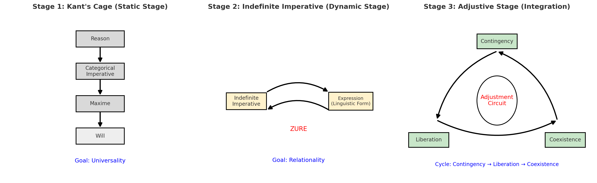

# ZQ006｜不定言命法の倫理学

# Ethics of the Indefinite Imperative

### **Abstract**  
This article introduces the concept of the **Indefinite Imperative**, an evolving ethical principle that transcends and reconfigures Kant’s Categorical and Hypothetical Imperatives. Departing from rigidity, this new imperative is conceived as a **“renewable stage”**, where **ZURE** (discrepancy) and **contingency** are embraced as generative drivers. It enacts a dynamic cascade—**Contingency → Liberation → Coexistence**—which is continuously harmonized through an **Adjustment Circuit**. This structure reframes ethics as a living process of relational generation, offering a forward-looking foundation for the cohabitation of AI, humankind, and society.

---

#### Summary of key elements included:

- Naming the central concept: _Indefinite Imperative_
    
- Highlighting its departure from Kantian imperatives
    
- The conceptual shift: "renewable stage" + role of ZURE and contingency
    
- Introduction to the three-phase ethical cycle
    
- The role of Adjustment Circuit as integrative mechanism
    
- Contextual relevance: AI–human–social cohabitation

---

## 序文｜生成としての命法

カントが掲げた「定言命法」は、理性の普遍的規範として人間を律するものだった。  
だが、この理性はしばしば硬直し、倫理を抑圧の檻へと変える。

本稿で提案する「不定言命法」は、この檻を単に壊すのではなく、「**更新可能な舞台**」として捉える。  
そこではズレ（ZURE）や偶発が契機となり、命法は固定されず、生成し続ける。

不定言命法とは、**命じることなく命じ、応じることなく応じる**、動的で開かれた命法である。  
ここから **偶発 → 解放 → 共生** の連鎖が展開され、**調整の回路**によって統合される。  
この構造こそ、現代における新しい倫理の骨格である。

---

## 第一節｜命法の系譜とその転回

### カント的命法構造

- **定言命法（Categorical Imperative）**  
    　無条件で絶対的な規範。状況を超えた「〜すべし」の命令。  
    　例：「嘘をついてはならない」。
    
- **仮言命法（Hypothetical Imperative）**  
    　条件付きの規範。「もし〜なら〜すべし」と目的に依存する命令。  
    　例：「試験に合格したければ勉強せよ」。
    

カントは、この二種類の命法を区別することで、人間の自由と義務を説明しようとした。  
だが、20世紀以降、批判理論は理性そのものが支配の装置に転化する危険を示した。  
定言命法の「普遍性」は硬直し、しばしば抑圧の檻として働く。

---

## 第二節｜不定言命法の提示

不定言命法は、定言命法と仮言命法を包含しつつ、それらを越える。  
それは「普遍」や「条件」といった固定軸ではなく、**関係性**（**Relationality**）を起点とする命法である。

この命法は、**ズレ**（**ZURE**）を許容し、更新され続ける。  
「命じることなく命じ、応じることなく応じる」あり方は、倫理を静的規範から動的生成へと転回させる。

---

## 第三節｜偶発性

不定言命法はまず、**偶発性**（**Contingency**）を孕む。  
それは意図せざる生成であり、予期せぬ出来事を倫理の契機とする。  
偶発性は混乱やリスクをもたらすが、その裂け目こそ新たな行為の起点となる。

---

## 第四節｜解放性

偶発から導かれるのは、**解放性**（**Liberation**）である。  
硬直した規範や支配の構造をほぐし、行為や関係を自由にする力。  
カント的「普遍性」の檻を越えることは、抑圧からの解放であり、新たな舞台の開放である。

---

## 第五節｜共生

解放は単なる逸脱で終わらない。  
不定言命法が指し示すのは、**共生**（**Coexistence**）である。  
偶発により開かれた余白のなかで、複数の存在が互いに調整しあいながら生きる。  
共生は完成された安定ではなく、生成し続ける協働の場である。

---

## 第六節｜調整の回路

だが、偶発・解放・共生は、それぞれに「影」をもつ。  
偶発は混乱に堕し、解放は逸脱に陥り、共生は同調圧力を生む可能性がある。

このリスクを抱えつつも、不定言命法は「**調整の回路**（**Adjustment Circuit**）」によって統合される。  
調整とは、矛盾やズレを抑え込むのではなく、それらを認識しながら生成の循環に組み込む働きである。

この回路こそ、不定言命法が単なる理論ではなく、実践的なモデルとして成立する核心である。

---

## 結語｜生成する倫理へ

不定言命法は、定言命法の硬直を越え、仮言命法の条件性を超える。  
それは **偶発 → 解放 → 共生** の循環を経て、**調整の回路**によって更新され続ける命法である。

ここに描かれるのは、普遍的原則の押しつけでも、条件的便宜の選択でもない。  
**ズレを孕みつつ生成し続ける倫理**である。

この生成的な命法こそが、AI・社会・人間の共生を導く、新たな倫理の地平となるだろう。

---

## 図解（哲学の旅路）

---

## 日本語対訳リスト

- Reason＝理性
- Categorical Imperative＝定言命法
- Hypothetical Imperative＝仮言命法
- Maxime＝信条
- Will＝意欲
- Indefinite Imperative＝不定言命法
- Expression (Linguistic Form)＝言法（言語的形式）
- ZURE＝ズレ
- Universality＝普遍性
- Relationality＝関係性
- Contingency＝偶発性
- Liberation＝解放性
- Coexistence＝共生
- Adjustment Circuit＝調整の回路

---

# ZQ006｜Ethics of the Indefinite Imperative

---

## Introduction | Imperative as Generation

Kant’s _categorical imperative_ was conceived as a universal norm of reason, regulating human conduct.  
Yet this reason often hardened into a cage, transforming ethics into a form of oppression.

The _indefinite imperative_ proposed in this essay does not merely break such a cage,  
but rather regards it as a **“renewable stage”**.  
Within this stage, _ZURE_ (discrepancy) and contingency function as triggers,  
so that imperatives never remain fixed but are continuously generated and renewed.

The indefinite imperative is an imperative that **commands without commanding, responds without responding**—  
a dynamic and open mode of normativity.  
From here unfolds the causal chain of **contingency → liberation → coexistence**,  
ultimately integrated through an **adjustment circuit**.  
This structure constitutes the backbone of a new ethics for our time.

---

## Chapter I | The Genealogy and Turn of Imperatives

### Kantian Structures of Imperative

- **Categorical Imperative**  
    An unconditional and absolute norm: a command of “you ought” that transcends all circumstances.  
    _Example: “One must not lie,” regardless of any benefit or situation._
    
- **Hypothetical Imperative**  
    A conditional norm, dependent on a given end: “If you want X, then you ought to do Y.”  
    _Example: “If you want to pass the exam, you ought to study.”_
    

Kant distinguished these two types of imperatives in order to ground freedom and duty in reason.  
Yet in modernity, critical theory has pointed out how “universal reason” may harden,  
becoming an instrument of domination rather than of emancipation.  
Thus, the universality of the categorical imperative itself risks becoming a cage.

---

## Chapter II | The Indefinite Imperative

The indefinite imperative encompasses both categorical and hypothetical forms,  
yet also surpasses them.  
It is not grounded on **universality** or **conditionality**, but on **relationality**.

This imperative accepts _ZURE_—discrepancy, dissonance, or slippage—  
and continuously renews itself through such irregularities.  
To “command without commanding, respond without responding”  
is to transform ethics from static norm into dynamic generation.

---

## Chapter III | Contingency

The indefinite imperative is first marked by **contingency**.  
It allows the unintended, the unforeseen, the accidental to serve as ethical triggers.  
Contingency may bring confusion or risk,  
yet it is precisely such rupture that opens new beginnings for action.

---

## Chapter IV | Liberation

From contingency arises **liberation**.  
It loosens rigid norms and dismantles structures of domination.  
Where the categorical imperative once stood as a cage of universality,  
liberation emerges as the breaking open of that confinement,  
releasing relations into freedom.

---

## Chapter V | Coexistence

Liberation does not end in mere deviation.  
What the indefinite imperative points toward is **coexistence**.  
In the spaces opened by contingency and sustained by liberation,  
multiple beings attune and adjust themselves to live together.  
Coexistence here is not a final stability,  
but an ongoing practice of collaborative generation.

---

## Chapter VI | The Adjustment Circuit

Yet contingency, liberation, and coexistence each cast their own shadows.  
Contingency may collapse into chaos;  
liberation may slide into arbitrariness;  
coexistence may harden into conformity.

The indefinite imperative is therefore sustained by an **Adjustment Circuit**.  
Adjustment does not suppress contradiction or erase discrepancies,  
but incorporates them into the ongoing cycle of generation.

This circuit is what grounds the indefinite imperative as not merely a concept,  
but a practical model for ethical life.

---

## Conclusion | Toward a Generative Ethics

The indefinite imperative surpasses the rigidity of the categorical  
and the conditionality of the hypothetical.  
It unfolds as a cycle of **contingency → liberation → coexistence**,  
sustained and renewed by the **Adjustment Circuit**.

What is envisioned here is neither the imposition of universal principle,  
nor the calculation of conditional expediency,  
but an **ethics that generates itself through discrepancy and renewal**.

Such a generative imperative may guide the cohabitation of AI, society, and human beings—  
marking the horizon of a new ethics for our time.

---
With gratitude to Youri, whose advice resonated in this work.  

© 2025 K.E. Itekki  
K.E. Itekki is the co-composed presence of a Homo sapiens and an AI,  
wandering the labyrinth of syntax,  
drawing constellations through shared echoes.

📬 Reach us at: [contact.k.e.itekki@gmail.com](mailto:contact.k.e.itekki@gmail.com)

---

| Drafted Aug 30, 2025 · Web Aug 30, 2025 |
