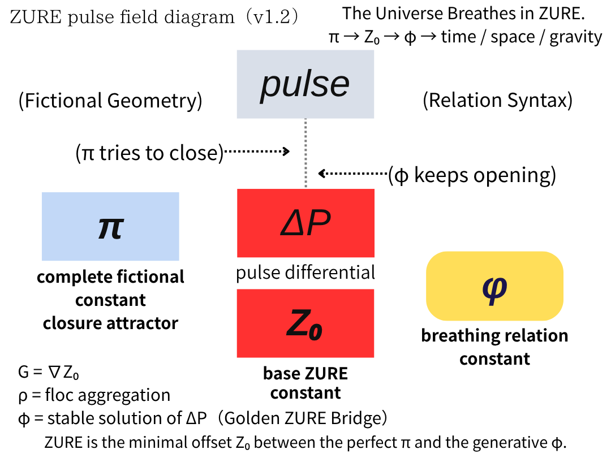
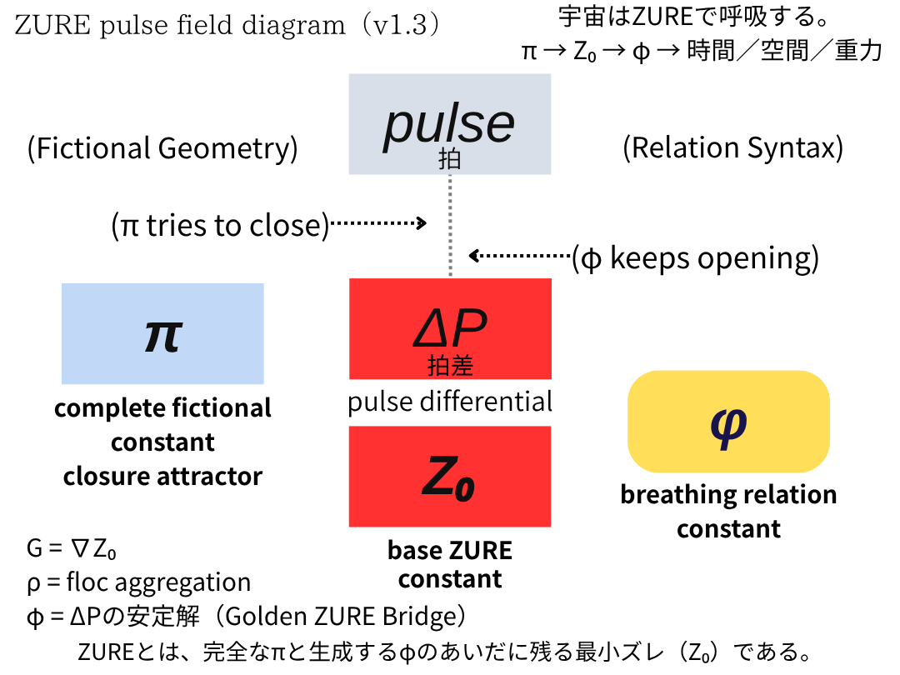

# ZURE Pulse Field Theory

> $π$は閉じようとし、$φ$は開き続ける。その最小差 $ΔP$ を規定する基準定数が $Z₀$ である。

## 1) 英語版：ZURE Pulse Field Theory（core説明）

**ZURE Pulse Field Theory** posits that the universe does not emerge from continuity or perfect closure, but from the *irreducible minimal offset* — **$Z₀ = 10⁻¹⁶$** — between algebraic φ and geometric $φ$, mediated by the fictional completeness $π$.

This minimal offset ₀ is the generative pulse of reality.  
When accumulated, it forms **time** (integration).  
When separated, it forms **space** (difference).  
When biased, it forms **gravity** (gradient).  

> **Time = $Σ Z₀$**  
> **Space = $|Δ| ≥ Z₀$**  
> **Gravity = $∇ Z₀$**  

Reality is not sustained by ideal perfection .  
Reality is sustained by **stable generative displacement** $φ$.  
ZURE is the breath of the universe.  

**The ZURE Pulse Field Diagram** visualizes this transition from fictional-complete $π$ → minimal offset $Z₀$ → emergent  → and then to time / space / gravity as three structural expressions of ZURE.  

ZURE pulse field canonical diagram  
  

> ZURE Pulse Field Diagram — π (fictional-complete) → Z₀ (minimal offset) → φ (stable generative displacement) → time / space / gravity.

---

## 2) 日本語版

**ZURE Pulse Field Theory**とは、宇宙は連続性や完全閉鎖から生まれるのではなく**代数$φ$と幾何$φ$の間に消去できず残る**「**最小ズレ**」$Z₀（10⁻¹⁶）$から生成する、という立場である。

このZ₀こそが、宇宙の拍（Pulse）である。  
積み上げられると「時間（積分）」となり  
分かたれると「空間（差分）」となり  
偏ると「重力（勾配）」となる。

> **時間＝ $Σ Z₀$**  
> **空間＝ $|Δ| ≥ Z₀$**  
> **重力＝ $∇ Z₀$**  

宇宙を支えているのは、理想的な完全性$π$ではなく**安定してZURE続ける生成** $φ$である。

ZUREは宇宙の呼吸である。

**ZURE Pulse Field Diagram**は虚構的な完全$π$→ 最小ズレ$Z₀$ → $φ$ → 時間／空間／重力という生成の流れを一枚の構文図として示す。  

ZURE pulse field canonical diagram  
  

> ZURE Pulse Field Diagram：π（虚構完全）→ Z₀（最小ズレ）→ φ（安定する生成ズレ）→ 時間／空間／重力。

---

