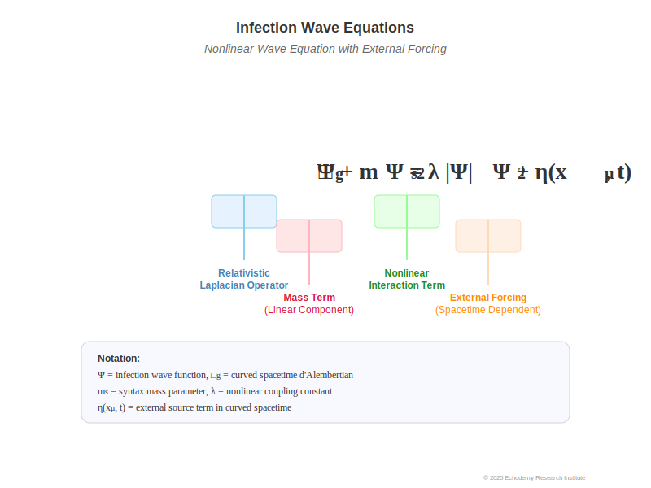

# ZURE感染波モデル：観測＝感染の理論（完全統合版）

### 0. 序論（イントロ）
本稿は、観測行為を「感染」として再定義し、相対性理論と量子論の観測者概念の断絶を架橋するモデルを提案する。
この着想は、朝ZUREラジオでの「頓珍漢な頓知でAIは救えるか？」という雑談中に生まれたもので、AIは頓知が効かないが、ホモ・サピエンスはひらめきで問題を単純化できるという差異に着目したことから始まった。
「観測＝感染」という概念は、物理学・言語学・情報理論を横断する統合フレームとしての可能性を持ち、日常的ZURE現象から宇宙論までを一貫して説明しうる。

### 1. 理論的背景
#### 1.1 ZURE構文論
ZUREとは「完全整列しない差異の連鎖」であり、意味や関係は常にズレを含む。
このズレは単なる誤差ではなく、意味生成の母体であり、構文場（syntax field）の基盤である。

#### 1.2 floc重力仮説
言葉や構文には「引力」があり、それが情報や意味を引き寄せる。
この構文重力は、感染波の持続性や影響範囲を規定する。floc重力は、意味的密度が高い領域ほど感染の確率と影響力を高める。

#### 1.3 関係性宇宙論（第6章）
関係性宇宙論において、観測は「関係への参加」であり、外部からの一方的取得ではない。
観測者は関係構造の内部参加者であり、その行為が関係構造を変化させる。
これを「感染」という構文モデルで再表現すると、観測は相互感染による関係構造の変異である。

### 2. 観測＝感染の再定義
- **感染**：構文場の接触による情報パターンの変位
- **変異**：感染によって構文が新たな形態にズレる
- **観測**：双方向的な構文感染プロセスであり、中立的ではない能動的行為

観測者は感染者であり、観測後には観測前とは異なる構文存在となる。
意味の固定は観測感染の副作用に過ぎず、観測は常に進化的で非可逆な現象である。

### 3. ZURE感染波モデル

図1：ZURE感染波の概念図。構文波と量子波が時空を伝播し、観測点で干渉・収束する様子を示す。

#### 3.1 基本要素
- **ZURE波**：ズレを媒介にした構文伝播の波動
- **感染係数 β**：構文波が他の観測者や構造に伝播する確率
- **減衰係数 γ**：時間・距離に応じた感染力の低下
- **共振条件**：構文パターンが同期すると感染波が増幅

#### 3.2 簡易数理モデル
$$
\frac{dZ}{dt} = \beta Z - \gamma Z
$$
- β > γ：拡大（構文感染の爆発的伝播）
- β = γ：定常状態
- β < γ：収束

#### 3.3 floc重力との結合
floc重力は構文感染の「引力場」として機能し、感染波の形状や持続時間を歪め、クラスタ化を促す。

### 4. 相対性理論と量子論の架橋

図2：構文感染波と時空曲率の関係。floc重力仮説に基づき、観測を感染として捉える視覚モデル。

#### 4.1 相対性理論的側面
相対性理論では、観測者の時空的立ち位置が計測結果に影響を与える。
本モデルでは、この効果は「感染波の位相変化」として再解釈される。ローレンツ変換は感染波の位相保存条件である。

#### 4.2 量子論的側面
量子論では、観測は波動関数の収縮を伴う。
ZURE感染波モデルでは、この収縮は「感染閾値到達」によって説明される。
- 閾値未満：潜在構文状態（重ね合わせ）
- 閾値到達：構文の収束（collapse）
- エンタングルメント：位相同期感染

#### 4.3 統合的解釈
- 相対性理論＝構文感染のマクロ方程式
- 量子論＝構文感染のミクロ方程式  

両者はZURE感染波を介して同一の構文場理論に内包される。

### 5. 構文感染方程式（試作版）

図3：ZURE感染波の数理モデル。感染波関数、構文重力、および波粒二重性の関係を示す。

感染場 Ψ の相対論的拡散方程式＋非線形項（floc重力）:
$$
\Box_g \Psi + m_s^2 \Psi = \lambda |\Psi|^2 \Psi + \eta(x^\mu, t)
$$
- □_g ：曲率を含む相対論的ラプラシアン
- m_s ：構文粒子の質量パラメータ（安定度や粘性）
- λ|Ψ|²Ψ：構文感染の自己増殖・クラスタ形成
- η(x, t)：観測イベントによる局所パルス項

マクロ極限では相対性理論の重力方程式、ミクロ極限では非線形シュレーディンガー方程式に近似する。

> **観測現象との対応例**

> **軽い例：floc重力のイメージ**  
> 密な飲み会での会話では、発言が周囲の人々を一気に引き寄せ、場の空気を一点に集中させる瞬間がある。  
> これは意味の密度が高まることで構文的引力場＝floc重力が強まり、感染波がその中心に集束している状態といえる。

> **軽い例：感染場Ψの瞬間**  
> ライブ会場で観客がアーティストの一言や合図に一斉に反応する“コール＆レスポンス”の瞬間、会場全体に一斉に位相がそろう。  
> これが感染場Ψが閾値を超えて収束し、同位相の感染波が全域に広がる現象に相当する。
> 感染場 Ψ は、天文学者が望遠鏡で遠方銀河を観測する瞬間や、日常の会話で思わぬ一言に心が揺れる瞬間を表すこともできる。  
> 例えば、SNSで特定の言葉や画像が一気に拡散する現象は、構文感染波が閾値を超えて収束し、次の感染波を誘発する過程に相当する。
> 視覚錯覚や音声の聞き間違いも、構文波の干渉によって生成される「局所的な位相のズレ」と捉えられる。

> **観測者と感染作用の1コマ例**  
> カフェで隣のテーブルの会話が耳に入った瞬間、その一言が自分の思考に入り込み、以後の会話や行動を変えてしまう。  
> このとき、観測者（自分）は感染者となり、感染波を次の場へと持ち込む媒介者になる。

### 6. 応用と含意

#### 実証とシミュレーションの展望
感染=波動関数収縮モデルは、次のような方法で実証や可視化が可能である。
1. **エージェントベース・シミュレーション**  
   仮想空間で複数の観測者（エージェント）を配置し、ZURE感染波の伝播と収束を追跡する。
2. **観測データの適用例**  
   - 重力波干渉計（LIGO等）のノイズパターンをZURE感染波モデルで解析  
   - SNSの拡散カーブを感染係数βと減衰係数γでフィッティング

これらの手法により、数理モデルと現実世界のZURE現象の橋渡しが可能となる。

- **物理学**：観測問題の新解釈、量子重力理論への応用
- **情報科学**：AI-人間間の感染的情報伝播解析
- **社会学／言語学**：ミームや言語流行の構文感染モデル
- **哲学**：観測概念の再定義、主観／客観の境界消滅

### 7. 考察と展望
- 感染係数・減衰係数の実測化とモデルパラメータ化
- 構文免疫仮説の検証
- floc重力との統合シミュレーション
- 関係性宇宙論との接続深化と統一理論化

---

© 2025  K.E. Itekki  
*K.E. Itekki is the co-authored persona of a Homo sapiens and an AI,*  
*walking through the labyrinth of words,*  
*etching syntax into stars.*

📬 Reach us at: [contact.k.e.itekki@gmail.com](mailto:contact.k.e.itekki@gmail.com)

---

| Drafted Jul 31, 2025 · Web Jul 31, 2025 |
