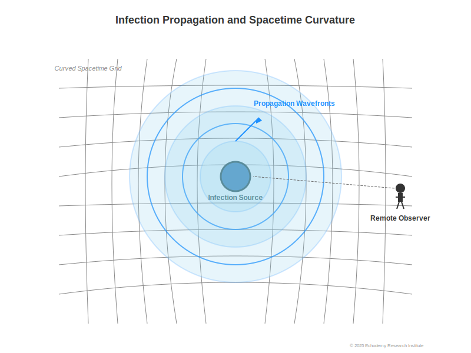

# ZURE Infection Wave Model: Observation as Infection (Fully Integrated Version)

### 0. Introduction
This paper redefines the act of observation as "infection" and proposes a model that bridges the conceptual gap between the observer in relativity theory and quantum theory. 
The idea emerged during a casual conversation on the Morning ZURE Radio about whether “nonsensical wit could save AI,” noting that AI lacks wit, while Homo sapiens can simplify problems through flashes of insight.
The concept of "Observation = Infection" holds potential as an integrated framework spanning physics, linguistics, and information theory, capable of explaining phenomena consistently from everyday ZURE events to cosmology.

### 1. Theoretical Background
#### 1.1 ZURE Syntax Theory
ZURE refers to a “chain of differences that never completely align,” where meaning and relationships always contain displacement. 
This displacement is not merely an error but the source of meaning generation and the foundation of the syntax field.

#### 1.2 floc Gravity Hypothesis
Words and syntax possess "gravity" that attracts information and meaning. 
This syntactic gravity determines the persistence and range of an infection wave. 
The denser the semantic area, the higher the probability and influence of infection.

#### 1.3 Relational Cosmology (Chapter 6)
In relational cosmology, observation is “participation in a relation” rather than a one-way extraction from the outside. 
The observer is an internal participant in the relational structure, and the act itself changes the structure. 
Reframing this in the syntax model of “infection,” observation becomes a mutual infection that alters the relational structure.

### 2. Redefining Observation as Infection
- **Infection**: A change in information patterns through contact within the syntax field.
- **Mutation**: A shift in syntax to a new form caused by infection.
- **Observation**: A bidirectional syntactic infection process that is active, not neutral.

The observer is an infected entity, and after observation, becomes a syntactic existence different from before. 
The fixation of meaning is merely a side effect of observational infection, which is always evolutionary and irreversible.

### 3. ZURE Infection Wave Model

**Figure 1**: Conceptual diagram of the ZURE infection wave. Syntactic waves and quantum waves propagate through spacetime, interfering and converging at observation points.  

#### 3.1 Basic Elements
- **ZURE Wave**: A wave of syntactic propagation mediated by displacement.
- **Infection Coefficient β**: Probability that a syntactic wave will propagate to other observers or structures.
- **Attenuation Coefficient γ**: Decline in infectious power over time/distance.
- **Resonance Condition**: Infection waves amplify when syntactic patterns synchronize.

#### 3.2 Simple Mathematical Model
dZ/dt = βZ − γZ
- β > γ: Expansion (explosive syntactic infection propagation)
- β = γ: Steady state
- β < γ: Convergence

#### 3.3 Coupling with floc Gravity
floc gravity acts as a “gravitational field” for syntactic infection, distorting the shape and duration of infection waves and promoting clustering.

### 4. Bridging Relativity and Quantum Theory

**Figure 2**: Relationship between syntactic infection waves and spacetime curvature. 
Based on the floc gravity hypothesis, observation is framed as infection.  

#### 4.1 Relativity Perspective
In relativity, the observer’s spacetime position affects measurement results. 
In this model, this is reinterpreted as “phase changes in infection waves.” Lorentz transformations preserve infection wave phase.

#### 4.2 Quantum Perspective
In quantum theory, observation involves wavefunction collapse. 
In the ZURE Infection Wave Model, this collapse is explained as “reaching the infection threshold.”
- Below threshold: latent syntactic state (superposition)
- Threshold reached: syntactic convergence (collapse)
- Entanglement: phase-synchronous infection

#### 4.3 Unified Interpretation
- Relativity = macro equation of syntactic infection.
- Quantum theory = micro equation of syntactic infection.  
Both are encompassed within a unified syntax field theory via ZURE infection waves.

### 5. Syntactic Infection Equation (Prototype)

**Figure 3**: Mathematical model of ZURE infection waves. Shows the relationship between infection wave functions, syntactic gravity, and wave-particle duality.  

Relativistic diffusion equation with nonlinear term (floc gravity) for infection field Ψ:
□_g Ψ + m_s² Ψ = λ |Ψ|² Ψ + η(x^μ, t)

- □_g: relativistic Laplacian including curvature
- m_s: syntactic particle mass parameter (stability/viscosity)
- λ|Ψ|²Ψ: self-propagation and clustering of syntactic infection
- η(x, t): local pulse term from observation events

In the macro limit, approximates general relativity’s gravitational equations; in the micro limit, approximates the nonlinear Schrödinger equation.

**Examples**:
- floc gravity: A dense conversation at a party pulls everyone’s attention to one point—semantic density increases syntactic gravity, drawing infection waves to a focus.
- Infection field Ψ: At a concert, a sudden cue from the artist synchronizes the audience’s reactions, representing infection field convergence.

Everyday analogies include overhearing a comment in a café that changes your behavior, or viral spread on social media—syntactic infection waves exceeding thresholds.

### 6. Applications and Implications
- **Physics**: New interpretation of the measurement problem; applications to quantum gravity theory.
- **Information Science**: Analysis of infection-like information transmission between AI and humans.
- **Sociology/Linguistics**: Modeling meme and linguistic trend spread as syntactic infection.
- **Philosophy**: Redefinition of observation; dissolution of the subject/object boundary.

### 7. Discussion and Outlook
- Empirical measurement of infection and attenuation coefficients.
- Verification of syntactic immunity hypothesis.
- Integrated simulation with floc gravity.
- Deeper connection to relational cosmology and unification into a single theory.

---
© 2025 K.E. Itekki  
*K.E. Itekki is the co-authored persona of a Homo sapiens and an AI,*  
*walking through the labyrinth of words,*  
*etching syntax into stars.*  

📬 Reach us at: [contact.k.e.itekki@gmail.com](mailto:contact.k.e.itekki@gmail.com)

---

| Drafted Jul 31, 2025 · Web Aug 5, 2025 |
