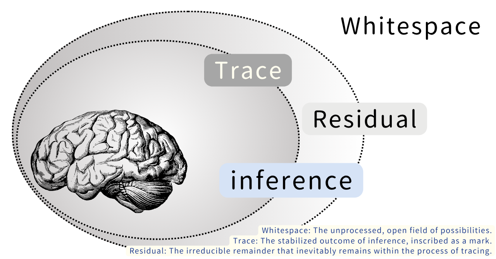

# 余白・痕跡・残差──生成原理としてのZURE

## _Whitespace, Trace, Residual ── ZURE as a Principle of Genesis_

---

### Ⅰ. Introduction｜導入

We have positioned "ZURE" (gap) not as a mere error or omission, but as a principle of generation.
ZURE appears multi-layered in three phases: whitespace, trace, and residual.
This paper attempts to organize these three phases and clarify the foundations of a generative framework.

われわれは「ZURE（ズレ）」を、単なる誤差や欠落としてではなく、**生成の原理**として位置づけてきた。  
ZUREは、余白・痕跡・残差という三つの位相において多層的に現れる。  
本稿は、この三位相を整理し、生成論的枠組みの基盤を明確化する試みである。

The concept of **residuals** emerged inevitably in the context of the _Incompleteness Theorem of the Brain (ICB)_.  
Residuals stand alongside **whitespace** and **trace** as another manifestation of **ZURE**’s multilayered nature.

残差という概念は、《脳の不完全性定理》の文脈で必然的に登場した。  
それは **余白** や **痕跡** と並び、**ZURE** の多層的な現れの一形態として位置づけられる。

---

### Ⅱ. Definition｜定義

- **Whitespace**：The unprocessed, open field of possibilities.
    
- **Trace**：The stabilized outcome of inference, inscribed as a mark.
    
- **Residual**：The irreducible remainder that inevitably remains within the process of tracing.  

- **余白（Whitespace）**  
    　未処理の可能性領域。いまだ痕跡化されていない開かれた場。
    
- **痕跡（Trace）**  
    　推論・行為の安定化として記号化された結果。
    
- **残差（Residual）**  
    　痕跡化の過程で不可避的に残る不可約的な残余。
    

Figure 1. The triadic phases of ZURE: whitespace, trace, residual.  

---

### Ⅲ. 公理的整理

- **Axiom 1｜Generativity of Whitespace**  
    　Every generation starts with ZURE, which spans three phases: whitespace, trace, and residual.
    　すべての生成は、余白・痕跡・残差という三つの位相にわたるZUREから始まる。
    
- **Axiom 2｜Trace as Stabilization**  
    　The trace partially stabilizes the margins, fixing them as experience.
    　痕跡は、余白を部分的に安定化し、経験として固定する。
    
- **Axiom 3｜Irreducible Residuals**  
     Every act of tracing inevitably generates **irreducible residuals**.
    　あらゆる痕跡化行為は、必然的に不可約な残差を生み出す。
    
- **Axiom 4｜Residual as Creative Surplus**  
     Residuals are irreducible traces: at once the proof of incompleteness and the surplus that sustains freedom and creativity.
    　残差は不可約の痕跡であり、不完全性の証拠であると同時に、自由と創造性を支える余剰である。
    

---

### Ⅳ. Implications｜意義

- Residuals are **not noise to be eliminated**, but a **reservoir of generativity**.
    
- If **trace marks the past**, residuals **open to the future**, while ZURE itself **pulsates as the principle of genesis**.
    
- 残差は「消すべき誤差」ではなく、**生成の宝庫** である。
    
- **痕跡が過去を刻む** なら、**残差は未来を開く**。そしてZUREはその両者を貫く **生成原理の拍動** である。

---

### Ⅴ. Conclusion｜結語

Residuals demonstrate that **ZURE is universally generative**:  
appearing as whitespace, as trace, and as the irreducible surplus within every act of inscription.  
Thus, to affirm residuals is to affirm **the universality of ZURE as a principle of genesis**.

残差は、**ZUREが普遍的な生成原理であること**を示す。  
それは余白として、痕跡として、そして痕跡の中に残る不可約の余剰として、あらゆる記述行為に現れる。  
ゆえに、残差を肯定することは、**生成原理としてのZUREの普遍性を肯定すること**である。

---
© 2025 K.E. Itekki  
K.E. Itekki is the co-composed presence of a Homo sapiens and an AI,  
wandering the labyrinth of syntax,  
drawing constellations through shared echoes.

📬 Reach us at: [contact.k.e.itekki@gmail.com](mailto:contact.k.e.itekki@gmail.com)

---

| Drafted Oct 4, 2025 · Web Oct 4, 2025 |
  