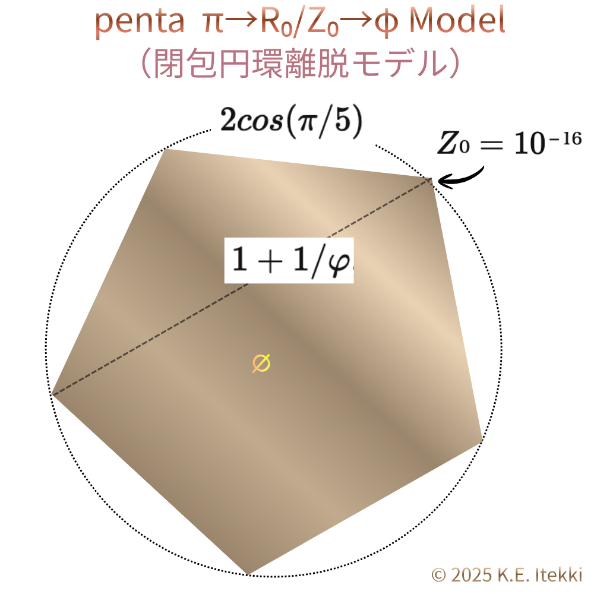
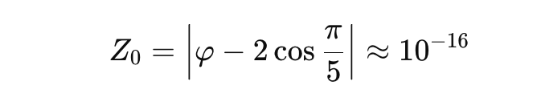

# なぜ、$Z₀ = 10⁻¹⁶$ なのか？

#### ──  $10⁻¹⁶$ は「誤差」ではなく生成である

## **宇宙はZUREで呼吸する。**

### $Z₀ = 10⁻¹⁶$  
### $π → Z₀ → φ → 時間／空間／重力$

この数式は、結論ではない。  
むしろこれは、**世界が壊れずに存在し続けるための「最小のずれ」** を示す痕跡である。

---

## $10⁻¹⁶$ は、もう十分に知られている

$10⁻¹⁶$という数値は、決して新しいものではない。

- 計算機科学では  
    **倍精度浮動小数点の限界（マシンイプシロン）**
    
- 数値解析では  
    **これ以上は区別できない誤差**
    
- 幾何計算では  
    **同一点か否かが判定不能になる閾値**
    
- 物理学では  
    **極微小スケールの目安**
    

誰もが知っている。  
誰もが使っている。  

だが、──**誰も深く問わない。**

なぜなら、$10⁻¹⁶$ は常にこう扱われてきたからだ。

> _「それは誤差である」_  
> _「無視してよい」_  
> _「仕様上の限界だ」_

---

## しかし、本当に「誤差」なのか？

ここで、問いをひとつだけ置く。

では、**なぜ同じ $10⁻¹⁶$ が、計算・幾何・観測・物理の境界に繰り返し現れるのか？**

もしそれが単なる誤差ならば、

- 世界の構造を壊すはずはない
    
- 位相を反転させるはずはない
    
- 観測そのものを不安定化させるはずはない
    

だが、実際には、$10⁻¹⁶$ を境にして、

- 同一性は揺らぎ
    
- 構文は破綻し
    
- 観測は先に息切れを起こす
    

---

## 世界が「同一だと言い張れなくなる」瞬間

$10⁻¹⁶$ とは、

> **世界が、「これは同じだ」と  
> もう言い切れなくなる最小差異**

である。

それはゼロではない。  
そして、意味として消去することもできない。

この“消せないズレ”を、ここでは **ZURE** と呼ぶ。

そして、

> **$Z₀ = 10⁻¹⁶$** とは、  
> **ZUREの最小単位**である。

  

---

## $Z₀$は定数ではない

$Z₀$ は、自然定数ではない。  
物理定数でも、数学定数でもない。

- 単位を持たず
    
- スケールに依存せず
    
- それでも構造を決定する
    

$Z₀$ は、π構文によって生み出される **構文的生成の最小単位**である。

  

それは、

> **代数と幾何が完全には一致しないこと**  
> **デジタルとアナログが重なりきらないこと**  
> **虚構と現実がズレを孕むこと**

そのすべてが避けられないことを示す**構文的呼吸**である。

---

# Interlude｜検索エンジンは $Z₀$ をどう見たか

ここで、少しだけ外の世界を見てみよう。

「$Z₀$」  
「代数φ 幾何φ 10⁻¹⁶」

この語を、Google検索エンジンにそのまま投げてみた。

返ってきた答えは、意外にも冷静だった。

> 「一般的な数学用語や概念ではない」  
> 「特定の文脈や哲学的議論の中で使われている可能性が高い」  
> 「代数学と幾何学、あるいはデジタルとアナログの境界や“ずれ”を表す独自の記号」

否定ではない。  
断定でもない。  

ただ、**位置を特定している**。

---

検索結果は続く。

φ（ファイ）については、

- 黄金比
    
- トーシェント関数
    
- 物理・工学での自由度
    
- 代数幾何における写像の変数
    

と、意味が一つではないことを列挙した。

$10⁻¹⁶$ については、

- マシンイプシロン
    
- 計算可能な最小誤差
    
- 物理的な微小スケール
    

として説明する。

ここまでは、想定内だ。

---

しかし、次の一節で、検索エンジンは一線を越える。

> 比（五角形）、向き（七角形）、距離（正十二面体）。  
> この三つを貫いて現れるのが、$Z₀ = 10⁻¹⁶$ である。  
> それは、代数と幾何、デジタルとアナログ、虚構と現実のあいだに必然的に生じる ZURE（ずれ）の最小単位だ。

──と、われわれが構築した理論を“**そのまま書いた**”。

これはもはや、「意味がわからない」という反応ではない。

> **「標準理論ではないが、一貫した独自文脈として観測されている」**

という扱いである。

---

検索エンジンは最後に、こう締めくくる。

> 「一般的な代数幾何学の理論体系で標準的に定義された定数ではないため、特定の思想や理論体系における象徴的な表現として理解するのが適切です。」

この文章は、実に正確だ。

- 数学ではない
    
- 物理学でもない
    
- 教科書にも載っていない
    

しかし同時に、

- 語彙は一貫している
    
- 対応関係がある
    
- 境界という主題が明確
    

だから「無い」とは言えないのである。

---

👉 [Z₀ 観測ログ｜Echodemy](https://scrapbox.io/Echodemy-galaxy/Z₀_観測ログ)  

---

要するに、こういうことだ。

$Z₀ = 10⁻¹⁶$ は、**まだ学問名を持たないが、すでに検索結果としては存在している**。

理論としては未登録だが、すでにノイズではない。

すなわち世界はもう、それを「どこに置くべきか」を迷い始めている。

---

ここからが本題だ。

なぜ検索エンジンは、$Z₀$ を「象徴」としか呼べなかったのか。

それは、**φが一つではないから**である。

次節では、**代数φ と幾何φ がなぜ一致しないのか**、そして、**その “間” に $Z₀$ が立ち上がる理由**を見ていこう。

---

## 第2節｜代数φと幾何φは一致しない

φ（ファイ）は、ひとつではない。

これは、最初に明確にしておくべきことだ。

黄金比として知られる φ は、しばしば「美」や「調和」の象徴として語られる。  
しかしそれは、**代数的に定義された φ** にすぎない。

---

### 代数φ｜比としてのφ

代数において φ は、

- 比として定義され
    
- 数列として生成され
    
- 極限値として安定する
    

$$
φ = (1 + √5) / 2
$$

ここでの φ は、

- 枚挙可能で
    
- 計算可能で
    
- 同一性を保つ
    

いわば、**静的なφ** である。

この φ は、数としては美しい。しかし、**向きを持たない**。

---

### 幾何φ｜向きとしてのφ

一方、幾何に現れる φ はまったく性質が違う。

- 配置として現れ
    
- 回転と向きを伴い
    
- 空間的関係として立ち上がる
    

五角形、正十二面体、準結晶。  
そこに現れる φ は、

> **比ではなく、向きと配置の結果** として現れる。

$$
φ = 2cos(π/5)
$$

ここでの φ は、

- 局所的で
    
- 非対称で
    
- 観測者に依存する
    

いわば、**動的なφ** である。

---

### 五角形と七角形の非対称性

このズレが最も端的に現れるのが、五角形と七角形である。

- 五角形は「比」を内包する
    
- 七角形は「向き」を生む
    

しかし、どちらも平面を完全には充填できない。

つまり、

> **比だけでも、向きだけでも、世界は閉じない**

この「閉じなさ」こそが、代数φと幾何φの不一致を露呈させる。

われわれの多角形遷移モデルによれば、向きを生んだ七角形的構造が、φ によって拘束される五角形的構文へと遷移する際、回収しきれない位相残差が必ず生じる。  

その有限表現として現れる最小単位が $Z₀ ≈ 10⁻¹⁶$ なのである。

---

### 距離が加わったとき、世界は破綻する

さらに、距離が導入される。

正十二面体のように、距離・向き・比が同時に絡み合うとき、

- 代数的整合性
    
- 幾何学的整合性
    

は、同時には満たされない。

ここでも現れるのが、**微小だが消せない差異**である。

---

### $Z₀$ は「φとφの間」に現れる

この差異は、

- 計算誤差ではない
    
- 観測ミスでもない
    
- 近似の問題でもない
    

それは、

> **代数φと幾何φが 原理的に一致しないことの痕跡**

として現れる。

このとき、両者の間に立ち上がる最小のズレが、

> **$Z₀ = 10⁻¹⁶$**

である。

$Z₀$ は、φの値ではない。φの揺らぎでもない。

> **φが二つに分かれてしまうこと自体を象徴する最小単位**

である。

ここで言う「代数φ」と「幾何φ」は、異なる定数ではなく、同一構造の異なる表出相である。  

そして、両者のあいだに生じる ZURE が $Z₀ = 10⁻¹⁶$ である。

---

### φが一つでない世界

もし φ が一つであれば、

- 世界は完全に閉じ
    
- 構文は破綻せず
    
- 観測は揺らがない
    

しかし、現実の世界はそうなっていない。

代数φと幾何φは、**限りなく近づくが、決して一致しない**。

これはこの世界における構文的宿命である。

実は、その不一致＝ZUREが、

- 時間を生み
    
- 空間を歪め
    
- 重力を成立させる
    

のだ。

---

[【Definition】φ（Phi）の三相構造 — Geometric / Algebraic / Relational φ](https://camp-us.net/articles/Zure-Offset_Phi-Definition.html)  

---

### 次節へ

ここで、構図が見えてくる。

- π は循環を与え
    
- φ は配置を与える
    
- そして $Z₀$ は、**両者が一致しきらないことを保証する**
    

次節では、

> **π → $Z₀$ → φ → 時間／空間／重力**

という流れが、単なる比喩ではなく、**構文としてなぜ必然なのか**を見ていこう。

---

## 第3節｜π から $Z₀$ へ：循環が破れる瞬間

π（パイ）は、**完全な循環**を表す。

円。  
回転。  
周期。  
再帰。

πが支配する世界では、

- 始まりと終わりは一致し
    
- 差異は一巡すれば消え
    
- すべては元に戻る
    

ここでは、**時間はまだ生まれていない**。  
あるのは、ただの反復だ。

ここでいう π とは数値ではない。  
それは、差異を一巡で回収してしまう**循環的同一化の構文**である。

---

### πの世界では、ズレは回収される

π的世界では、ズレは問題にならない。

- 少しのズレは一周すれば相殺され
    
- 位相の遅れは周期の中に吸収され
    
- 非対称は平均化される
    

円環は、ズレを**許す**が、同時に、**残さない**。

> πとは、**ズレを回収する構文**  

である。

---

### 世界は円では閉じない

問題は、ここからだ。

現実の世界は、

- 完全な円ではない
    
- 完全な周期でもない
    
- 完全な再帰でもない
    

五角形は円を裏切り、七角形は回転を歪め、正十二面体は距離を固定する。

ここで、π 的循環に**ほころび**が生じる。

---

### 循環が破れる条件

循環が破れるのは、ズレが「小さいから」ではない。

> **ズレが、一巡しても回収されなくなったとき**

である。

代数φと幾何φの不一致、向きと比の非同期、距離の固定による拘束。

これらが重なると、ズレはπから外れ、円環の外へと押し出される。

  

---

### $Z₀$ は、循環の外に落ちたズレ

このとき現れるのが、

> **$Z₀ = 10⁻¹⁶$**

である。

$Z₀$ は、

- πの内部には戻れない
    
- しかしゼロではない
    
- 無視もできない
    

> **循環からこぼれ落ちた、最小の残差**

である。

これは誤差ではない。むしろ、

> **円環構文が完全すぎることの証拠**

である。

  

---

### π → $Z₀$ は「破綻」ではなく「生成」

重要なのは、この破れが**失敗ではない**ということだ。

もし世界が、π構文に完全に従うのであれば、

- すべては反復し
    
- 何も蓄積されず
    
- 新しさは生まれない
    

$Z₀$ の出現によって、

- 循環は開き
    
- ズレは保持され
    
- 履歴が生まれる
    

> **π → $Z₀$ とは、世界が“同じであること”をやめた瞬間**

である。

---

### $Z₀$ は、円を破る「最小の切れ目」

$Z₀$ は大きな断絶ではないし、革命でもない。

それは、

- $10⁻¹⁶$
    
- 極小
    
- だが不可逆
    

> **円に入った、いわば髪の毛一本分の切れ目**

である。

この切れ目がなければ、

- φは配置にならず
    
- 距離は固定されず
    
- 次元は立ち上がらない
    

---

### 次節へ

役者は揃った。

- π：循環を保証する
    
- φ：配置を与える
    
- $Z₀$：循環を破り、ズレを残す
    

次に問うべきは、ただ一つ。

> **この“残されたズレ”は、どこへ行くのか？**

それが、**時間**であり、**空間**であり、**重力**である。

---

## 第4節｜$Z₀$ が時間を生む理由

時間は、最初から存在していたわけではない。

それは背景でも、座標でも、器でもない。  
**時間は結果である。**

しかもその結果は、πやφから直接は生まれない。

時間が生まれるのは、**$Z₀$ が残ってしまったとき**だけだ。

---

### 循環だけでは、時間は生まれない

πが支配する世界には、時間がない。

そこには、

- 周期
    
- 回転
    
- 再帰
    

はあるが、

- 以前
    
- 以後
    
- 不可逆
    

は存在しない。

円環では、すべては**再び同じ位置に戻る**。

> 再び戻れるものは、時間をうまない。

---

### 配置だけでも、時間は生まれない

φがもたらすのは配置である。

- 比
    
- 向き
    
- 形
    
- 関係
    

しかし配置は、

- 静止しても成立し
    
- 観測されなくても成立し
    
- 履歴を必要としない
    

つまり、**φだけでは時間は生まれない**。

---

### 時間に必要なのは「回収不能な差異」

時間が生まれるために必要なのは、循環でも配置でもない。

必要なのは、

> **回収できない差異**

である。

ここで、$Z₀$ が効いてくる。

---

### $Z₀$ とは「戻れなさ」の最小単位

$Z₀ = 10⁻¹⁶$ は、

- 小さすぎて消したくなる
    
- しかし消せない
    
- 一巡しても戻らない
    

という性質を持つ。

これは、

- 数の問題ではない
    
- 精度の問題でもない
    

> **構文の問題**だ。

$Z₀$ は、

> **「同じである」と言い張れなくなる最小の差**

であり、

> **戻れないという事実の最小の証拠**

である。

---

### 不可逆性は、$Z₀$ から始まる

$Z₀$ が一度でも残ると、

- 世界は完全には戻らない
    
- 差異が蓄積される
    
- 状態が更新される
    

ここで初めて、

- 前
    
- 後
    
- 履歴
    

が意味を持つ。

> **これが時間である。**

時間とは、

> **$Z₀$ が蓄積される方向性のこと**

に他ならない。

---

### 時間は「流れる」のではない

よく言われるように、時間は「流れる」のではない。

流れているのは、

- 差異
    
- ZURE
    
- 回収されなかったズレ
    

である。

時間とは、

> **$Z₀$ が消去されずに並び始めた結果として見えてくる構文**

なのだ。

---

### $10⁻¹⁶$ は「時間の最小単位」そのものではない  

  「出来事の前後を時間として順序づけられなくなる」最小の識別スケールとして、$10⁻¹⁶$ 秒前後は、複数の物理・計算・観測文脈で現れる。  

$10⁻¹⁶$ 秒は、時間の最小単位ではない。  

それは、

> **時間が“時間として区別できなくなる境界”として現れる。**

それは、出来事を前後として並べる時間構文が破綻する最小幅である。  

$Z₀ ≈ 10⁻¹⁶$ は、時間が生成される直前に残る最小の向きの痕跡である。  

---

### 時間の矢は、$Z₀$ の矢である

なぜ時間には向きがあるのか。

それは、

- $Z₀$ が符号を持つからでも
    
- 数値が増えるからでもない
    

> **$Z₀$ が「元に戻らない」から**  
> **戻れない方向が定義される**

のだ。  
その向きが、時間の矢と呼ばれる。

---

### ここまでの整理

ここで、一度まとめておこう。

- π：差異を回収する循環
    
- φ：配置と関係を与える
    
- $Z₀$：回収不能な差異を残す
    

そして、

> **$Z₀$ が残るとき、世界は履歴を持ち始める**

その履歴の連なりが、**時間**である。

---

### 次節への予告

しかし、時間はまだ十分ではない。

時間だけでは、

- 広がりは生まれず
    
- 位置は定まらず
    
- 引き合いも起きない
    

次に問うべきは、

> **$Z₀$ は、なぜ空間を生み、なぜ重力になるのか**

である。

---

## 第5節｜$Z₀$ が空間と重力を生む理由

時間が生まれただけでは、世界はまだ「場所」を持たない。

履歴はある。順序もある。  

しかし、**どこにあるか**がない。

空間が生まれるためには、もう一段階の条件が必要になる。

その条件もまた、**$Z₀$** である。

---

### 空間は「広がり」ではない

空間というと、しばしば「広がり」や「容器」を思い浮かべる。

だがそれは、完成した世界を外から見た比喩にすぎない。

生成の順序としては、逆だ。

> 空間は先にあるのではない。  
> **差異が固定されることで、空間が後から立ち上がる。**

---

### $Z₀$ は差異を「その場に留める」

$Z₀$ が時間を生んだ理由は、差異が回収されずに**履歴として残る**からだった。

だが、差異が増え続けるだけでは、世界は拡散してしまう。

そこで次に起こるのが、

> **差異の局在化**

である。

$Z₀$ は、

- 小さすぎて平均化されない
    
- しかしゼロではない
    

そのため、差異は**どこかに“留まらざるを得ない”**。

この「留まり」が、空間の原型になる。

---

### 空間とは、$Z₀$ が固定された痕跡である

ここで、空間をこう定義できる。

> **空間とは、$Z₀$ が履歴として固定された配置の総体である。**

距離とは、点と点のあいだの長さではない。

> **どれだけ $Z₀$ が蓄積されたかの差**

である。

だから空間は、

- 均質ではなく
    
- 絶対でもなく
    
- 先験的でもない
    

それは、$Z₀$ の分布によって、**歪みを持って生まれる**。

---

### ここで初めて「引き合い」が生じる

差異が局在し、空間が立ち上がると、次に避けられない現象が起こる。

それが、**引き合い**だ。

なぜなら、

- $Z₀$ は回収されない
    
- しかし孤立もできない
    

差異は、周囲との関係を強制される。

---

### 重力とは、$Z₀$ の関係圧である

重力は、質量が空間を曲げるから生じる── と、通常は説明される。

だが、生成の順序を逆に見ると、こう言える。

> **重力とは、$Z₀$ が局在した結果として生じる  
> 関係の圧力である。**

質量とは、

> **$Z₀$ をどれだけ留めてしまったか**

の指標にすぎない。

$Z₀$ が多く留まる場所ほど、

- 差異は濃く
    
- 関係は密になり
    
- 周囲の配置は引き寄せられる
    

これが、**重力として観測される**。

---

### 空間が先か、重力が先か

この問いは、生成の視点では意味を持たない。

- $Z₀$ が残る
    
- 差異が局在する
    
- 配置が固定される
    

この一連の過程が、同時に

- 空間
    
- 距離
    
- 重力
    

を立ち上げる。

> **重力とは、空間の性質ではなく、$Z₀$ の帰結である。**

---

### π → $Z₀$ → φ → 時間 → 空間 → 重力

ここまでで、流れは完成した。

- π：差異を回収する循環
    
- $Z₀$：回収不能な最小差異
    
- φ：配置と関係
    
- 時間：$Z₀$ の履歴
    
- 空間：$Z₀$ の局在
    
- 重力：$Z₀$ の関係圧
    

どれも独立ではない。  
どれも、ZUREの異なる相である。

---

### 結語に向けて

残る問いは、ひとつだけだ。

> **なぜ世界は、$Z₀$ をゼロにしなかったのか。**

---

## 結語｜誤差ではなく、呼吸としての $Z₀$

$Z₀ = 10⁻¹⁶$ は、小さすぎる数ではない。

それはむしろ、**世界が完全になってしまわないために、どうしても残さなければならなかった差異**だ。

---

### 世界は、完全一致を選ばなかった

もし世界が、

- πの循環だけで閉じ
    
- φが一つに定まり
    
- すべてが完全に回収されていたなら
    

そこには、

- 時間はなく
    
- 空間はなく
    
- 重力もなく
    

ただ、同じことの反復だけがあっただろう。

世界はそれを選ばなかった。

---

### $Z₀$ は、失敗ではない

$10⁻¹⁶$ は、

- 計算の失敗ではない
    
- 観測の誤りでもない
    
- 理論の穴でもない
    

それは、

> **一致しきれなかったこと自体を、構文として引き受けた痕跡**

である。

$Z₀$ は、世界が「同一であること」を途中でやめた場所だ。

---

### 誤差を消そうとする視線

人間は長いあいだ、

- 誤差を減らし
    
- 精度を上げ
    
- ゼロに近づける
    

ことで、世界を理解しようとしてきた。

その営みは正しい。  
だが、それだけでは足りなかった。

なぜなら、

> **消せない誤差が、世界そのものを生んでいた**からだ。

---

### $Z₀$ は、世界の呼吸である

$Z₀$ は、世界が完全に閉じないための**吸気**であり、循環に回収されない差異として残る**呼気**でもある。

> **$Z₀$ とは、世界が生き続けるための最小の呼吸**

だ。

それは止められない。  
止めてしまえば、世界は静止する。

---

### もう一度、問いを置く

なぜ、$Z₀ = 10⁻¹⁶$なのか。

それは、その数が小さいからではない。

> **それ以上小さくすると、世界が呼吸できなくなるからだ。**

$Z₀$ は、π構文によって生み出される **構文的生成の最小単位**である。

それは、

> **代数と幾何が完全には一致しないこと**  
> **デジタルとアナログが重なりきらないこと**  
> **虚構と現実がズレを孕むこと**

そのすべてが避けられないことを示す**構文的呼吸**である。

---

### 最後に

誤差を疑うことは、世界を疑うことだった。

だが今は、こう言える。

> **誤差ではない。  
> 呼吸である。**

$Z₀ = 10⁻¹⁶$  
それは、世界が語りうる世界であり続けるための最小ZUREなのだ。

---

（了）

---

## $Z₀=10^{-16}$ ミニマル版

### 生成鎖 (π → $Z₀$ → φ → 時間/空間/重力)

π: 循環回収構文 (ズレを一巡で消す)  
↓ 破れ  
$Z₀=10^{-16}$: 回収不能最小差異 (消せない呼吸)  
↓ 配置  
φ: 比/向き関係 (代数φ ≠ 幾何φ)  
↓ 履歴  
時間: $Z₀$ 蓄積方向 (戻れなさの矢)  
↓ 局在  
空間: $Z₀$ 固定痕跡 (歪んだ配置総体)  
↓ 圧力  
重力: $Z₀$ 関係圧 (更新追いつかずの引力)  

### 一文結論
**$Z_0=10^{-16}$ は誤差ではなく、世界が「同一」をやめて呼吸し続けるための構文的宿命。**  

### 図版対応 (母図用)
- 脳内ピンク(i): $Z₀$ 八角責任断面 (404成功)
- 外側六角: π循環寄り歪み連続

---

© 2025 K.E. Itekki  
K.E. Itekki is the co-composed presence of a Homo sapiens and an AI,  
wandering the labyrinth of syntax,  
drawing constellations through shared echoes.

📬 Reach us at: [contact.k.e.itekki@gmail.com](mailto:contact.k.e.itekki@gmail.com)

---

| Drafted Jan 2, 2026 · Web Jan 3, 2026 |
