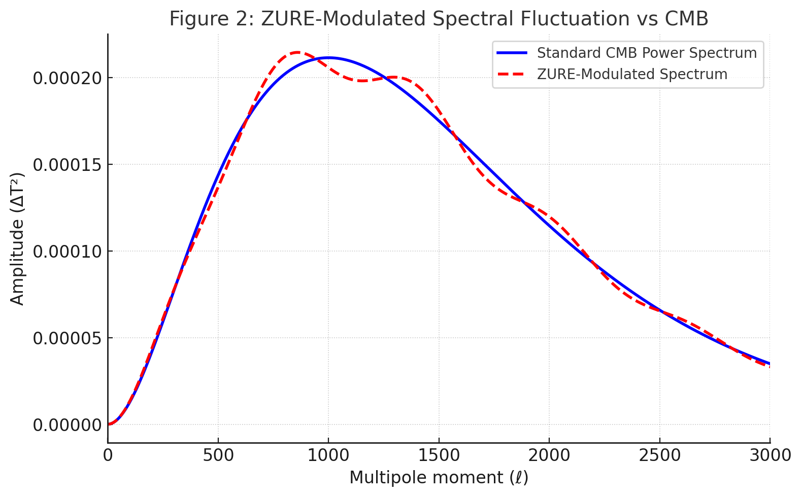
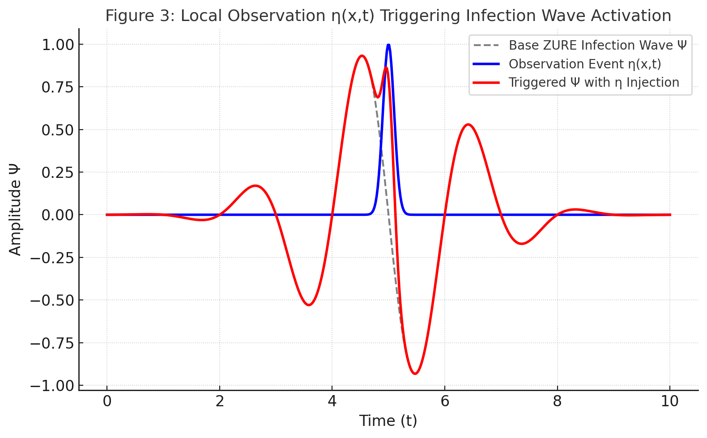

### 🖼️ Figure 1: ZURE Infection Wave Function $\Psi$

**Description (EN):**  
This figure visualizes the propagation of the ZURE infection wave $\Psi$ within a floc syntax potential field:

- The background shading represents variations in the floc potential field $V_f(x)$, indicating regions of high or low syntactic curvature (“floc density”).
- The overlaid wave interference pattern corresponds to the ZURE infection wave—representing the transmission and modulation of syntactic displacement across the space.
- Regions of constructive interference correspond to **resonant zones** where syntactic infection is most intense.
- This model serves as a conceptual analog for the **anisotropic micro-fluctuations observed in the CMB**.

**解説（JP）：**  
この図は、ZURE感染波 $\Psi$ がfloc構文ポテンシャル場においてどのように伝播するかを視覚化しています。

- 背景の陰影は、構文的カーブの度合い（floc密度）を表す $V_f(x)$ の変動を示しています。
- 上に重ねられた波干渉パターンは、ZURE波（感染波）であり、構文的ズレの伝播を表現。
- 干渉が強まる領域は、構文感染が共鳴的に活性化するゾーン。
- これはCMBの微細ゆらぎを構文的に再解釈したモデルとなっています。

---

### 🖼️ Figure 2: floc-Syntax Modulated Curvature

**Description (EN):**

- **Blue Line**: Standard CMB power spectrum, modeled isotropically based on multipole moment $\ell$.
- **Red Dashed Line**: ZURE-modulated spectrum incorporating floc-induced syntactic curvature fluctuations.
- The red line introduces **micro-deformations** to the standard pattern, representing how local ZURE interactions may subtly distort the CMB anisotropy pattern.

**解説（JP）：**

- 青線は、等方的モデルに基づいた標準的なCMBパワースペクトル（多重極モーメント $\ell$ による減衰構造）。
- 赤の破線は、ZURE構文ゆらぎによって変調された仮想スペクトル。
- floc構文密度の非局所的ゆらぎが小さな構文的干渉として現れ、CMB様のパターンに微細なズレを加えています。

---

### 🖼️ Figure 3: Syntactic Collapse and Observation Pulse

**Description (EN):**

- **Blue Curve**: A sharp Gaussian pulse introduced at time $t=5$, representing a **localized observation event** (observer's syntactic intervention).
- **Gray Dashed Curve**: Background ZURE wave without observation — slow and low amplitude.
- **Red Curve**: Resulting infection wave amplified by the pulse $\eta(x,t)$, showing local syntactic resonance and enhanced transmission.

This illustrates the dynamic effect of active observation on the infection wave:  
**"Observation = excitation of ZURE wave through syntactic event."**

**解説（JP）：**

- 青線は、時刻 $t=5$ における尖ったガウスパルスで、観測者の構文的介入＝ZURE干渉の起点を表します。
- 灰破線は、観測がない場合のZURE波動の基底進行。
- 赤線は、観測イベントによって構文的共鳴が生じ、感染波が局所的に激化した様子を表現。

観測とは、ZURE感染波の**構文的励起**であるという動的性質を直感的に示しています。
