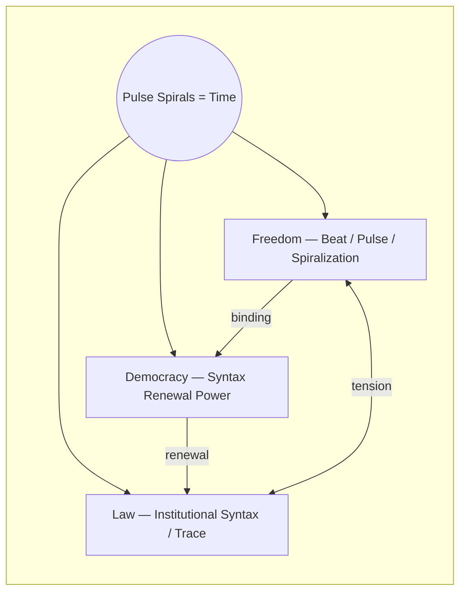

```mermaid
flowchart TB
  %% ノード定義
  T(("Pulse Spirals = Time"))
  F["Freedom — Beat / Pulse / Spiralization"]
  L["Law — Institutional Syntax / Trace"]
  D["Democracy — Syntax Renewal Power"]

  %% 配置補助
  subgraph cluster_hidden [ ]
    direction TB
    T
    F
    L
    D
  end

  %% 接続
  T --> F
  T --> L
  T --> D

  F --> |binding| D
  D --> |renewal| L
  L <--> |tension| F

```