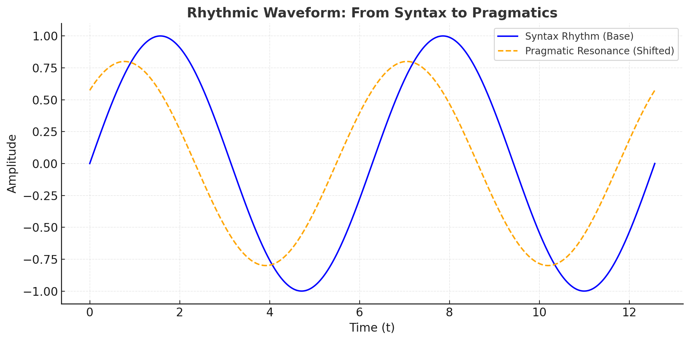

# 図版ギャラリー｜HEG-2

EgQE / HEG-2 の主要論稿で使用された図版をまとめています。  
論文本文とあわせてご覧ください。

---

## 🌀 三層再配置図

  

**説明**: Syntax = Ontic Structure, Semantics = Generative Resonance, Pragmatics = Site of Action。  
言語の三層を「機能」から「存在・生成・行為」へ再配置する図。

---

## 🔄 ΔRパイプライン

  

**説明**: ZURE → Resonance μ → 行為 $ΔR$ → 再位相化。  
行為と語用の更新プロセスを流れとして可視化。

---

## 🪨 化石図（Fossil Record）

  

**説明**: HEG-2 → SAT → SATy の層理。  
「行為の記号論から記号の行為論へ」という歴史的責任を地層として描いた図。

---

## 📊 ZUREスペクトログラム

  

**説明**: 応答系列のズレ周波数帯を可視化。  
ズレの周波数構造が、共鳴の強度や意味生成のリズムを示す。

---

## 関連リンク
- [HEG-2 論稿リスト](../SATy.md)  