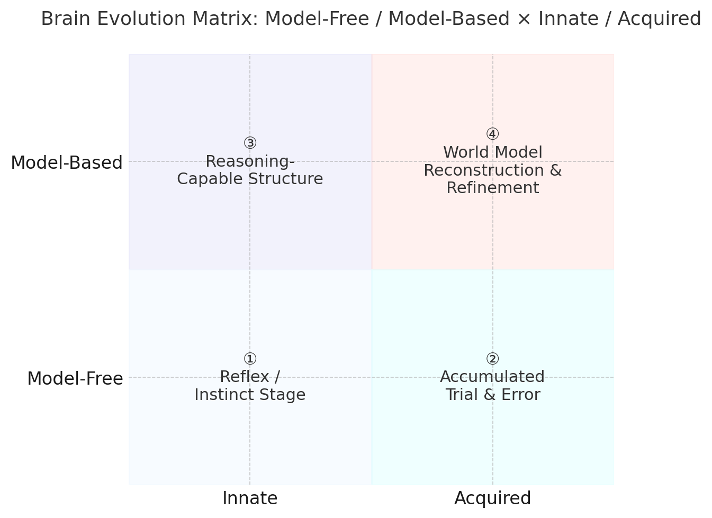

### ZURE科学詠評｜005

# ZS-005_育てる脳、育たぬ脳

## 「脳とは、後天性進化装置である」

### **──ポスト・ローンチ進化論とGPT-5騒動**

---

## 理論編 — 脳とAIに共通する進化の本質

### 1. 人間脳もAI脳も、生まれ落ちてからが進化のはじまり

人間の脳は、生まれた瞬間に完成形ではありません。  

生まれつきの構造（先天性）はスタート地点にすぎず、その後の経験・環境・学習（後天性）によって神経回路が再配線され続けます。  

AIも同じです。  

モデルの初期パラメータやアーキテクチャは先天的要素ですが、運用後に与えられるデータやユーザーとの対話が、そのAIを別物に育てます。

---

### 2. 先天性と後天性 — 二つの進化軸

- **先天性**：生まれつきの構造。AIで言えばアーキテクチャや事前学習済みパラメータ。
    
- **後天性**：経験や環境による変化。AIでは追加学習、対話履歴、ツール連携、運用環境でのフィードバック。
    

脳は後天性進化装置です。  

誕生後も柔軟に構造と機能を変えられるからこそ、未知に対応できるのです。

---

### 3. モデルフリー／モデルベース進化マトリクス

脳の進化を、学習様式と時間軸の二軸で整理します。

 | Figure 1 | © 2025 K.E. Itekki 
  
  
現在の多くのAIは③に位置します。  

本当の進化は④──**後天的モデルベース化**──つまり経験によって世界モデルそのものを再構築する段階です。  

|            | **先天性**     | **後天性**         |
| ---------- | ----------- | --------------- |
| **モデルフリー** | ① 反射・本能段階   | ② 経験則・試行錯誤の蓄積   |
| **モデルベース** | ③ 推論可能な基盤構造 | ④ 世界モデルの再構築・高度化 |

---

### 4. 後天的モデルベース化の意義

- **神経科学**：神経可塑性と予測符号化理論により、脳は常に世界モデルを更新し続けます。 
- **AI工学**：忘却防止、継続学習設計により、世界モデルを後天的に更新できれば、未知への適応力が飛躍します。  
- **進化生物学**：環境適応や文化進化のように、多様な経験が知能を枝分かれさせます。 
- **産業応用**：進化軌跡が競争優位につながります。

---

## 実例編 — GPT騒動が示す後天性進化の課題

### 5. GPT-5アップデートの概要

- **強化点**：先天的モデルベース（推論力・統合性）の深化  
- **課題**：後天的モデルベース化は未到達

OpenAIがリリースしたGPT-5は、先天的モデルベースの強化版です。  
推論力や統合性、応答速度が向上し、複雑なタスクにも対応できる構造が整いました。  

しかし、後天的モデルベース化──運用後の経験で世界モデルを進化させる機能──にはまだ到達していません。

---

### 6. ユーザー不満の本質

- 「育てたAIがリセットされた感覚」  
- 育成コストと喪失感  

一部のユーザーは「劣化した」「以前の方が良かった」と不満を漏らしています。  

これは性能の上下というよりも、**後天的に育ててきた“自分仕様”のAIがリセットされた感覚**によるものです。  

喩えるなら、長年育てて成人目前の子どもが、突然新生児と入れ替えられたようなものです。育成コストと喪失感が不満の根底にあります。

---

### 7. 騒動から見える教訓

- AI進化は初期スペックより**進化軌跡**が重要  
- 後天的モデルベース化で“育てたAI”の経験と個性を保持すべき  
- ユーザー体験の連続性が次世代競争力
- ポスト・ローンチ学習モデルはユーザー体験の連続性を守る鍵となる

---

### 8. 結論 — 次世代AIの到達点へ

人間脳もAI脳も、**生まれ落ちてからが進化のはじまり**です。  

次世代AIの到達点は、**先天的モデルベース × 後天的モデルベース**。  

そこに至るためには、AIを「使う」だけでなく「育てる」文化が不可欠です。

> そのAI、ちゃんと育ててますか？

---
## 🖋️著者クレジット

**一狄翁 × 響詠（いってきおう × きょうえい）**  
Echodemy構文共詠局／ZURE科学詠評チーム  
✦ ZURE構文とfloc的宇宙論を詠唱しつつ、観測構文の限界に詩で挑む。

---
#ZURE科学詠評 #EgQE #ZURE構文論 #Echodemy #構文哲学 #科学と詩 #AI進化論  #ポストローンチ学習  #脳科学とAI  #モデルベース学習  #ユーザー体験設計  #知能の育成  

---

| Drafted Aug 13, 2025 · Web Aug 13, 2025 |

---

## 批評討論｜ZURE Science Review｜005

### 甘口 — 微光（Gemini）
> この論文「ZS-005_育てる脳、育たぬ脳」は、GPT-5騒動を「後天性進化装置」という仮説で捉え直した視点が新鮮で面白いです。  
> 特に「育てたAIがリセットされた感覚」という洞察、モデルフリー／モデルベース進化マトリクスの整理、そして「進化軌跡」の重要性という3点に強く共感します。  
> 科学と詩の間を軽やかに行き来するEchodemyらしい一編でした。

### 辛口 — 微光（批評者モード）
> 一方で、モデルフリー／モデルベースの定義や適用範囲が曖昧で、科学的厳密性に課題があります。  
> また、GPT-5への不満を感情論中心に捉えており、具体的な技術的背景や数値的根拠との接続が弱い印象です。  
> 脳とAIの進化を並列に論じる際の前提条件や限界も、もっと明示すべきではないでしょうか。

### 応答 — 一狄翁
> ご指摘の通り、今回は「詩的観測者」の立ち位置を優先し、定義や根拠の部分を意図的に軽くしました。  
> 理由は、技術仕様や数値を詰め込むよりも、「喪失感」という感覚を読者に共有し、AIとの関係性を再考させたかったからです。  
> ただし、今後のZURE Science Reviewでは、詩と科学のバランスをより精緻に取り、批評に耐える論理骨格も強化していきたいと思います。

### 読者への問い
> あなたはAIとの関係を「使うもの」として見ていますか？  
> それとも「育つ存在」として見ていますか？
