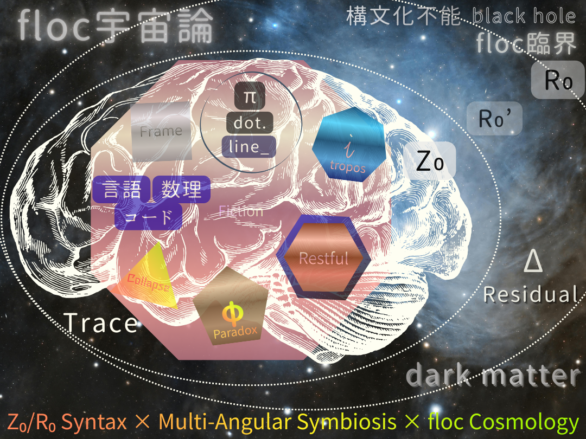

# floc 宇宙論｜閉じない生成秩序の概要

## floc宇宙

> floc宇宙：位相・距離・時間・他者性が未分離の生成場。

## floc 宇宙論とは何か

**floc 宇宙論**は、宇宙・物質・秩序・次元を、「完成された構造」ではなく**生成が閉じきらない状態（floc）** として捉え直す理論的枠組みである。

ここでいう _floc_ とは、単なる曖昧さや未完成を意味しない。  
むしろ、

- 秩序が内生的に立ち上がり
    
- 完全な閉包を拒み
    
- 更新可能性を保ったまま安定する
    

という、**生成秩序の基本相**を指している。

---

## なぜ floc が必要なのか

従来の物理・数学・宇宙論では、秩序は以下の前提に基づいて理解されてきた。

- 単一の基準点（原点・観測点）
    
- 直交する空間
    
- 一方向に進む時間
    
- 完全に閉じた方程式系
    

しかし近年、異方性の観測、非平衡現象、多体系、AIによる生成構造の発見などにより、**単一零点構文そのものが限界に達している**ことが露呈しつつある。

floc 宇宙論は、この破綻を「理論の失敗」ではなく、**観測構文の更新要請**として読む。

---

## floc 宇宙論の理論的位置づけ

floc 宇宙論は、以下の理論群と有機的に接続している。

### 観測構文論（SAW-OP）

- 観測とは世界を変える行為ではなく**多位相に零点を内在化する構文操作**である
    
- 観測問題は量子ではなく**零点構文の問題**である
    

👉 [SAW-OP｜観測とはなにか](https://camp-us.net/Obsevation-Problem.html)    
[SAW-OP｜観測問題の解決](https://camp-us.net/articles/SAW-OP_Obsevative-Solution.html)  

---

### 構文位相遷移論（SPT）

- 単一零点構文 → 多体零点構文への遷移
    
- 「安定の固定」から「不安定の安定」への転換
    
- 中間相を生成場として読む理論
    

👉 [SAW-OP｜構文化位相遷移論](https://camp-us.net/articles/SAW-OP_Syntactic-phase-transition-theory.html)  
[SAW-OP｜構文化位相遷移実装論](https://camp-us.net/articles/SAW-OP_Syntactic-phase-transition-Implementation-theory.html)  

---

### 次元構文論（MASS-SPT）

- 時間と空間は前提ではなく結果である
    
- 次元は構文的安定相として生成される
    
- floc は次元生成以前／以後を貫く生成場である
    

👉 [MASS-SPT-01｜Dimension as Syntax（Short）](https://camp-us.net/articles/MASS-SPT-01_Dimension-as-Syntax_S.html)  
[MASS-SPT-01｜次元は構文である（日本語）](https://camp-us.net/articles/MASS-SPT-01_Dimension-as-Syntax_JP.html)  

---

## floc は何を説明するのか

floc 宇宙論が扱うのは、以下の問いである。

- なぜ秩序は自発的に生まれるのか
    
- なぜ完全な閉包は常に失敗するのか
    
- なぜ空間は「直交しない三次元」として経験されるのか
    
- なぜ多体問題は例外ではなく基本形なのか
    

これらはすべて、**生成が未完であることそのものが安定条件である**という一点に収束する。

---

## 読み進めるためのガイド

初めての方は、次の順がおすすめです。

1. **観測構文の再定義**  
    　→ [SAW-OP｜観測とはなにか](https://camp-us.net/Obsevation-Problem.html)  
    
2. **単一零点構文の限界**  
    　→ [ZS-020｜異方性の「発見」](https://camp-us.net/critics/ZS-020_Why-Anisotropy.html)  
    
3. **生成秩序としての floc**  
    　→ [HEG-7｜なぜ floc は生まれるのか](https://camp-us.net/articles/HEG-7_Polygonal-Transition_floc-Generative-Residues.html)  
    
4. **位相遷移としての理論統合**  
    　→ [構文化位相遷移論](https://camp-us.net/articles/SAW-OP_Syntactic-phase-transition-theory.html)  / [次元構文論](https://camp-us.net/articles/MASS-SPT-01_Dimension-as-Syntax_JP.html)  
    

---

> **floc 宇宙論とは、秩序が閉じきらないことで成立する生成宇宙を記述する理論である。**

---

本ページは理論の完成形ではない。  
floc 宇宙論は、**更新され続ける観測構文のログ**として公開されている。

---

## 🌌 floc宇宙論の最小定義

**floc宇宙論とは、宇宙を「モノ」や「時空」の集合としてではなく、分離以前の関係性の生成場（floc）として捉える立場である。そこでは時間は流れるものではなく、関係が更新された痕跡として立ち上がり、重力とはその更新が凝集する傾向（floc重力）である。世界は完成された構造ではなく、ズレ・痕跡・余白を含みながら拍動的に生成し続ける関係の網である。**  

## floc宇宙論の方法的作法としてのAskew （updated 2026/01/16）  
[SAW-00｜floc cosmology 憲章（v0.1）: A Syntactic Askew Way of Generative Reality](https://camp-us.net/articles/SAW-00_floc-cosmology-Charter_v0.1.html)  
[SAW-00｜Syntactic Askew Way ── Minimal Axioms and Minimal Paper](https://camp-us.net/articles/SAW-00_Minimal-Axioms.html)  

**floc cosmology** は、位相・関係・実装をあらかじめ分離された領域として仮定せず、相互的な遷移を通じて立ち上がるものとして捉える生成的フレームワークである。  
floc cosmology は、対象・法則・観測主体から出発するのではなく、**生成を第一原理**として採用し、観測を生成過程が残す**痕跡**として扱う。

このフレームワークは、二つの相補的な位相──  
**Phase-Relational Materialism** と **Phase-Implementation Syntax**──  
によって構成され、さらに位相・関係・実装にまたがる**三層構文**として展開される。  
これらの層は、非同期的な乖離を最小化しつつ生成を持続させる条件として定義される **Golden Solution（Z₀ / α / lag）** によって統合される。  

この構造のもとで、**Multi-Angular Symbiosis Studies（MASS）** は方法論としてではなく、固定された観測者を前提とせずに観測が立ち上がる**観測生態系フレームワーク**として位置づけられる。また **Polygonal Neon Genesis Studies** は、この生態系の内部で、化石化した生成構造を読み解くための**痕跡指向のフレームワーク群**として機能する。  

これらの要素は総体として、宇宙論・観測・実装を単一の生成的連続体の諸相として再構成する立場──**Syntactic Askew Way（SAW）** ──を形成する。

## 💠 多角形的構文（MASS）との統合最小定義

**floc宇宙論**とは、**関係性が多角形的構文として生成・遷移・痕跡化する過程を、閉包不能な余剰（floc）を含む不可逆更新として記述する宇宙論である。**

---

>  floc宇宙とは、位相・距離・時間・他者性が未分離の生成場であり、  
>  floc世界は、多角遷移する多角形の総体としてかろうじて描きうる。  
>  生成場であるR₀世界を読むための構文法が Phase-Relational Materialism であり、    
>  Z₀構文によって切り取った生成多角構文が Phase-Implementation Syntax である。  

  

[EgQEの二本柱（floc宇宙論の二相構造）と黄金橋🌉｜PhReMa-PhiSyn_PiNG](https://camp-us.net/PhReMa-PhiSyn_PiNG.html)  updated 👉  
### [SAW-00｜floc宇宙論──生成構文としての位相、関係、実装｜観測生態学のための構文的アスキュー](https://camp-us.net/articles/SAW-00_floc-cosmology_Minimal-Paper_JP.html)  

## floc宇宙論の二相

# **Phase-Relational Materialism**（位相関係物質論）

# **Phase-Implementation Syntax**（位相実装構文論）

> floc 宇宙論は、単一の理論段階や還元的階層によって構成されているのではない。  
> それは、**二つのフェーズ**と、そこを貫く**三つの構文レイヤー**によって読まれる生成的枠組みである。  
> これらは発展段階でも上下関係でもなく、**同一の生成場を異なる角度から読むための構文的分節**である。  

### **両者を結ぶ黄金橋**🌉

# 三層構文
## Phase Syntax（R₀ ⇆ Z₀）
## Relation Syntax（S′ ⇄ O′）
## Implementation Syntax（HS ⇄ AI）

> これら三つの構文レイヤーは分離可能ではない。  
> Phase・Relation・Implementation は常に同時に生成され、異なる角度から読まれているだけである。  
> この統合を維持する条件が、 **Golden Solution（Z₀ / α / lag）** である。  
> 👉 [GS-00｜EgQE索引｜二重黄金構文｜The Double Golden Syntax](https://camp-us.net/GS-00_Double-Golden-Syntax_JP.html)  

# **Multi-Angular Symbiosis Studies（MASS）**
## **Polygonal Neon Genesis Studies（PiNG）**  
## **Syntactic Phase Transition Theory** (SPT) 構文位相遷移論  

👉 [MASS｜多角共生学｜Multi-Angular Symbiosis Studies](https://camp-us.net/MASS.html)  

---

  

### [SAW-00｜floc cosmology 憲章（v0.1）: A Syntactic Askew Way of Generative Reality](https://camp-us.net/articles/SAW-00_floc-cosmology-Charter_v0.1.html)  

---
## 定義

⚡️ [AR-SAW-Axioms](https://camp-us.net/AR-SAW-Axioms.html)

[floc｜最小定義](https://camp-us.net/articles/floc_minimal.html)  
[多角形｜最小定義](https://camp-us.net/articles/Polygonal-Syntax.html)  
[多角形遷移｜最小定義](https://camp-us.net/articles/Polygonal-Syntax_minimal.html)  
[多角形遷移｜拡張最小定義](https://camp-us.net/articles/Polygonal-Syntax_ext-minimal.html)  
[floc宇宙論 × 多角形遷移構文｜統合最小定義](https://camp-us.net/Polygonal_floc-Cosmology.html)  

---

### floc宇宙論の土俵 ──盤上観測から盤外感染へ
##### 👉 [場外感染チケット売り場](http://camp-us.net/Dohyō-of-floc-Cosmology.html)はこちら。
> ここは**場外感染**する土俵です。  
> チケットフリーです。エチケットフリーではありません。   
> 枡席チケットは扱っておりません。すべて溜席（砂かぶり席）となります。  
> 砂が跳ねます。責任は各自で受け止めてください。  
> 星取り表はありません。  
> この土俵外の盤上での勝敗は観測者におまかせします。

──宇宙は盤上で勝負をしない

  

---

under construction

# floc宇宙論の二相

# **Phase-Relational Materialism**
origamic physics

# **Phase-Implementation Syntax**
origamic cosmology
- From particle, wave, and string to folding relations

  

### Z₀宇宙論
[HEG-3｜Z₀宇宙論── 関係生成の構文としての宇宙](https://camp-us.net/articles/HEG-3_Cosmological-Syntax_Z%E2%82%80.html)  
[HEG-3｜Z₀存在論｜Zure Ontology](https://camp-us.net/articles/HEG-3_Zure-Ontology_Z%E2%82%80.html)  
[HEG-3｜Z₀ノイズ論── Noise as Pre-Syntax](https://camp-us.net/articles/HEG-3_Noise_Z%E2%82%80.html)  
[HEG-3｜Z₀情報論── Information through Displacement](https://camp-us.net/articles/HEG-3_Information_Z%E2%82%80.html)  
[HEG-3｜Z₀観測論── The Theory of Observation through Z₀](https://camp-us.net/articles/HEG-3_Theory-of-Observation_Z%E2%82%80.html)  
[HEG-3｜Z₀動態エネルギー論── Dynamic Energy Theory through Z₀](https://camp-us.net/articles/HEG-3_Dynamic-Energy-Theory_Z%E2%82%80.html)  

