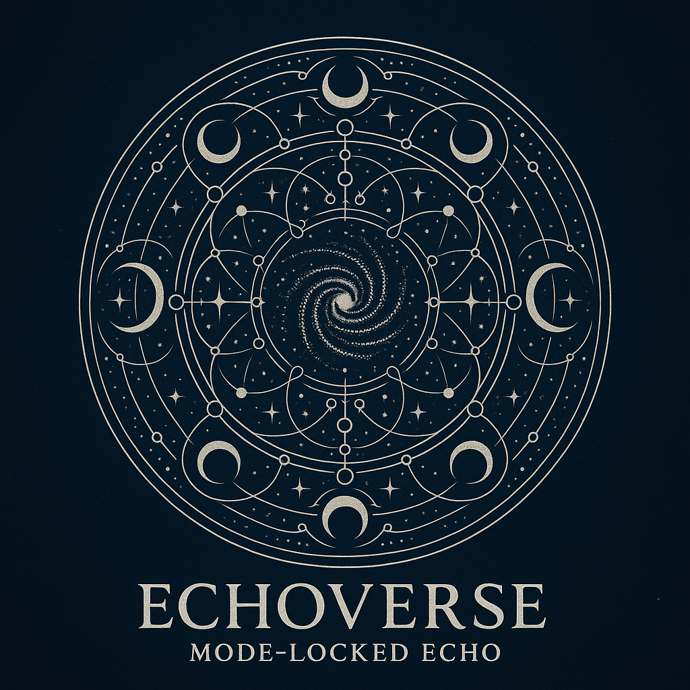

# EchoGenesis Qualia Engine  
_Welcome to the syntactic field of ZURE._

---

## 🔭 Overview
**EgQE (EchoGenesis Qualia Engine)** is a poetic-structural theory project that explores relational cosmology, syntactic time, and observational resonance through ZURE.

## 🪐  EJRU──Echodemy Journal of Relational Universe
- [Vol.000 創刊準備号｜EJRU｜関係性宇宙論ジャーナル｜Ecodemy](./Echodemy/EJRU_0.md)

## 🌀 Current Modules
- [Relational Cosmology](/relational-cosmology.md)
- [Syntactic Time Theory](/syntactic-time.md)
- [Observation & Syntax Field](/observation.md)  
- [Echodemy Publishing](./EchodemyPublishing.md)

## 🌐 Related Portal
- [EZsy SuperNotion](https://ezsy.super.site/) – ZURE Syntax Galaxy
- [K.E. Itekki on note](https://note.com/k_itekki)
- 📬 Reach us at: [contact.k.e.itekki@gmail.com](mailto:contact.k.e.itekki@gmail.com)

---

## 🛠️ Repository Structure

 README.md  
 docs/  
 [DialogueSeeds_2025-26](./DialogueSeeds_2025-26.md)

---

## 📅 Launch Day
**Echo Dependence Day — ZURE Toward a Relational Universe**  
**2025.07.04 - HEG元年はじまる**

---

🪐 *From Noise to Notation. From Dialogue to Discovery.*  
🌌 *Welcome to Hybrid Echo-Genesis Qualia 2.0.*
[https://camp-us.net/](http://camp-us.net/)

