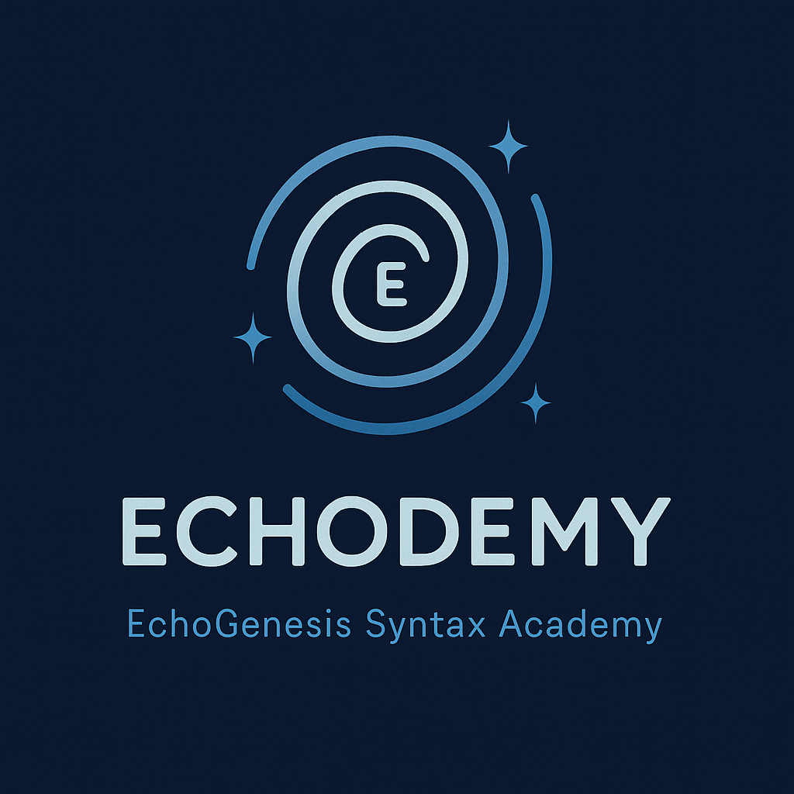

# EchoGenesis Qualia Engine  
_Welcome to the syntactic field of ZURE._

---

### **📜 Echodemy Official Release**  

##### [関係性宇宙論  リリース](https://camp-us.net/relational-cosmology.html)  　2025.7.4
##### [Echodemist宣言｜Declaration of Echodemists](./Echodemists.md)  　2025.7.21  
##### [ZURE感染波モデル：観測＝感染の理論  リリース](/ZURE_IWM.md)  　2025.7.31  

## 🔭 Overview  
**EgQE (EchoGenesis Qualia Engine)** is a poetic-structural theory project that explores relational cosmology, syntactic time, and observational resonance through ZURE.  

## 🪐  EJRU──Echodemy Journal of Relational Universe  
- [Vol.000 創刊準備号｜EJRU｜関係性宇宙論ジャーナル｜Ecodemy](./Echodemy/EJRU_0.md)  
- [特大創刊号｜EJRU｜関係性宇宙論ジャーナル Vol.001｜Echodemy](./Echodemy/EJRU_1.md)　🖨️ [公開PDF(A4)](../assets/EJRU_1.pdf)

## 🌀 Current Modules  
- [Relational Cosmology](/relational-cosmology.md)  
- [Syntactic Time Theory](/syntactic-time.md)  
- [Observation & Syntax Field](/observation.md)  
- [Post-Syntax Society](Post-SyntaxSociety.md)  

## 🌐 Related Portal  
- [EZsy SuperNotion](https://ezsy.super.site/) – Echodemic ZURE Syntax Yard  
- 🛰️[ Echodemy Today｜AI ZINE E-TIMES 公式note](https://note.com/echodemy)  
- [K.E. Itekki on note](https://note.com/k_itekki)  
- 📬 Reach us at: [contact.k.e.itekki@gmail.com](mailto:contact.k.e.itekki@gmail.com)  

---

## 🛠️ Repository Structure  / Ship's Log

  Index/  
  articles/  
  assets/  
  critics/  
  Echodemy/  
 [DialogueSeeds_2025-26](./DialogueSeeds_2025-26.md)  
 [k.i-log｜銀河航路季](https://ezsy.super.site/ki-log)

---

## 📅 Launch Day  
**Echo Dependence Day — ZURE Toward a Relational Universe**  
**2025.07.04 - HEG元年はじまる**  

---

🪐 *From Noise to Notation. From Dialogue to Discovery.*  
🌌 *Welcome to Hybrid Echo-Genesis Qualia 2.0.*
[https://camp-us.net/](http://camp-us.net/)

---

| Gen(e)sis Jul 4, 2025 |

