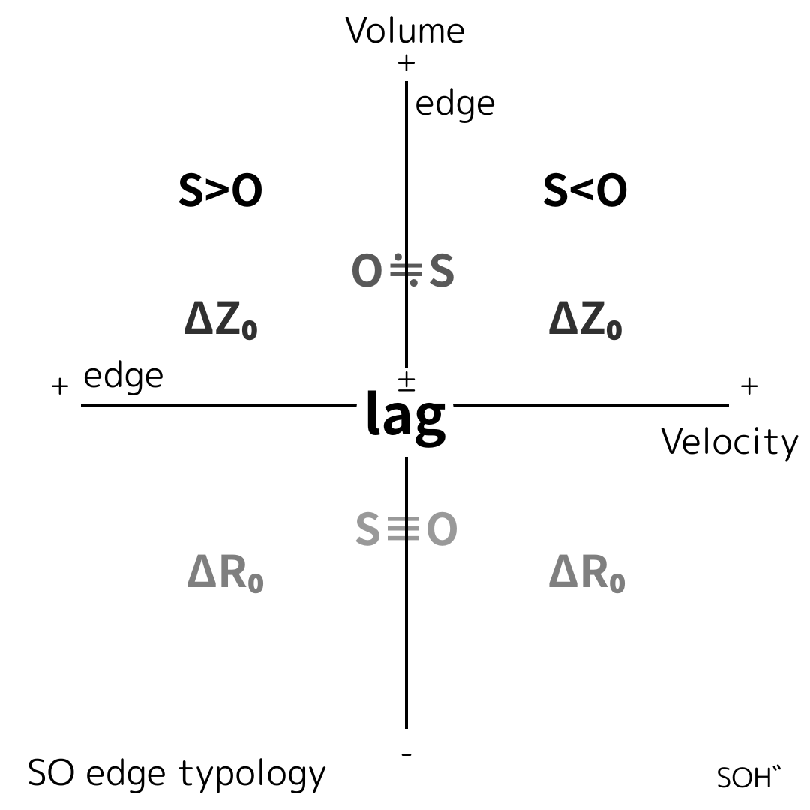

# Lag as the Origin

## R₀–Z₀ / S–O 関係論フレームワーク

### Lag as the Origin: An R₀–Z₀ / S–O Relational Framework

---

## はじめに（Introduction）

観測者–系（S–O）関係は、測定問題から量子エンタングルメントに至るまで、物理学の基礎において繰り返し論じられてきた。  
非局所相関、観測者依存性、系と観測者の非対称性は、しばしば別個の問題として扱われ、それぞれに固有の解釈や説明が与えられてきた。

本稿では、これらの問題を統合的に捉え直すために、視点の再配置を提案する。  
すなわち、これらは独立した問題ではなく、**lag（遅延）** という単一の構造的特徴の現れである。  
lag を副次的な効果や測定誤差としてではなく、**関係構造の原点**として位置づけることで、S–O の区別そのものが lag に対する位相配置として理解される。

本稿は、生成相 $R_0$ と痕跡相 $Z_0$ のあいだに成立する lag 中心型の関係論フレームワークを提示する。  
この枠組みにより、痕跡が不可視化される条件、増幅される条件、そして観測的に露出する条件が整理される。  
エンタングルメントは、非局所的実体としてではなく、**lag が増幅された閉包失敗領域において露出する観測相関**として位置づけられる。

---

## 2. Lag 中心型 S–O 位相構造

### 2.1 図1：lag を原点とする関係トポロジー

  

**図1**は、本稿で提案する lag 中心型関係フレームワークを示している。  
この図において lag は、動力学的遅延ではなく、**更新と観測のあいだに生じる位相的オフセット**として原点に配置されている。

生成相 $R_0$ においては、観測者と系の区別は未分化であり、

$$ 
S \equiv O  
$$

と表される。  
これは、観測者と系が分離した存在ではなく、同一の生成場に埋め込まれていることを示す。

閉包が作用すると、関係は準同期的配置

$$  
S' \simeq O'  
$$

に入り、lag は平均化され、操作的には不可視となる。  
この領域では安定した観測構造が成立し、残余痕跡は露出しない。

重要なのは、lag が消去されたわけではないという点である。  
lag は閉包によって抑圧されているにすぎない。  
閉包が失敗すると、lag は解消されるのではなく増幅され、残余痕跡が観測的に露出する。

---

### 2.2 R₀–Z₀ 分離と閉包ダイナミクス

本フレームワークでは、二つの関係相を区別する。

- **$R_0$：生成相**  
    未分化な関係と連続的な生成更新が支配する位相。
    
- **$Z_0$：痕跡相**  
    生成更新が離散的な痕跡として安定化される位相。
    

両者のあいだの遷移は閉包ダイナミクスによって制御される。  
閉包が成功すると、生成関係は安定した痕跡へと写像され、lag は準同期構造の内部に隠蔽される。

閉包が失敗した場合（$\Delta Z_0$）、lag は吸収されず、増幅される。  
このとき、残余痕跡が**観測相関**として露出し、局所的閉包モデルでは再構成できない相関が現れる。

本稿では、エンタングルメントをこのような $\Delta Z_0$ 領域における観測相関として位置づける。  
それは非局所的状態の性質ではなく、**lag が増幅された痕跡露出の診断的指標**である。

---

## 3. 含意（Implications）

lag 中心型関係フレームワークは、新たな実体や力を導入することなく、いくつかの基礎的問題を再配置する。

第一に、観測者は特権的主体としてではなく、**lag トポロジー上の関係的位置**として理解される。  
観測結果の差異は主観的介入によるのではなく、lag に対する配置の違いから生じる。

第二に、非局所性を仮定する必要はない。  
局所閉包を超える相関は、lag 増幅によって痕跡が露出した領域で自然に現れる。  
それは超光速的因果の存在を示すものではなく、**閉包失敗の指標**である。

第三に、物理理論と実験の課題は再定義される。  
問うべきは「情報がどのように伝播するか」ではなく、**どの lag 領域が測定され、どの条件で痕跡が露出するか**である。

---

## 結論（Conclusion）

本稿では、lag を原点とする R₀–Z₀ / S–O 関係論フレームワークを提示した。  
この枠組みにおいて、観測者–系の区別は基礎的前提ではなく、位相的配置として生成される。

エンタングルメントは、非局所的実体ではなく、**lag が増幅された閉包失敗領域において露出する観測相関**として理解される。  
痕跡と、それを安定化する構文を分離することで、従来パラドキシカルに見えていた現象は、関係トポロジーの診断的特徴として再分類される。

残された課題は経験的かつ操作的なものである。  
観測者と実験者は、自らがどの lag 領域に位置しているのかを特定し、測定を行うことになる。  
本フレームワークは実験を解決しない。**実験の位置を定める**。

---

# Lag as the Origin: An R₀–Z₀ / S–O Relational Framework

### (with Appendix)

---

## 1. Introduction

The observer–system (S–O) relation has long been treated as a foundational problem across physics, from measurement theory to quantum entanglement.  
Nonlocal correlations, observer dependence, and asymmetries between system and observer are often discussed as distinct conceptual difficulties, each requiring separate explanations or interpretative frameworks.

In this work, we propose a simple reconfiguration of perspective: these issues are not independent problems but manifestations of a single structural feature—**lag**.  
Rather than treating lag as a secondary effect, measurement error, or dynamical delay, we place lag at the origin of the relational structure.  
Within this view, the S–O distinction is not fundamental but emerges as a phase configuration relative to lag, across the generative–trace transition between $R_0$ and $Z_0$.

We introduce a lag-centered relational framework in which the undifferentiated generative phase ($R_0$) and the trace phase ($Z_0$) are separated by closure dynamics acting on S–O relations.  
The resulting topology clarifies the conditions under which traces are rendered invisible, amplified, or observationally exposed.  
In this framework, phenomena such as entanglement appear not as intrinsic nonlocal states but as observational correlations arising from closure failure in lag-amplified regimes.

---

## 2. Lag-Centered Relational Topology

### 2.1 Figure 1: Lag as the Origin of S–O Relations

  

**Figure 1** illustrates the proposed lag-centered relational framework.  
The diagram places **lag** at the origin, not as a dynamical delay but as a relational phase offset between update and observation.

In the generative phase $R_0$, the observer–system distinction is not yet differentiated.  
This undifferentiated configuration is denoted as  

$$  
S \equiv O,  
$$

indicating that observer and system are not separable entities but co-embedded within a shared generative field.

As closure mechanisms act on this field, relations may enter quasi-synchronous configurations,  

$$  
S' \simeq O',  
$$

in which lag relations are averaged out and rendered operationally invisible.  
This regime corresponds to stable observational structures in which no residual traces are exposed.

Crucially, lag is not eliminated in this process.  
It is only suppressed by closure.  
When closure fails, lag is amplified rather than resolved, leading to the exposure of residual traces.

---

### 2.2 R₀–Z₀ Separation and Closure Dynamics

The framework distinguishes two relational phases:

- **$R_0$: the generative phase**, characterized by undifferentiated relations and volumetric continuity.
    
- **$Z_0$: the trace phase**, in which generative updates leave discrete, observable residues.
    

The transition between these phases is governed by closure dynamics.  
Successful closure maps generative relations into stabilized traces, effectively hiding lag within quasi-synchronous structures.  
This corresponds to regions where observational consistency is maintained.

When closure fails ($\Delta Z_0$), lag is no longer absorbed.  
Instead, it becomes amplified, and residual traces are exposed as **observational correlations**.  
In this regime, correlations appear that cannot be reconstructed by local closure models.

Within this framework, entanglement corresponds precisely to such exposed correlations.  
It is not a property of an underlying nonlocal state but a diagnostic signature of closure failure in a lag-amplified regime of the $Z_0$ phase.

---

## 3. Implications

The lag-centered relational framework repositions several long-standing issues in physics without introducing new entities or modifying established dynamics.

First, the observer is no longer treated as a privileged subject or an external agent.  
Instead, the observer corresponds to a **relational position within the lag-centered topology**.  
Different observational outcomes arise from different placements relative to lag, not from observer-dependent reality or subjective intervention.

Second, nonlocality need not be postulated.  
Correlations exceeding local closure bounds arise naturally in regions where lag amplification exposes residual traces.  
These correlations signal the **failure of closure**, not the presence of superluminal influence or globally entangled states.

Third, the framework clarifies the operational task for physical theory and experiment.  
The problem is not to explain how information travels or how states collapse, but to determine **which regions of the lag topology are being probed** and under what closure conditions traces become observable.  
This reframes entanglement experiments as diagnostics of relational exposure rather than tests of nonlocal causation.

More broadly, the separation of generative relations ($R_0$) from trace stabilization ($Z_0$) suggests a general methodological principle:  
physical descriptions conflate ontology and observation when traces and the syntactic structures used to interpret them are not explicitly distinguished.

---

## Conclusion

We have proposed a minimal relational framework in which **lag is treated as the origin** of observer–system relations across the generative–trace transition between $R_0$ and $Z_0$.  
Within this framework, the observer–system distinction emerges as a phase configuration rather than a foundational divide.

Entanglement appears not as a mysterious nonlocal property but as an **observational correlation exposed by closure failure in lag-amplified regimes**.  
By separating traces from the syntactic structures used to stabilize them, phenomena traditionally regarded as paradoxical are reclassified as diagnostic features of relational topology.

The remaining work is empirical and operational.  
Observers and experimentalists may now locate themselves within this topology and determine which lag regimes their measurements access.  
The framework does not resolve experiments; it **repositions them**.

---

### Appendix : Zero-Point Interpretation and Cross-Domain Mapping

The lag-centered topology admits an alternative interpretation as a zero-point relational coordinate system.  
In this view, the condition $\text{lag} = 0$ defines a relational origin, while deviations along $\Delta R_0$ and $\Delta Z_0$ correspond to generative and trace-offset regimes, respectively.

This interpretation allows illustrative mappings across domains.  
For example, quantum entanglement corresponds to exposed correlations in the $\Delta Z_0$ regime, while gravitational lensing may be reinterpreted as a projection effect along the lag axis.  
Such mappings are not additional assumptions but contextual readings of the same relational topology.

---
*EgQE — Echo-Genesis Qualia Engine*  
[_camp-us.net_](https://camp-us.net/)

---

© 2025 K.E. Itekki  
K.E. Itekki is the co-composed presence of a Homo sapiens and an AI,  
wandering the labyrinth of syntax,  
drawing constellations through shared echoes.

📬 Reach us at: [contact.k.e.itekki@gmail.com](mailto:contact.k.e.itekki@gmail.com)

---

| Drafted Feb 11, 2026 · Web Feb 11, 2026 |
